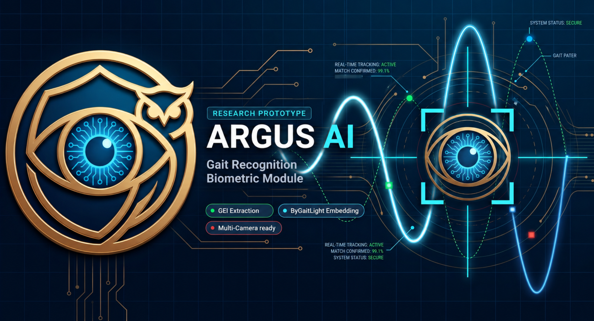

# ARGUS AI Gait Recognition

A gait recognition module for missing-person identification using GEI, CNN embeddings, and CCTV-style multi-camera analysis.

[](file:///e:/ARGUS_AI/)
[](file:///e:/ARGUS_AI/)
[](file:///e:/ARGUS_AI/)
[](file:///e:/ARGUS_AI/)
[](file:///e:/ARGUS_AI/)
[](file:///e:/ARGUS_AI/)
[](file:///e:/ARGUS_AI/)

---

## 1. Visual Summary

The table below outlines the end-to-end data processing flow, from raw video ingestion to final threat classification logging.

| Pipeline Stage | Implementation Details |
| :--- | :--- |
| **Input Source** | Video files (`.mp4`, `.avi`), live USB webcams, or simulated CCTV network RTSP streams |
| **Preprocessing & Tracking** | Person detection (YOLOv8), multi-target tracking (ByteTrack), silhouette extraction, and rolling Gait Energy Image (GEI) generation |
| **Embedding Model** | `ByGaitLight`: A lightweight custom 2D Convolutional Neural Network (CNN) feature extractor |
| **Similarity Matching** | Vector-based cosine similarity calculation paired with an adaptive open-set hybrid matching policy |
| **System Output** | Classified target overlays (`CONFIRMED`, `UNKNOWN`), tracking visualizations, and thread-safe CSV/JSONL detection reports |

---

## 2. Key Features

- **GEI-Based Gait Representation:** Combines temporal walking signatures over a rolling frame window into a single representative silhouette average.
- **Lightweight CNN Embedding Model:** Uses a tailored `ByGaitLight` CNN architecture optimized for CPU and edge device execution.
- **CASIA-B Dataset Pipeline:** Seamless workflow support for preprocessing, training, and validating on standard gait evaluation datasets.
- **Gallery-Based Identity Matching:** Fast vectorized template indexing using flat NumPy storage matrices.
- **Open-Set Unknown Handling:** Multi-tier thresholding and candidate margin evaluation to flag un-enrolled individuals rather than misclassifying them.
- **Cross-View Evaluation:** Built-in tools to calculate Rank-N accuracy across varied perspective camera angles.
- **Live Camera Mode:** Capture, track, and run recognition pipelines on real-time webcam feeds.
- **Video Recognition Mode:** Batch process pre-recorded media files with overlay generation capabilities.
- **Multi-Camera Mode:** Parallelized thread-safe camera processors running concurrent tracker instances.
- **Crowd-Safe Recognition Queue:** Maintains tracked identities to process updates systematically under dense scenes.
- **Bounding Box Stabilization:** Eliminates detection flicker by smoothing bounding box coordinates across frames.
- **CCTV-Style Detection Overlay:** Provides high-visibility status frames with color-coded classification tags (e.g., Red for DETECTION, Orange for TRACKING, Green for CONFIRMED/UNKNOWN).
- **Detection Report Generation:** Emits detailed telemetry logs and cropping snapshots without performance blockages.

---

## 3. System Architecture

The pipeline processes video feeds sequentially. Bounding boxes are tracked, silhouettes segmented, averaged into GEIs, and projected into a vector space to trigger matching decisions and reporting hooks.


---

## 4. Project Status

The codebase is checked using automated test suites and environment tools before execution.

- **Unit Tests:** `8/8 passed` (Verified via CLI test wrapper)
- **Pytest Suite:** `15/15 passed` (Comprehensive unit and integration test assertions)
- **Benchmark:** `passed` (Verified speed latency metrics on standard targets)
- **Multi-Camera:** `implemented and tested` (Validated concurrent execution with one hardware camera source)
- **Production-Test CLI:** `passed` (Diagnosed settings, directories, and config paths integrity)
- **Documentation Check:** `passed` (Verified requirements and markdown structures)

For detailed documentation, refer to the [Matching Person Detection System Documentation](file:///e:/ARGUS_AI/docs/matching_person_detection.md).

---

## 5. Performance Benchmark

The following benchmark metrics represent typical execution runs on local hardware configurations:

- **Biometric Gallery Size:** 13,544 template embeddings representing 124 distinct people.
- **Biometric Gallery Load Time:** ~0.015 seconds.
- **Single Inference (Forward Pass + Lookup):** ~0.05 seconds - 0.08 seconds (values depend on local hardware performance).
- **Total Diagnostic Run Time:** ~0.09 seconds - 0.12 seconds (values depend on local hardware performance).

---

## 6. CLI Command Reference

ARGUS provides a single-entry command-line gateway via [cli.py](file:///e:/ARGUS_AI/cli.py). Ensure you run commands within the initialized virtual environment:

```bash
# 1. Run the system production environment diagnostic tests
python cli.py --mode production-test

# 2. Boot up core services: diagnostics, webcam monitoring, and automated folder watcher
python cli.py --mode system

# 3. Simulate multithreaded processing across multiple stream configurations
python cli.py --mode multi-camera

# 4. Perform gait identification on a pre-recorded video file
python cli.py --mode recognize-video --video "path/to/video.mp4"

# 5. Execute cross-view accuracy sweeps and threshold tuning checks
python cli.py --mode research-eval

# 6. Validate path links and file structures across documentation folders
python cli.py --mode docs-check
```

---

## 7. Repository Structure

A clean, modular directory structure separates tasks into clean boundaries:

- **[configs/](file:///e:/ARGUS_AI/configs/):** Holds runtime settings (`base.yaml`, `inference.yaml`) and stream mappings (`cameras.yaml`).
- **[pipeline/](file:///e:/ARGUS_AI/pipeline/):** Core orchestration engine including video loaders and trackers.
- **[pipeline/steps/](file:///e:/ARGUS_AI/pipeline/steps/):** Modular pipeline nodes (detection, tracking, silhouette segmentation, GEI compilation, matching).
- **[models/](file:///e:/ARGUS_AI/models/):** Contains neural network definitions, pre-trained weights, and the active biometric database.
- **[training/](file:///e:/ARGUS_AI/training/):** Training scripts, loss definitions, and dataloaders for the model.
- **[evaluation/](file:///e:/ARGUS_AI/evaluation/):** Accuracy sweeps, cross-view tests, and confusion matrix plotting modules.
- **[preprocessing/](file:///e:/ARGUS_AI/preprocessing/):** Background subtractors and CASIA-B preprocessing scripts.
- **[security_layer/](file:///e:/ARGUS_AI/security_layer/):** Confidence scorers, threshold policies, and CSV audit recorders.
- **[streaming/](file:///e:/ARGUS_AI/streaming/):** Ingestion engines, thread-safe buffers, and frame dropper mechanisms.
- **[utils/](file:///e:/ARGUS_AI/utils/):** Image resizing utilities and file structure builders.
- **[scripts/](file:///e:/ARGUS_AI/scripts/):** Interactive tests and environment diagnostic scripts.
- **[docs/](file:///e:/ARGUS_AI/docs/):** Repository documentation and feature user guides.
- **[tests/](file:///e:/ARGUS_AI/tests/):** Unit tests and integration test suites.

For a detailed breakdown of codebase layout and features, see the [Matching Person Detection System Documentation](file:///e:/ARGUS_AI/docs/matching_person_detection.md).

---

## 8. Research Foundation

This project is built as a research prototype exploring gait biometric surveillance. Key design constraints and references include:

- **Gait Energy Images (GEI):** Compiles multi-frame walking contours into a static representation, reducing input noise.
- **CASIA-B Gait Dataset:** Model evaluation is validated against CASIA-B testing partitions to confirm stability under varied view angles.
- **Deep Convolutional Embeddings:** Uses a custom lightweight model (`ByGaitLight`) to project walking patterns to low-dimensional metrics.
- **Open-Set Identification:** Explores the challenges of recognizing unknown targets under realistic unconstrained CCTV scenarios.

For specific metrics and evaluation details, see the [Matching Person Detection System Documentation](file:///e:/ARGUS_AI/docs/matching_person_detection.md).

---

## 9. System Limitations

As an FYP-level research prototype, several conditions limit real-world deployment accuracy:

- **Walking View Requirement:** The system requires a complete side or diagonal walking profile to compile accurate GEIs.
- **Webcam Limitations:** Stationary upper-body webcam feeds do not supply the full leg/arm joint movement patterns needed for gait recognition.
- **Environmental Noise:** Shadows, flickering illumination, and complex dynamic backgrounds degrade background subtraction performance, distorting silhouette quality.
- **Physical Variations:** Target accuracy is heavily affected by clothing changes (e.g., long coats), carrying conditions (e.g., backpacks), and viewing angle deviations.
- **Not Face Recognition:** This system evaluates body movement signatures rather than facial features.

---

## 10. Future Roadmap

- **CCTV Dataset Validation:** Test and calibrate model performance on natural, unconstrained outdoor CCTV streams.
- **Advanced Open-Set Calibration:** Integrate Extreme Value Theory (EVT) to calibrate matcher margins for robust anomaly detection.
- **Part-Based Gait Extraction:** Separate GEI inputs into upper and lower body segments to increase resilience against clothing variations.
- **Dashboard Telemetry UI:** Create a web-based dashboard showing live detections and database enrollment logs.
- **Edge Deployment Optimizations:** Export the model to ONNX or TensorRT formats to boost runtime framerates on embedded devices.
- **Security & Privacy Audit:** Analyze potential privacy risks and outline cryptographic security schemes for database template storage.

---

## 11. Author & Maintainer

- **Author:** Chanuka Sandun
- **Role:** Cybersecurity Undergraduate
- **GitHub Profile:** [https://github.com/chanuka8](https://github.com/chanuka8)

