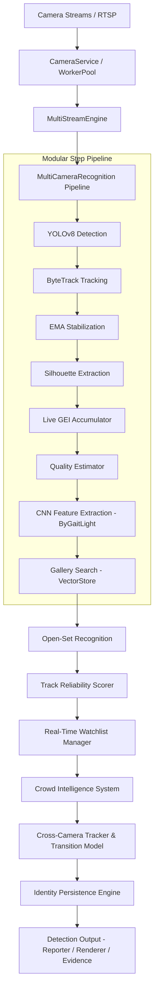

# ARGUS AI

A modular spatial-temporal gait recognition, multi-object tracking, and multi-camera surveillance intelligence framework.

[](file:///e:/ARGUS_AI/)
[](file:///e:/ARGUS_AI/LICENSE)
[](https://github.com/chanuka8/argus-gait-recognition/actions/workflows/CI.yaml)
[](file:///e:/ARGUS_AI/)
[](file:///e:/ARGUS_AI/pipeline/multi_camera_recognition.py)
[](file:///e:/ARGUS_AI/intelligence/open_set_recognizer.py)
[](file:///e:/ARGUS_AI/intelligence/crowd_robustness_manager.py)
[](file:///e:/ARGUS_AI/intelligence/missing_person_workflow.py)
[](https://github.com/ultralytics/ultralytics)
[](https://pytorch.org/)
[](https://opencv.org/)
[](https://github.com/astral-sh/ruff)
[](file:///e:/ARGUS_AI/tests)
[](file:///e:/ARGUS_AI/VERSION)

---

## Features

### Core Recognition
- **YOLOv8 Person Detection**: Deep learning bounding box localization ([pipeline/detection/person_detector.py](file:///e:/ARGUS_AI/pipeline/detection/person_detector.py)).
- **ByteTrack Multi-Object Tracking**: Track ID assignment using ByteTrack and IoU algorithms ([pipeline/steps/tracking.py](file:///e:/ARGUS_AI/pipeline/steps/tracking.py)).
- **EMA Bounding Box Stabilization**: Exponential Moving Average coordinate filter eliminating detection jitter ([utils/box_stabilizer.py](file:///e:/ARGUS_AI/utils/box_stabilizer.py)).
- **Silhouette Extraction**: Segmented human contour isolation and morphological cleaning ([pipeline/steps/silhouette_step.py](file:///e:/ARGUS_AI/pipeline/steps/silhouette_step.py)).
- **Live GEI Generation**: Rolling sequence aggregation of 30 frames into 2D Gait Energy Images ([pipeline/steps/live_gei.py](file:///e:/ARGUS_AI/pipeline/steps/live_gei.py)).
- **CNN Gait Recognition**: 256-dimensional gait signature extraction via lightweight `ByGaitLight` CNN ([models/architectures/bygait_light.py](file:///e:/ARGUS_AI/models/architectures/bygait_light.py)).
- **Gallery Matching**: Biometric template indexing and fast vector retrieval ([storage/vector_store.py](file:///e:/ARGUS_AI/storage/vector_store.py)).
- **Cosine Similarity Matching**: Cosine distance evaluation between live embeddings and gallery candidates ([storage/vector_store.py](file:///e:/ARGUS_AI/storage/vector_store.py)).

### Recognition Intelligence
- **Open-Set Recognition**: Three-state identity classification (`KNOWN`, `UNKNOWN`, `UNCERTAIN`) evaluating top-1 similarity thresholds (`known_threshold=0.85`, floor `unknown_threshold=0.70`) and candidate margin constraints (`margin_threshold=0.05`) ([intelligence/open_set_recognizer.py](file:///e:/ARGUS_AI/intelligence/open_set_recognizer.py)).
- **Track Reliability Score**: Multi-source evidence scoring producing a normalized index in $[0.0, 1.0]$, explicitly decoupling identity confidence from physical track stability ([intelligence/track_reliability_scorer.py](file:///e:/ARGUS_AI/intelligence/track_reliability_scorer.py)).
- **Quality-Aware Recognition**: Area, symmetry, and sharpness evaluation to gate low-quality silhouettes before feature extraction ([pipeline/steps/quality_estimator.py](file:///e:/ARGUS_AI/pipeline/steps/quality_estimator.py), [intelligence/quality_assessment.py](file:///e:/ARGUS_AI/intelligence/quality_assessment.py)).
- **Temporal Verification**: Sliding-window majority vote verification over consecutive frames to prevent transient misclassifications ([pipeline/steps/temporal_gait_verifier.py](file:///e:/ARGUS_AI/pipeline/steps/temporal_gait_verifier.py)).
- **Prediction Smoothing**: Temporal history aggregation preventing rapid state oscillation ([pipeline/steps/temporal_gait_verifier.py](file:///e:/ARGUS_AI/pipeline/steps/temporal_gait_verifier.py)).

### Multi-Camera
- **Multi-Camera Tracking**: Global track assignment (`GTRACK-XXXX`) and multi-stream trajectory management ([intelligence/cross_camera_tracker.py](file:///e:/ARGUS_AI/intelligence/cross_camera_tracker.py)).
- **Camera Transition Modeling**: Directed topology graph enforcing expected travel-time windows $[T_{min}, T_{max}]$, transition probabilities, entry/exit zones, and candidate tie resolution ([intelligence/camera_transition_model.py](file:///e:/ARGUS_AI/intelligence/camera_transition_model.py)).
- **Cross-Camera Identity Persistence**: Accumulated score decay ($\alpha=0.90$) and duplicate alert suppression across streams ([intelligence/identity_persistence.py](file:///e:/ARGUS_AI/intelligence/identity_persistence.py)).
- **Crowd-Robust Detection**: Adaptive gating, IoU tuning, and threshold adjustments under high spatial density ([intelligence/crowd_robustness_manager.py](file:///e:/ARGUS_AI/intelligence/crowd_robustness_manager.py)).

### Operational Intelligence
- **Real-Time Watchlist Integration**: Dynamic target identity registration, priority category routing, and instant match notification triggers ([intelligence/missing_person_workflow.py](file:///e:/ARGUS_AI/intelligence/missing_person_workflow.py)).
- **Crowd Density Estimation**: Real-time person count, area occupancy calculation, and density level classification (`LOW`, `MODERATE`, `HIGH`, `SEVERE`) ([intelligence/crowd_density_estimator.py](file:///e:/ARGUS_AI/intelligence/crowd_density_estimator.py)).
- **Crowd Occlusion Analysis**: Overlap ratio assessment and occlusion status tracking across crowded scenes ([intelligence/crowd_occlusion_analyzer.py](file:///e:/ARGUS_AI/intelligence/crowd_occlusion_analyzer.py)).
- **Recognition Deferral**: Deferring low-confidence or heavily occluded identity decisions until clean sequence evidence accumulates ([intelligence/recognition_deferral_engine.py](file:///e:/ARGUS_AI/intelligence/recognition_deferral_engine.py)).
- **Track Recovery**: Re-identifying lost object tracks using spatial-temporal motion constraints and feature similarity ([intelligence/track_recovery_manager.py](file:///e:/ARGUS_AI/intelligence/track_recovery_manager.py)).
- **Crowd Intelligence System**: High-level coordinator unifying crowd density, occlusion analysis, deferral, and multi-camera evidence fusion ([intelligence/crowd_intelligence_system.py](file:///e:/ARGUS_AI/intelligence/crowd_intelligence_system.py)).

### Performance & Infrastructure
- **Configurable Crowd Robustness**: Parameterized density thresholds and adaptive gating via YAML ([configs/inference.yaml](file:///e:/ARGUS_AI/configs/inference.yaml)).
- **Configurable Watchlist**: YAML-driven alert thresholds, cooldown durations, and watchlist integration controls ([configs/inference.yaml](file:///e:/ARGUS_AI/configs/inference.yaml)).
- **Modular Pipeline**: Cleanly decoupled processing step interfaces for custom step replacement ([pipeline/steps/](file:///e:/ARGUS_AI/pipeline/steps/)).
- **YAML Configuration**: Centralized, hierarchical parameter specification across inference, camera networks, and pipeline modules ([configs/inference.yaml](file:///e:/ARGUS_AI/configs/inference.yaml), [configs/cameras.yaml](file:///e:/ARGUS_AI/configs/cameras.yaml)).

---

## Technology Stack

- **Python**: Core implementation language (Python 3.11+).
- **PyTorch**: Deep learning backend for `ByGaitLight` CNN feature extraction and vector operations.
- **YOLOv8**: Object detection network for high-precision human bounding box localization.
- **OpenCV**: Computer vision operations, silhouette segmentation, image processing, and display rendering.
- **NumPy**: Numerical array computations, vector distance calculation, and GEI accumulation.
- **ByteTrack**: Multi-object tracking algorithm for consistent local track ID assignment.
- **FastAPI & Uvicorn**: Lightweight HTTP REST API server engine and schema definitions ([api/server.py](file:///e:/ARGUS_AI/api/server.py)).
- **YAML**: Configuration serialization via PyYAML.

---

## System Architecture


```mermaid
graph TD
    RTSP[Camera Streams / RTSP] --> CS[CameraService / WorkerPool]
    CS --> MSE[MultiStreamEngine]
    MSE --> MCR[MultiCameraRecognition Pipeline]
    
    subgraph Modular Step Pipeline
        MCR --> DET[YOLOv8 Detection]
        DET --> TRK[ByteTrack Tracking]
        TRK --> EMA[EMA Stabilization]
        EMA --> SIL[Silhouette Extraction]
        SIL --> GEI[Live GEI Accumulator]
        GEI --> QUA[Quality Estimator]
        QUA --> FEA[CNN Feature Extraction - ByGaitLight]
        FEA --> MAT[Gallery Search - VectorStore]
    end

    MAT --> OSR[Open-Set Recognition]
    OSR --> TRS[Track Reliability Scorer]
    TRS --> WLM[Real-Time Watchlist Manager]
    WLM --> CIS[Crowd Intelligence System]
    CIS --> CCT[Cross-Camera Tracker & Transition Model]
    CCT --> IDP[Identity Persistence Engine]
    IDP --> REP[Detection Output - Reporter / Renderer / Evidence]
```

---

## Recognition Pipeline

The end-to-end processing pipeline transforms raw camera video frames into validated biometric identity predictions:

1. **Frame Ingestion**: Video frames are captured via RTSP, USB webcam, or video files by `MultiStreamEngine` or `CameraService`.
2. **Detection & Stabilization**: `PersonDetector` locates human bounding boxes. Coordinates are filtered through `BoxStabilizer` using Exponential Moving Average (EMA) smoothing to eliminate detection jitter.
3. **Local Tracking**: `TrackingStep` (ByteTrack / IoU) updates local track trajectories and maintains unique `(camera_id, local_track_id)` keys.
4. **Silhouette Extraction**: `SilhouetteStep` isolates human silhouette contours using background subtraction and crops images to a standard $64 \times 128$ resolution.
5. **Live GEI Accumulation**: `LiveGEI` accumulates rolling 30-frame sequence buffers to generate static 2D Gait Energy Images.
6. **Quality Gate**: `QualityEstimator` measures GEI area, lateral symmetry, and sharpness, gating low-quality silhouettes from downstream matching.
7. **Embedding Generation**: The 2D GEI is processed through the lightweight `ByGaitLight` CNN to produce a 256-dimensional L2-normalized gait embedding vector.
8. **Vector Gallery Matching**: Cosine similarity is computed against target gallery embeddings in `VectorStore`. If enabled, secondary ReID features are combined via `DualModalFusion`.
9. **Open-Set Decision**: `OpenSetRecognizer` evaluates candidate scores into `KNOWN`, `UNKNOWN`, or `UNCERTAIN` states using configured similarity floors and candidate margin thresholds.
10. **Track Reliability Scoring**: `TrackReliabilityScorer` computes multi-source evidence reliability scores in $[0.0, 1.0]$, explicitly decoupling identity confidence from physical track stability.
11. **Real-Time Watchlist Integration**: Matches are checked against active watchlist target entries in `WatchlistManager` (`MissingPersonWorkflow`) to trigger alerts and priority routing.
12. **Crowd Intelligence System**: `CrowdIntelligenceSystem` evaluates crowd density, occlusion ratios, recognition deferrals, and multi-camera evidence fusion.
13. **Cross-Camera Transition & Persistence**: `CrossCameraTracker` queries `CameraTransitionModel` to evaluate directed topology graphs and travel-time bounds $[T_{min}, T_{max}]$, while `IdentityPersistence` applies temporal score decay, checks alert cooldowns, and emits outputs to `DetectionReporter` and `DetectionDisplayRenderer`.

---

## Project Structure

```text
ARGUS_AI/
├── api/                   # FastAPI server stubs and request schemas
├── configs/               # System, inference, camera, and GEI YAML configurations
├── evaluation/            # Open-set, cross-view, dataset split, and leakage evaluators
├── intelligence/          # Open-set recognizer, track reliability, watchlist, crowd intelligence, transition model
├── models/                # ByGaitLight CNN, OSNet ReID backbone, loss functions, gallery storage
├── monitoring/            # Camera health monitor, watchdog daemon, logging infrastructure
├── pipeline/              # Live, multi-camera, video, and folder recognition orchestrators
│   └── steps/             # Modular pipeline steps (detection, tracking, silhouette, GEI, quality)
├── security_layer/        # Security engine and audit logging
├── services/              # Camera discovery, ONVIF client, worker threads, service manager
├── storage/               # Vector store, evidence manager, dataset loader
├── streaming/             # Multi-stream engine, load balancer, buffer queue, camera scheduler
├── tests/                 # 210 automated unit and integration test files
└── utils/                 # Display renderer, detection reporter, alert manager, box stabilizer
```

---

## Installation

### Prerequisites
- **Python**: 3.11 or higher
- **OS**: Windows 10/11 or Linux (Ubuntu 20.04+)
- **GPU** (Optional): CUDA-compatible GPU for accelerated PyTorch execution

### Virtual Environment Setup

#### Windows (PowerShell)
```powershell
python -m venv venv
.\venv\Scripts\Activate.ps1
pip install -r requirements.txt
```

#### Linux / macOS (Bash)
```bash
python3 -m venv venv
source venv/bin/activate
pip install -r requirements.txt
```

---

## Configuration

System operations are configured via YAML files in `configs/`:

- **[configs/cameras.yaml](file:///e:/ARGUS_AI/configs/cameras.yaml)**: Defines RTSP camera endpoints, resolution, framerates, worker pool limits, and ONVIF discovery parameters.
- **[configs/inference.yaml](file:///e:/ARGUS_AI/configs/inference.yaml)**: Controls matching policy thresholds, open-set recognition, track reliability scoring, watchlist integration, crowd robustness, crowd intelligence, box stability EMA, ReID settings, GEI quality parameters, temporal verification, and camera transition topology.

---

## Usage

All primary workflows are accessible via [cli.py](file:///e:/ARGUS_AI/cli.py).

### System Health Check
```bash
python cli.py --mode health
```

### Multi-Camera Recognition Stream
```bash
python cli.py --mode multi-camera
```

### Video File Recognition
```bash
python cli.py --mode recognize-video --video "path/to/sample.mp4"
```

### Build Biometric Gallery
```bash
python cli.py --mode gallery
```

### Run Model Evaluation
```bash
python cli.py --mode evaluate
```

### System Integration & Diagnostic Test
```bash
python cli.py --mode production-test
```

---

## Testing

Verification is enforced via automated test suites, bytecode compilation, and code style compliance checks:

```bash
# 1. Bytecode compilation check
python -m compileall -x "venv|\.venv" .

# 2. Linting and code style verification
ruff check .

# 3. Full repository test suite (210 tests)
pytest -q
```

### Current Test Status
- **Ruff Linting**: Pass (`ruff check .` compliant with 0 errors)
- **Bytecode Compilation**: Pass (`python -m compileall` check clean)
- **Automated Tests**: **210 passed** (100% passing across 18 test modules)
- **Warnings**: 1 non-blocking warning (`ByteTrack` deprecation warning from upstream tracking package)

---

## Development & Code Quality

- **Code Style**: Checked using `ruff`. Run `ruff check .` to verify formatting compliance (`All checks passed!`).
- **Type Annotations**: Comprehensive type hints used across `intelligence/`, `pipeline/`, `services/`, and `storage/`.
- **Thread Safety**: Mutable shared state objects use `threading.Lock()` wrappers to guarantee thread-safe operations across multi-camera worker threads.
- **Modular Pipeline Design**: Custom processing steps implement explicit step interfaces to maintain low coupling.

---

## Performance Notes

### Implemented Code-Level Optimizations
- **Sequence Compression**: 30 video frames aggregated into a single $64 \times 128$ 2D GEI representation, reducing downstream network compute by ~30x.
- **Lightweight CNN Architecture**: `ByGaitLight` designed with minimal parameter footprint (126,144 parameters) for fast CPU/GPU inference.
- **Backpressure Frame Dropping**: `FrameDropper` drops oldest frames under queue congestion to preserve real-time streaming latency.
- **EMA Coordinate Smoothing**: `BoxStabilizer` reduces detection jitter without full model re-detection on every sub-frame.

---

## Limitations

- **Gait View Requirements**: Requires clear side or diagonal walking profiles (~30 consecutive frames) to construct valid GEIs.
- **Webcam Constraints**: Stationary upper-body webcam feeds do not supply leg/stride movement signatures required for gait recognition.
- **Plain-Text Credentials**: RTSP stream passwords in `configs/cameras.yaml` are stored unencrypted in plain text.
- **API Server Status**: The FastAPI server ([api/server.py](file:///e:/ARGUS_AI/api/server.py)) currently provides route stubs and requires completion to expose full live stream controls over HTTP.

---

## Project Status

### Implemented
- [x] YOLOv8 person detection & ByteTrack multi-object tracking
- [x] Exponential Moving Average (EMA) bounding box coordinate stabilization
- [x] Silhouette segmentation and Live GEI 30-frame sequence builder
- [x] `ByGaitLight` lightweight CNN gait embedding model
- [x] Vector Store biometric gallery indexing & cosine similarity search
- [x] Open-Set Recognition (`KNOWN`, `UNKNOWN`, `UNCERTAIN` classification with margin logic)
- [x] Track Reliability Scorer (`TrackReliabilityScorer` multi-evidence index)
- [x] Real-Time Watchlist Integration (`WatchlistManager` / `MissingPersonWorkflow`)
- [x] Crowd Intelligence System (Crowd Density Estimator, Occlusion Analyzer, Recognition Deferral Engine, Track Recovery)
- [x] `CrossCameraTracker` global track ID management & directed `CameraTransitionModel` topology
- [x] `IdentityPersistence` score decay & alert cooldown suppression
- [x] `QualityEstimator` & `TemporalGaitVerifier` filtering steps
- [x] `MultiStreamEngine`, `WorkerPool`, `LoadBalancer`, and `Watchdog`
- [x] ONVIF discovery & vendor adapters
- [x] 210 automated unit and integration tests passing with 0 failures

### Experimental
- [ ] Dual-Modal ReID & Gait score fusion (`intelligence/dual_modal_fusion.py`)
- [ ] Spatial-Temporal Camera Topology Auto-Learning (`intelligence/camera_topology_learner.py`)
- [ ] Multi-Camera Evidence Fusion (`intelligence/multi_camera_evidence_fusion.py`)

### Planned
- [ ] Complete HTTP REST API endpoints for full camera stream controls
- [ ] Web-based GUI Dashboard for live multi-camera monitoring
- [ ] Encrypted credentials storage for RTSP stream security

---

## Repository Statistics

- **Primary Language**: Python (100%)
- **Core Packages**: `pipeline`, `intelligence`, `models`, `services`, `streaming`, `storage`, `monitoring`, `evaluation`, `security_layer`, `utils`, `api` (11 core packages)
- **Automated Tests**: **210 passing tests**
- **Linter Status**: **0 errors** (`ruff check .` compliant)

---

## License

This project is licensed under the [MIT License](file:///e:/ARGUS_AI/LICENSE).

---

## Maintainer

**Chanuka Sandun**

Undergraduate in Cyber Security

Developer of the ARGUS AI Gait Recognition Module

- GitHub: https://github.com/chanuka8
- LinkedIn: https://www.linkedin.com/in/chanukasandun/
