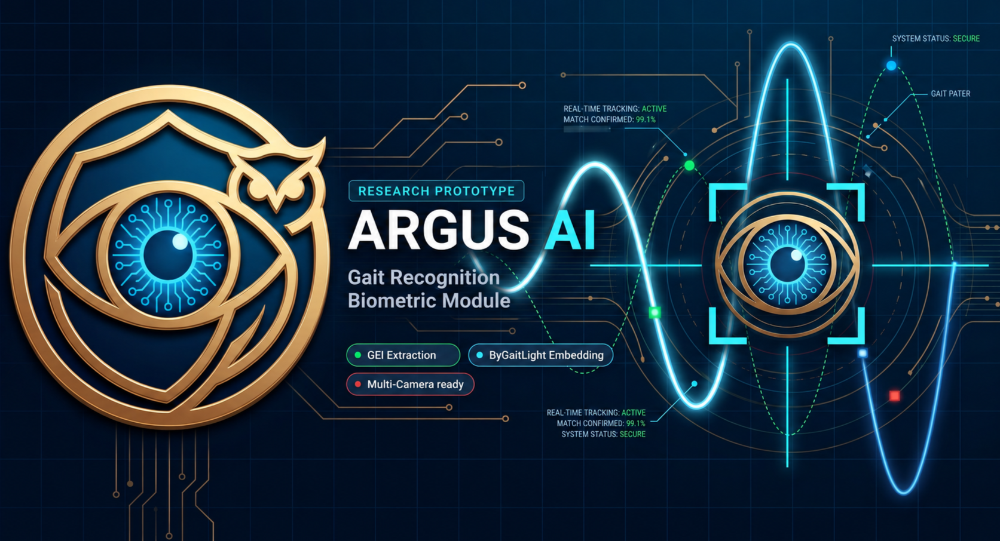
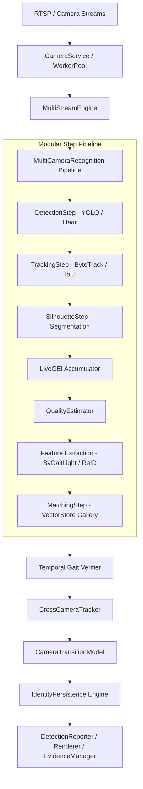

# ARGUS AI

A modular spatial-temporal gait recognition, multi-object tracking, and multi-camera surveillance intelligence framework.

[](file:///e:/ARGUS_AI/)
[](file:///e:/ARGUS_AI/LICENSE)
[](file:///e:/ARGUS_AI/)
[](https://github.com/astral-sh/ruff)
[](file:///e:/ARGUS_AI/tests)
[](file:///e:/ARGUS_AI/VERSION)

---

## Features

### Recognition Pipeline
- **Human Detection**: Deep learning bounding box localization with Exponential Moving Average (EMA) box stabilization ([utils/box_stabilizer.py](file:///e:/ARGUS_AI/utils/box_stabilizer.py)).
- **Multi-Object Tracking**: Local track ID assignment using ByteTrack and IoU tracking algorithms ([pipeline/steps/tracking.py](file:///e:/ARGUS_AI/pipeline/steps/tracking.py)).
- **Silhouette Extraction**: Segmented human contour isolation and morphological cleaning ([pipeline/steps/silhouette_step.py](file:///e:/ARGUS_AI/pipeline/steps/silhouette_step.py)).
- **Live GEI Generation**: Rolling sequence aggregation of 30 frames into 2D Gait Energy Images ([pipeline/steps/live_gei.py](file:///e:/ARGUS_AI/pipeline/steps/live_gei.py)).
- **ByGaitLight Feature Embedding**: 256-dimensional gait signature extraction via custom CNN ([models/architectures/bygait_light.py](file:///e:/ARGUS_AI/models/architectures/bygait_light.py)).
- **Appearance ReID & Dual-Modal Fusion**: Secondary OSNet appearance embedding and adaptive quality-weighted score fusion ([intelligence/dual_modal_fusion.py](file:///e:/ARGUS_AI/intelligence/dual_modal_fusion.py)).
- **Gallery Vector Search**: Fast cosine similarity metric indexing against target biometric templates ([storage/vector_store.py](file:///e:/ARGUS_AI/storage/vector_store.py)).

### Intelligence Layer
- **Cross-Camera Tracking**: Global track assignment (`GTRACK-XXXX`) and multi-stream trajectory management ([intelligence/cross_camera_tracker.py](file:///e:/ARGUS_AI/intelligence/cross_camera_tracker.py)).
- **Camera Transition Model**: Spatial-temporal directed topology modeling enforcing expected travel-time windows $[T_{min}, T_{max}]$, transition probabilities, entry/exit zones, and deterministic candidate tie resolution ([intelligence/camera_transition_model.py](file:///e:/ARGUS_AI/intelligence/camera_transition_model.py)).
- **Identity Persistence & Cooldown**: Accumulated score decay ($\alpha=0.90$) and duplicate alert suppression ([intelligence/identity_persistence.py](file:///e:/ARGUS_AI/intelligence/identity_persistence.py)).
- **GEI Quality Estimation**: Area, symmetry, and sharpness evaluation to gate low-quality silhouettes ([pipeline/steps/quality_estimator.py](file:///e:/ARGUS_AI/pipeline/steps/quality_estimator.py)).
- **Temporal Verification**: Sliding window vote smoothing to prevent transient misclassifications ([pipeline/steps/temporal_gait_verifier.py](file:///e:/ARGUS_AI/pipeline/steps/temporal_gait_verifier.py)).
- **Missing Person Search Workflow**: Watchlist registration and priority match notifications ([intelligence/missing_person_workflow.py](file:///e:/ARGUS_AI/intelligence/missing_person_workflow.py)).

### Streaming & Infrastructure
- **Multi-Camera Engine**: Thread-safe RTSP stream ingestion engine ([streaming/multi_stream_engine.py](file:///e:/ARGUS_AI/streaming/multi_stream_engine.py)).
- **Worker Pool & Load Balancer**: Dynamic camera allocation and queue backpressure frame dropping ([streaming/load_balancer.py](file:///e:/ARGUS_AI/streaming/load_balancer.py)).
- **ONVIF & Vendor Discovery**: Network ONVIF WS-Discovery client and Hikvision/Dahua/Axis vendor adapters ([services/onvif_client.py](file:///e:/ARGUS_AI/services/onvif_client.py)).
- **Watchdog Daemon**: Process monitoring and automatic worker thread restart on stream stalls ([monitoring/watchdog.py](file:///e:/ARGUS_AI/monitoring/watchdog.py)).

### Utilities & Operations
- **Unified Configuration**: YAML-based modular configuration management ([configs/inference.yaml](file:///e:/ARGUS_AI/configs/inference.yaml), [configs/cameras.yaml](file:///e:/ARGUS_AI/configs/cameras.yaml)).
- **Telemetry & Evidence**: Thread-safe JSONL/CSV report generation and image snapshot archiving ([utils/detection_reporter.py](file:///e:/ARGUS_AI/utils/detection_reporter.py), [storage/evidence_manager.py](file:///e:/ARGUS_AI/storage/evidence_manager.py)).
- **CCTV Display Overlay**: Color-coded status frames (`CONFIRMED`, `VERIFIED`, `REVIEW_REQUIRED`, `UNKNOWN`) ([utils/display_renderer.py](file:///e:/ARGUS_AI/utils/display_renderer.py)).
- **CLI Interface**: Gateway for execution, evaluation, training, health diagnostics, and testing ([cli.py](file:///e:/ARGUS_AI/cli.py)).

---

## System Architecture


```mermaid
graph TD
    RTSP[RTSP / Camera Streams] --> CS[CameraService / WorkerPool]
    CS --> MSE[MultiStreamEngine]
    MSE --> MCR[MultiCameraRecognition Pipeline]
    
    subgraph Modular Step Pipeline
        MCR --> DET[DetectionStep - YOLO / Haar]
        DET --> TRK[TrackingStep - ByteTrack / IoU]
        TRK --> SIL[SilhouetteStep - Segmentation]
        SIL --> GEI[LiveGEI Accumulator]
        GEI --> QUA[QualityEstimator]
        QUA --> FEA[Feature Extraction - ByGaitLight / ReID]
        FEA --> MAT[MatchingStep - VectorStore Gallery]
    end

    MAT --> TGV[Temporal Gait Verifier]
    TGV --> CCT[CrossCameraTracker]
    CCT --> CTM[CameraTransitionModel]
    CTM --> IDP[IdentityPersistence Engine]
    IDP --> REP[DetectionReporter / Renderer / EvidenceManager]
```

---

## Recognition Pipeline

The end-to-end processing pipeline transforms raw camera video frames into validated biometric identity predictions:

1. **Frame Ingestion**: Video frames are captured via RTSP, USB webcam, or video files by `MultiStreamEngine` or `CameraService`.
2. **Detection & Stabilization**: `PersonDetector` locates human bounding boxes. Coordinates are filtered through `BoxStabilizer` using Exponential Moving Average (EMA) smoothing to eliminate detection jitter.
3. **Local Tracking**: `TrackingStep` (ByteTrack / IoU) updates local track trajectories and maintains unique `(camera_id, local_track_id)` keys.
4. **Silhouette Extraction**: `SilhouetteStep` isolates human silhouette contours using background subtraction and crops images to a standard $64 \times 128$ resolution.
5. **Live GEI Accumulation**: `LiveGEI` accumulates rolling 30-frame sequence buffers to generate static 2D Gait Energy Images.
6. **Quality Gate**: `QualityEstimator` measures GEI area, lateral symmetry, and sharpness, gating low-quality silhouettes from downstream matching.
7. **Embedding Generation**: The 2D GEI is processed through the lightweight `ByGaitLight` CNN to produce a 256-dimensional L2-normalized gait embedding vector.
8. **Vector Gallery Matching**: Cosine similarity is computed against target gallery embeddings in `VectorStore`. If enabled, secondary ReID features are combined via `DualModalFusion`.
9. **Temporal Verification**: `TemporalGaitVerifier` applies a sliding-window majority vote over consecutive frames to confirm target identities.
10. **Cross-Camera Transition Modeling**: `CrossCameraTracker` queries `CameraTransitionModel` to evaluate directed topology graphs, travel-time bounds $[T_{min}, T_{max}]$, and weighted transition probabilities:
    $$\text{final\_score} = w_{id} \cdot s_{id} + w_{prob} \cdot P_{trans} + w_{time} \cdot L_{time}$$
11. **Identity Persistence & Output**: `IdentityPersistence` applies temporal score decay, checks alert cooldowns, and emits outputs to `DetectionReporter` (JSONL/CSV logs and snapshot images) and `DetectionDisplayRenderer` overlays.

---

## Project Structure

```text
ARGUS_AI/
├── api/                   # FastAPI server stubs and request schemas
├── configs/               # System, inference, camera, and GEI YAML configurations
├── evaluation/            # Open-set, cross-view, dataset split, and leakage evaluators
├── intelligence/          # Cross-camera tracking, transition model, persistence, fusion
├── models/                # ByGaitLight CNN, OSNet ReID backbone, loss functions, gallery storage
├── monitoring/            # Camera health monitor, watchdog daemon, logging infrastructure
├── pipeline/              # Live, multi-camera, video, and folder recognition orchestrators
│   └── steps/             # Modular pipeline steps (detection, tracking, silhouette, GEI, quality)
├── security_layer/        # Security engine and audit logging
├── services/              # Camera discovery, ONVIF client, worker threads, service manager
├── storage/               # Vector store, evidence manager, dataset loader
├── streaming/             # Multi-stream engine, load balancer, buffer queue, camera scheduler
├── tests/                 # 152 automated unit and integration test files
└── utils/                 # Display renderer, detection reporter, alert manager, box stabilizer
```

---

## Installation

### Prerequisites
- **Python**: 3.11 or higher
- **OS**: Windows 10/11 or Linux (Ubuntu 20.04+)
- **GPU** (Optional): CUDA-compatible GPU for accelerated PyTorch execution

### Virtual Environment Setup

#### Windows (PowerShell)
```powershell
python -m venv venv
.\venv\Scripts\Activate.ps1
pip install -r requirements.txt
```

#### Linux / macOS (Bash)
```bash
python3 -m venv venv
source venv/bin/activate
pip install -r requirements.txt
```

---

## Configuration

System operations are configured via YAML files in `configs/`:

- **[configs/cameras.yaml](file:///e:/ARGUS_AI/configs/cameras.yaml)**: Defines RTSP camera endpoints, resolution, framerates, worker pool limits, and ONVIF discovery parameters.
- **[configs/inference.yaml](file:///e:/ARGUS_AI/configs/inference.yaml)**: Controls matching policy thresholds, crowd control limits, box stability EMA, ReID settings, GEI quality parameters, temporal verification windows, and camera transition topology:

```yaml
camera_transitions:
  enabled: true
  similarity_threshold: 0.50
  max_history_seconds: 300.0
  allow_same_camera: false
  weights:
    identity_similarity: 0.60
    transition_probability: 0.20
    travel_time_likelihood: 0.20
  camera_transitions:
    camera_01:
      camera_02:
        min_travel_seconds: 5.0
        max_travel_seconds: 30.0
        probability: 0.80
```

---

## Usage

All primary workflows are accessible via [cli.py](file:///e:/ARGUS_AI/cli.py).

### System Health Check
```bash
python cli.py --mode health
```

### Multi-Camera Recognition Stream
```bash
python cli.py --mode multi-camera
```

### Video File Recognition
```bash
python cli.py --mode recognize-video --video "path/to/sample.mp4"
```

### Build Biometric Gallery
```bash
python cli.py --mode gallery
```

### Run Model Evaluation
```bash
python cli.py --mode evaluate
```

### System Integration & Diagnostic Test
```bash
python cli.py --mode production-test
```

---

## Testing

Verification is enforced via automated test suites and linting checks:

```bash
# 1. Bytecode compilation check
python -m compileall intelligence tests

# 2. Linting and code style verification
ruff check .

# 3. Focused Camera Transition Model test suite
pytest -q tests/test_camera_transition_model.py

# 4. Full repository test suite (152 tests)
pytest -q
```

---

## Development & Code Quality

- **Code Style**: Checked using `ruff`. Run `ruff check .` to verify formatting compliance.
- **Type Annotations**: Comprehensive type hints used across `intelligence/`, `pipeline/`, `services/`, and `storage/`.
- **Thread Safety**: Mutable shared state objects use `threading.Lock()` wrappers to guarantee thread-safe operations across multi-camera worker threads.
- **Modular Pipeline Design**: Custom processing steps implement explicit `step` interfaces to maintain low coupling.

---

## Performance Notes

### Implemented Code-Level Optimizations
- **Sequence Compression**: 30 video frames aggregated into a single $64 \times 128$ 2D GEI representation, reducing downstream network compute by ~30x.
- **Lightweight CNN Architecture**: `ByGaitLight` designed with minimal parameter footprint for fast CPU/GPU inference.
- **Backpressure Frame Dropping**: `FrameDropper` drops oldest frames under queue congestion to preserve real-time streaming latency.
- **EMA Coordinate Smoothing**: `BoxStabilizer` reduces detection jitter without full model re-detection on every sub-frame.

### Benchmarking Requirements
- Multi-camera FPS scaling across 16+ concurrent 1080p RTSP feeds requires physical multi-GPU hardware benchmarking.

---

## Limitations

- **Gait View Requirements**: Requires clear side or diagonal walking profiles (~30 consecutive frames) to construct valid GEIs.
- **Webcam Constraints**: Stationary upper-body webcam feeds do not supply leg/stride movement signatures required for gait recognition.
- **Plain-Text Credentials**: RTSP stream passwords in `configs/cameras.yaml` are stored unencrypted in plain text.
- **API Server Status**: The FastAPI server ([api/server.py](file:///e:/ARGUS_AI/api/server.py)) currently provides route stubs and requires completion to expose full live stream controls over HTTP.

---

## Roadmap

### Completed Features
- [x] YOLO human detection & ByteTrack multi-object tracking
- [x] Silhouette segmentation and Live GEI 30-frame sequence builder
- [x] `ByGaitLight` CNN gait embedding model
- [x] Vector Store identity gallery indexing & search
- [x] Dual-Modal ReID & Gait score fusion
- [x] `CrossCameraTracker` global track ID management
- [x] Directed `CameraTransitionModel` with travel-time window scoring
- [x] `IdentityPersistence` score decay & alert suppression
- [x] `QualityEstimator` & `TemporalGaitVerifier` filtering steps
- [x] `MultiStreamEngine`, `WorkerPool`, `LoadBalancer`, and `Watchdog`
- [x] ONVIF discovery & vendor adapters
- [x] 152 automated unit and integration tests passing with 0 failures

### In Progress
- [ ] Field evaluation on physical outdoor CCTV hardware streams
- [ ] Spatial-temporal transition parameter tuning across multi-building camera networks

### Planned
- [ ] Full FastAPI REST endpoint integration with `ArgusService` engine
- [ ] RTSP credential encryption and environment variable injection
- [ ] Model export to ONNX Runtime and TensorRT execution providers
- [ ] Web-based React/Next.js monitoring dashboard UI

---

## Repository Statistics

- **Primary Language**: Python (100%)
- **Core Packages**: `pipeline`, `intelligence`, `models`, `services`, `streaming`, `storage`, `monitoring`, `evaluation`, `security_layer`, `utils`, `api` (11 core packages)
- **Automated Tests**: **152 passing tests** across 16 test modules
- **Linter Status**: **0 errors** (`ruff check .` compliant)

---

## License

This project is licensed under the [MIT License](file:///e:/ARGUS_AI/LICENSE).
