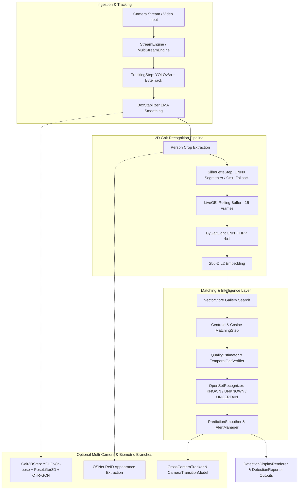
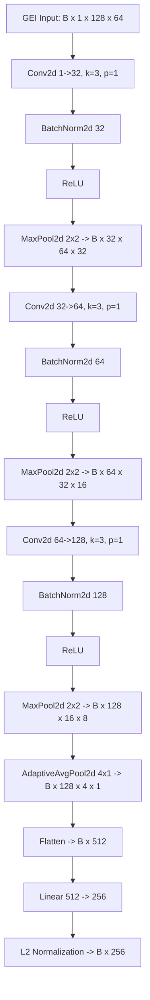
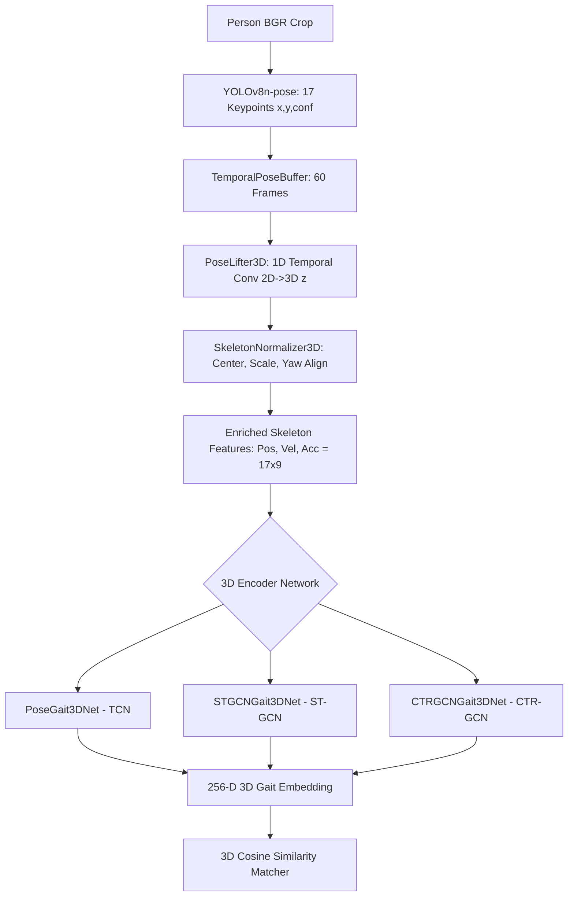
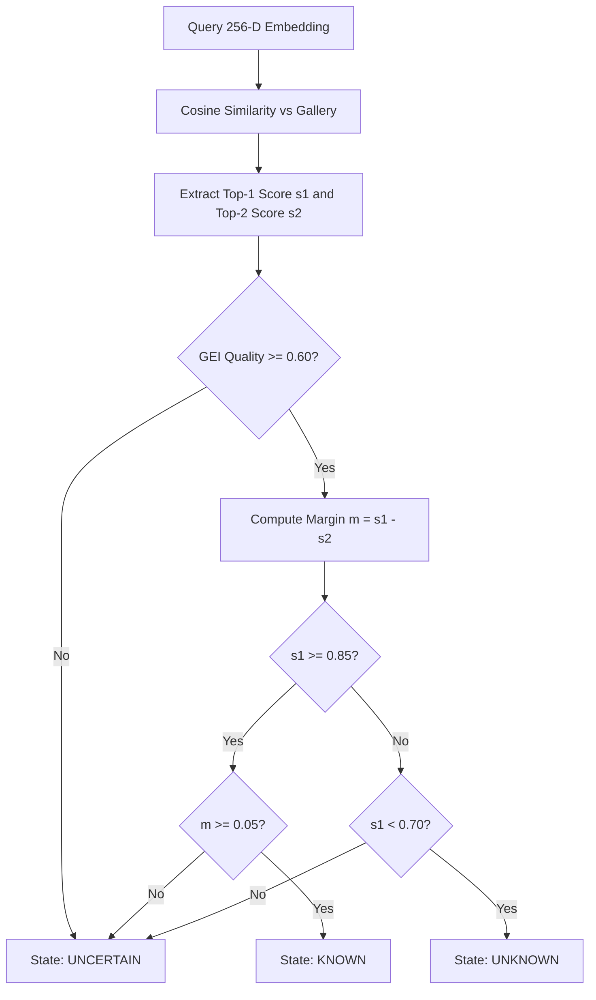

# ARGUS AI: Authoritative Complete Current Architecture Reconstruction

**Audited Commit:** `78f229ae9d55dce517c6b15685b6c61ed29f0764`  
**Branch:** `main`  
**Working Tree Status:** Modified (`scripts/run_ablation_study.py`)  
**Audit Date:** 2026-08-11  

---

## Executive Summary

ARGUS AI is a production-grade, multi-camera gait recognition and biometric surveillance system designed for open-set identification. The primary biometrics engine relies on **2D Gait Energy Images (GEI)** processed via a custom lightweight Convolutional Neural Network with Horizontal Pyramid Pooling (**ByGaitLight**) producing 256-dimensional L2-normalized embeddings.

The system features an **optional 3D Pose Gait** branch (YOLOv8-pose keypoints $\rightarrow$ 2D-to-3D temporal pose lifting $\rightarrow$ TCN / ST-GCN / CTR-GCN) and an **optional Appearance ReID** branch (OSNet). By default, both optional branches are disabled in `configs/inference.yaml` (`gait_3d.enabled: false`, `reid.enabled: false`), keeping the **2D GEI pipeline as the sole active primary recognition engine**.

**2D/3D Fusion Notice:** Dual-modal fusion (`DualModalFusion`) is implemented exclusively for 2D Gait + Appearance ReID. **No joint 2D+3D gait fusion engine is implemented**; the 3D pose gait pipeline operates as an independent alternate recognition branch.

---

## 1. Repository Directory Structure & Responsibilities

| Directory | Core Responsibility | Active System Integrations |
| :--- | :--- | :--- |
| `api/` | RESTful API service endpoints (FastAPI / Uvicorn). | `api.server:app` provides status, recognition endpoints, and live stream control. |
| `configs/` | Centralized YAML & JSON configurations. | `inference.yaml`, `system.yaml`, `detection.yaml`, `cameras.yaml`, `gei.yaml`, `subject_split.json`. |
| `core/` | System lifecycle, threshold management, logging, health checks. | `ArgusSystem`, `ThresholdManager`, `Logger`, `SystemMonitor`. |
| `data/` | Raw dataset storage, CASIA-B processed GEIs, and input buffer streams. | `data/casia_processed/gei`, `data/new_input`. |
| `deployment/` | Packaging scripts, readiness checks, and ONNX/TensorRT export tools. | `export_onnx.py`, `export_tensorrt.py`, deployment health validators. |
| `enrollment/` | Subject gallery enrollment services and folder watchers. | `AutoEnrollmentService`, `EnrollmentManager`, `FolderWatcher`, `GalleryUpdater`. |
| `evaluation/` | Offline performance metrics, leakage validation, ROC analysis, threshold calibration. | `Evaluator`, `Evaluator3D`, `OpenSetEvaluator`, `ThresholdCalibrator`, `LeakageValidator`. |
| `intelligence/` | Open-set logic, multi-camera tracking, cross-camera topology, dual-modal fusion, track reliability. | `OpenSetRecognizer`, `CrossCameraTracker`, `CameraTransitionModel`, `DualModalFusion`, `TrackReliabilityScorer`. |
| `models/` | Neural network architectures, active weights, ONNX/TensorRT engines, gallery stores. | `ByGaitLight`, `PoseGait3DNet`, `STGCNGait3DNet`, `CTRGCNGait3DNet`, `VectorStore`. |
| `monitoring/` | System logs, performance metrics trackers, and watchdog process monitors. | `SystemMonitor`, `Watchdog`, centralized logging setup. |
| `pipeline/` | End-to-end execution engines (Live, Video, Folder, Multi-Camera). | `LiveRecognitionPipeline`, `MultiCameraRecognitionPipeline`, `FolderRecognitionPipeline`. |
| `preprocessing/` | CASIA-B dataset extractors, silhouette alignment, GEI generators, 2D/3D skeleton builders. | `CasiaExtractor`, `GEIBuilder`, `SilhouetteExtractor`, `SkeletonExtractor`. |
| `scripts/` | Command-line operational routines, evaluation sweeps, training triggers, benchmarks. | `train_model.py`, `evaluate_model.py`, `run_auto_enrollment.py`, `benchmark.py`. |
| `security_layer/` | Access security, RTSP credential vault, API authorization, security event engine. | `SecurityEngine`, `CredentialsVault`. |
| `services/` | Background daemons, background auto-enrollment workers. | `AutoEnrollmentWatcherService`. |
| `storage/` | Vector database abstraction for gallery feature embeddings. | `VectorStore` (`gallery_features.npy`, `gallery_labels.npy`, `gallery_metadata.json`). |
| `streaming/` | Thread-safe RTSP/USB/File frame capture and multi-camera stream queueing. | `StreamEngine`, `MultiStreamEngine`. |
| `tests/` | Unit, integration, security, and benchmark test suites. | PyTorch/Pytest test suites in `tests/unit/` and `tests/integration/`. |
| `training/` | Training loops, PyTorch datasets/dataloaders, loss functions, learning rate schedulers. | `Trainer`, `Gait3DTrainer`, `GEIDataset`, `ConditionBalancedSampler`, `JointGaitLoss`. |
| `utils/` | Box stabilization, visual rendering, reporting, prediction smoothing, alert management. | `BoxStabilizer`, `DetectionDisplayRenderer`, `DetectionReporter`, `PredictionSmoother`, `AlertManager`. |

---

## 2. Complete Main 2D Gait Recognition Pipeline

### End-to-End Pipeline Execution Trace:
$$\text{Video/RTSP Input} \xrightarrow{} \text{StreamEngine} \xrightarrow{} \text{TrackingStep (YOLOv8n + ByteTrack)} \xrightarrow{} \text{BoxStabilizer} \xrightarrow{} \text{Person Crop} \xrightarrow{} \text{SilhouetteStep (ONNX / Otsu)} \xrightarrow{} \text{LiveGEI (15 frames)} \xrightarrow{} \text{ByGaitLight (HPP 4x1)} \xrightarrow{} \text{256-D L2 Embedding} \xrightarrow{} \text{MatchingStep / CentroidMatchingStep} \xrightarrow{} \text{OpenSetRecognizer (3-State)} \xrightarrow{} \text{PredictionSmoother} \xrightarrow{} \text{DetectionDisplayRenderer}$$

### Stage-by-Stage Detailed Specification

```
+--------------------------------------------------------------------------------------------------------------------+
| STAGE 1: Frame Ingestion                                                                                           |
| Source File: streaming/stream_engine.py -> StreamEngine                                                            |
| Input: RTSP stream / USB camera (Index 0) / Video File MP4                                                          |
| Output: BGR Numpy Array Frame                                                                                      |
| Data Shape: (480, 640, 3) uint8 (Configurable via system.yaml)                                                    |
| Configuration Keys: camera.type, camera.device_index, camera.width, camera.height                                 |
| Fallback: Reconnect loop (up to max_reconnect_attempts)                                                             |
| Integrated: YES (Active in main.py, live_recognition.py, multi_camera_recognition.py)                              |
+--------------------------------------------------------------------------------------------------------------------+
                                         |
                                         v
+--------------------------------------------------------------------------------------------------------------------+
| STAGE 2: Person Detection & Tracking                                                                               |
| Source File: pipeline/steps/tracking.py -> TrackingStep                                                            |
| Input: BGR Frame (H, W, 3)                                                                                         |
| Output: supervision.Detections (xyxy, confidence, tracker_id)                                                     |
| Tensor/Data Shape: xyxy: (N, 4) float32, tracker_id: (N,) int32                                                     |
| Configuration Keys: detection.yaml -> model_path ("models/weights/yolov8n.pt"), confidence (0.4), iou (0.45),    |
|                     classes ([0]), device ("cpu"), img_size (640)                                                  |
| Fallback: Local fallback to yolov8n.pt if model_path missing                                                       |
| Integrated: YES (Active primary detector/tracker)                                                                  |
+--------------------------------------------------------------------------------------------------------------------+
                                         |
                                         v
+--------------------------------------------------------------------------------------------------------------------+
| STAGE 3: Bounding Box Stabilization & Filtering                                                                    |
| Source File: utils/box_stabilizer.py -> BoxStabilizer                                                              |
| Input: Raw Detections List [(track_id, xyxy, conf)]                                                                |
| Output: Dict[track_id] -> (stable_xyxy, is_valid, is_predicted)                                                     |
| Data Shape: stable_xyxy: (4,) float32                                                                              |
| Configuration Keys: inference.yaml -> box_stability: ema_alpha (0.35), min_detection_confidence (0.35),           |
|                     min_iou_keep (0.25), max_missed_frames (8), max_jump_ratio (0.35)                              |
| Fallback: Raw box pass-through if box_stability.enabled = false                                                    |
| Integrated: YES (Active in Live & Multi-Camera pipelines)                                                          |
+--------------------------------------------------------------------------------------------------------------------+
                                         |
                                         v
+--------------------------------------------------------------------------------------------------------------------+
| STAGE 4: Person Crop Extraction                                                                                    |
| Source File: pipeline/live_recognition.py -> LiveRecognitionPipeline._crop_person                                 |
| Input: BGR Frame (H, W, 3) & Bounding Box [x1, y1, x2, y2]                                                         |
| Output: BGR Crop Sub-image                                                                                         |
| Data Shape: (h_crop, w_crop, 3) uint8                                                                              |
| Fallback: Skip frame if crop dimensions <= 0                                                                       |
| Integrated: YES                                                                                                    |
+--------------------------------------------------------------------------------------------------------------------+
                                         |
                                         v
+--------------------------------------------------------------------------------------------------------------------+
| STAGE 5: Foreground Silhouette Extraction & Alignment                                                              |
| Source File: pipeline/steps/silhouette_step.py -> SilhouetteStep / LearnedSilhouetteSegmenter                      |
| Input: BGR Crop (h_crop, w_crop, 3) uint8                                                                          |
| Output: Normalized Centered Silhouette Canvas                                                                      |
| Data Shape: (128, 64) uint8 binary (0 or 255)                                                                      |
| Configuration Keys: inference.yaml -> silhouette: method ("learned"), model_path ("models/engines/silhouette_...|
|                     segmenter.onnx"), threshold (0.5), target_size ([64, 128])                                     |
| Fallback: OtsuSilhouetteExtractor (cv2.THRESH_OTSU) if ONNX runtime/model unavailable                              |
| Integrated: YES                                                                                                    |
+--------------------------------------------------------------------------------------------------------------------+
                                         |
                                         v
+--------------------------------------------------------------------------------------------------------------------+
| STAGE 6: Gait Energy Image (GEI) Accumulation                                                                      |
| Source File: pipeline/steps/live_gei.py -> LiveGEI                                                                 |
| Input: Single 64x128 binary silhouette canvas                                                                      |
| Output: Aggregated Gait Energy Image GEI                                                                           |
| Data Shape: (128, 64) uint8 (values 0..255)                                                                        |
| Configuration Keys: gei.yaml / inference.yaml -> max_frames (15), min_frames (10), duplicate_threshold (0.98),    |
|                     cycle_detection_enabled (false default, true in gei.yaml)                                      |
| Fallback: Rolling mean over max_frames when cycle detection is disabled or unconfident                             |
| Integrated: YES                                                                                                    |
+--------------------------------------------------------------------------------------------------------------------+
                                         |
                                         v
+--------------------------------------------------------------------------------------------------------------------+
| STAGE 7: Feature Extraction & Embedding Projection                                                                 |
| Source File: models/architectures/bygait_light.py -> ByGaitLight                                                   |
| Input: GEI Tensor normalized (1, 1, 128, 64) float32 (values 0.0..1.0)                                             |
| Output: L2-Normalized Feature Vector                                                                               |
| Tensor Shape: (1, 256) float32, L2-norm = 1.0                                                                      |
| Configuration Keys: ByGaitLight(embedding_dim=256, part_bins=4)                                                   |
| Fallback: ONNX / TensorRT backend execution if PyTorch backend replaced                                            |
| Integrated: YES (Core Model)                                                                                       |
+--------------------------------------------------------------------------------------------------------------------+
                                         |
                                         v
+--------------------------------------------------------------------------------------------------------------------+
| STAGE 8: Gallery Biometric Similarity Matching                                                                     |
| Source File: pipeline/steps/matching_step.py -> MatchingStep & CentroidMatchingStep                                |
| Input: Query embedding (256,), Gallery Features Matrix (N, 256), Gallery Labels (N,)                              |
| Output: Top-1 candidate label and Cosine Similarity score                                                          |
| Configuration Keys: inference.yaml -> matching_policy: confirmed_threshold (0.92), verify_low (0.85),            |
|                     unknown_ceiling (0.70), margin (0.05), top_k (5)                                               |
| Integrated: YES                                                                                                    |
+--------------------------------------------------------------------------------------------------------------------+
                                         |
                                         v
+--------------------------------------------------------------------------------------------------------------------+
| STAGE 9: Open-Set Decision & Quality/Temporal Filtering                                                            |
| Source File: intelligence/open_set_recognizer.py -> OpenSetRecognizer                                              |
| Input: Top candidate matches [(id, score)], GEI Quality Score, Temporal Verification state                         |
| Output: OpenSetDecisionResult(state: KNOWN|UNKNOWN|UNCERTAIN, identity, score, confidence)                           |
| Configuration Keys: open_set: known_threshold (0.85), unknown_threshold (0.70), margin_threshold (0.05),          |
|                     quality_threshold (0.60)                                                                       |
| Integrated: YES                                                                                                    |
+--------------------------------------------------------------------------------------------------------------------+
                                         |
                                         v
+--------------------------------------------------------------------------------------------------------------------+
| STAGE 10: Prediction Smoothing & Display Rendering                                                                 |
| Source File: utils/prediction_smoother.py -> PredictionSmoother & utils/display_renderer.py                        |
| Input: Raw identity prediction, confidence score, track_id                                                         |
| Output: Smoother confirmed identity, Rendered Bounding Box Overlay on Display Window                               |
| Configuration Keys: inference.yaml -> matching_policy: history_size (10), min_stable_votes (3)                   |
| Integrated: YES                                                                                                    |
+--------------------------------------------------------------------------------------------------------------------+
```

---

## 3. Person Detection Specification

* **Model Family:** YOLOv8 (Ultralytics)
* **Active Weights File:** `models/weights/yolov8n.pt` (Fallback: `yolov8n.pt` in root)
* **Confidence Threshold:** `0.40` (Config: `configs/detection.yaml`)
* **NMS IoU Threshold:** `0.45`
* **Target Classes:** `[0]` (Person class only)
* **Inference Image Size (`imgsz`):** `640`
* **Device:** `"cpu"` (Configurable to `"cuda"` or `"auto"`)
* **Detector Output Format:** `supervision.Detections` containing bounding boxes `xyxy` `(N, 4) float32`, confidence scores `(N,) float32`, class IDs `(N,) int32`, and tracker IDs `(N,) int32`.

---

## 4. Tracking Specification

* **Tracking Algorithm:** ByteTrack (`supervision.ByteTrack`)
* **Box Stabilization Engine:** `BoxStabilizer` (`utils/box_stabilizer.py`)
  * **EMA Smoothing Factor ($\alpha$):** `0.35`
  * **Min Keep IoU:** `0.25`
  * **Max Missed Frames Limit:** `8` frames
  * **Max Coordinate Jump Ratio:** `0.35`
  * **Track Pruning Timeout:** `30` frames
* **Track Lifecycle States:** 
  1. `ACTIVE`: Detected by YOLO + ByteTrack updated.
  2. `PREDICTED`: Detection missed or jump rejected; box extrapolated using EMA.
  3. `LOST/STALE`: Missed frames $> 8$; excluded from active recognition queue.
  4. `PRUNED`: Inactive $> 30$ frames; memory freed.
* **Gait Buffer Linkage:** `track_id` directly maps to `LiveGEI` buffer instance in `LiveRecognitionPipeline.buffers[track_id]`.

---

## 5. Silhouette Extraction Pipeline

```
Person BGR Crop
      |
      v
LearnedSilhouetteSegmenter (ONNX: models/engines/silhouette_segmenter.onnx, input 256x256 RGB)
      |
      +---> [If ONNX Unavailable / Fails] ---> OtsuSilhouetteExtractor (cv2.THRESH_BINARY + cv2.THRESH_OTSU)
      |
      v
Morphological Cleaning (3x3 Kernel: Open 1-iter, Close 2-iter)
      |
      v
Contour Filtering (Area: 50 <= area <= 0.95*CropArea; Aspect Ratio: 1.2 <= h/w <= 6.0)
      |
      v
Height Normalization & Centering (Scale height to 108px [85% of 128px canvas])
      |
      v
Canvas Alignment (Centered in 64x128 canvas)
      |
      v
Final Output Shape: (128, 64) uint8 binary (0 or 255)
```

---

## 6. GEI (Gait Energy Image) Architecture

* **Classes:** `LiveGEI` (`pipeline/steps/live_gei.py`)
* **Max Rolling Frames:** `15`
* **Min Required Frames:** `10`
* **Duplicate Frame Filter:** IoU comparison between consecutive binary masks; rejects frame if $\text{IoU} \ge 0.98$.
* **Motion Signal:** Width of silhouette non-zero column extent across frames.
* **Cycle Detection:** Optional normalized autocorrelation on width signal over `cycle_history_window = 30` (Lags: `6` to `24` frames, confidence threshold `0.35`).
* **Fallback Aggregation:** Rolling mean across last `max_frames` ($15$) normalized to `uint8` (`0` to `255`).
* **Model Input Contract:** Rescaled to `float32` $[0.0, 1.0]$, shaped as `(1, 1, 128, 64)`.

---

## 7. Current 2D Gait Model Architecture

**Primary Model Class:** `ByGaitLight` (`models/architectures/bygait_light.py`)

### Layer-by-Layer Breakdown

| Layer | Type | Input Shape | Output Shape | Kernel / Stride / Pad | Parameters |
| :--- | :--- | :--- | :--- | :--- | :--- |
| `features.0` | Conv2d | `(B, 1, 128, 64)` | `(B, 32, 128, 64)` | $3 \times 3$, Stride 1, Pad 1 | $32 \times (1 \times 3 \times 3) + 32 = 320$ |
| `features.1` | BatchNorm2d | `(B, 32, 128, 64)` | `(B, 32, 128, 64)` | - | $64$ |
| `features.2` | ReLU (inplace) | `(B, 32, 128, 64)` | `(B, 32, 128, 64)` | - | $0$ |
| `features.3` | MaxPool2d | `(B, 32, 128, 64)` | `(B, 32, 64, 32)` | $2 \times 2$, Stride 2 | $0$ |
| `features.4` | Conv2d | `(B, 32, 64, 32)` | `(B, 64, 64, 32)` | $3 \times 3$, Stride 1, Pad 1 | $64 \times (32 \times 3 \times 3) + 64 = 18,496$ |
| `features.5` | BatchNorm2d | `(B, 64, 64, 32)` | `(B, 64, 64, 32)` | - | $128$ |
| `features.6` | ReLU (inplace) | `(B, 64, 64, 32)` | `(B, 64, 64, 32)` | - | $0$ |
| `features.7` | MaxPool2d | `(B, 64, 64, 32)` | `(B, 64, 32, 16)` | $2 \times 2$, Stride 2 | $0$ |
| `features.8` | Conv2d | `(B, 64, 32, 16)` | `(B, 128, 32, 16)` | $3 \times 3$, Stride 1, Pad 1 | $128 \times (64 \times 3 \times 3) + 128 = 73,856$ |
| `features.9` | BatchNorm2d | `(B, 128, 32, 16)` | `(B, 128, 32, 16)` | - | $256$ |
| `features.10`| ReLU (inplace) | `(B, 128, 32, 16)` | `(B, 128, 32, 16)` | - | $0$ |
| `features.11`| MaxPool2d | `(B, 128, 32, 16)` | `(B, 128, 16, 8)` | $2 \times 2$, Stride 2 | $0$ |
| `pool` | HPP AdaptiveAvgPool2d | `(B, 128, 16, 8)` | `(B, 128, 4, 1)` | Output size $(4, 1)$ | $0$ |
| `flatten` | Flatten | `(B, 128, 4, 1)` | `(B, 512)` | Flatten dim 1..end | $0$ |
| `embedding` | Linear | `(B, 512)` | `(B, 256)` | In 512, Out 256 | $512 \times 256 + 256 = 131,328$ |
| `normalize` | F.normalize (L2) | `(B, 256)` | `(B, 256)` | $p=2, \text{dim}=1$ | $0$ |

* **Total Backbone Parameters:** `224,448`
* **HPP Configuration:** `part_bins = 4` (gives 4 vertical spatial strips: head, upper torso, lower torso, legs).
* **Embedding Projection:** Direct global `Linear(512 -> 256)`. **EXP-005 decoupled per-part projection was rejected** and is NOT part of the current active architecture.
* **Embedding Dimension:** `256`
* **Inference Output:** L2-normalized 256-D vector ($\|v\|_2 = 1.0$).

---

## 8. Training Architecture

* **Dataset:** CASIA-B processed GEI (`data/casia_processed/gei`).
* **Subject Partition Standard:** Defined in `configs/subject_split.json`:
  * **Train Subjects (62):** `001` - `062`
  * **Validation Subjects (12):** `063` - `074`
  * **Test Subjects (50):** `075` - `124` (Strict subject-disjoint zero-leakage protocol)
* **Dataloader Sampler:** `ConditionBalancedSampler` (rounds-robins across NM, BG, CL conditions).
* **Loss Function:** `JointGaitLoss` (`models/architectures/losses.py`):
  $$\mathcal{L}_{\text{total}} = \mathcal{L}_{\text{ArcFace}} + \lambda_{\text{triplet}} \cdot \mathcal{L}_{\text{BatchHardTriplet}}$$
  * **ArcFace:** Scale $s = 30.0$, Margin $m = 0.50$.
  * **Batch-Hard Triplet Loss:** Margin $m = 0.30$, Weight $\lambda_{\text{triplet}} = 0.25$ (Candidate EXP-003E) or $0.50$ (Candidate EXP-002).
* **Optimizer:** Adam ($\text{lr} = 0.0001$).
* **Scheduler:** CosineAnnealingLR ($T_{\text{max}} = \text{epochs}, \eta_{\text{min}} = 1e-5$).
* **Active System Default Checkpoint:** `runs/exp_001/best_model.pth` (Configured in `configs/system.yaml`; legacy/unpartitioned heritage).
* **Top Strict Subject-Disjoint 2D Candidate:** `runs/exp_003e_hpp_arcface_triplet025/best_model.pth` (Rank-1 72.63%, NM 97.00%, BG 78.26%, CL 42.64%, ROC AUC 0.8776).

---

## 9. 2D Open-Set Decision Pipeline

```
Query Embedding (256-D)
          |
          v
Cosine Similarity Match against Active Gallery Templates
          |
          v
Top-1 Similarity (s1) & Top-2 Similarity (s2)
          |
          v
Margin Calculation: m = s1 - s2
          |
          +---> If s1 < unknown_threshold (0.70) ------------------------> State: UNKNOWN
          |
          +---> If s1 >= known_threshold (0.85) AND m >= margin (0.05) --> State: KNOWN
          |
          +---> Otherwise (s1 in [0.70, 0.85) OR m < 0.05) -------------> State: UNCERTAIN
```

* **ThresholdManager (`core/threshold_manager.py`):** Loads `confirmed_threshold` ($0.92$), `known_threshold` ($0.85$), `unknown_ceiling` / `unknown_threshold` ($0.70$), `margin` ($0.05$). Resolves optional evaluation calibration metadata (`threshold_calibration.json`).
* **OpenSetRecognizer (`intelligence/open_set_recognizer.py`):** Classifies into `OpenSetState.KNOWN`, `OpenSetState.UNKNOWN`, or `OpenSetState.UNCERTAIN`. Evaluates candidate margin ($s_1 - s_2$) and GEI feature quality score.

---

## 10. Quality + Temporal Decision Pipeline

1. **`QualityEstimator` (`pipeline/steps/quality_estimator.py`):** Evaluates candidate GEI prior to embedding extraction across 5 weighted metrics: Blur (0.25), Noise (0.20), Shadow (0.15), Completeness (0.25), Stability (0.15). Accepts GEI if $\text{Overall Quality} \ge 0.60$; rejects bad GEIs early.
2. **`TemporalGaitVerifier` (`pipeline/steps/temporal_gait_verifier.py`):** Maintains a rolling buffer of 3 valid embeddings per track. Performs gallery matching across all 3 and requires majority agreement ($\ge 2/3$ votes).
3. **`PredictionSmoother` (`utils/prediction_smoother.py`):** Deque window size 10. Requires $\ge 3$ stable votes before confirming identity transitions; defaults to `"UNKNOWN"`.

---

## 11. Gallery & Enrollment Architecture

* **Feature Vector Dimension:** 256-D float32.
* **Serialization Format:** NumPy `.npy` arrays with strict `allow_pickle=False` validation (`VectorStore` in `storage/vector_store.py`).
  * `gallery_features.npy`: Shape `(N, 256)` float32.
  * `gallery_labels.npy`: Shape `(N,)` string/int.
  * `gallery_metadata.json`: Keyed by `person_id` with `status` (`"ACTIVE"`/`"DISABLED"`), `embeddings` count, and timestamp.
* **Centroid Logic:** `CentroidMatchingStep` (`pipeline/steps/centroid_matching_step.py`) aggregates all active templates per identity into a single unit-normalized mean centroid vector for fast initial filtering.

---

## 12. Optional ReID Branch

* **Architecture:** OSNet (`osnet_x0_25.pth` in `models/weights/osnet_x0_25.pth`).
* **Status:** Secondary appearance biometric; **Disabled by default** (`reid.enabled: false` in `configs/inference.yaml`).
* **Integration Point:** If enabled, extracts 512-D appearance features from person RGB crops. Fused with gait scores via `DualModalFusion` ($\text{Gait Weight} = 0.70, \text{ReID Weight} = 0.30$).
* **Constraint:** Does NOT replace gait recognition.

---

## 13. Identity Persistence

* **Engine:** `IdentityPersistence` (`intelligence/identity_persistence.py`).
* **Confidence Decay:** Exponential moving decay ($\text{decay} = 0.90$).
* **Alert Suppression Window:** $30.0$ seconds cooldown per confirmed identity to prevent duplicate alerting.

---

## 14. Cross-Camera Architecture

* **Transition Tracker:** `CrossCameraTracker` (`intelligence/cross_camera_tracker.py`).
* **Transition Model:** `CameraTransitionModel` (`intelligence/camera_transition_model.py`).
* **Topology Learner:** `CameraTopologyLearner` (`intelligence/camera_topology_learner.py`).
* **Trace:** Track exit at Camera A $\rightarrow$ `record_exit` logs timestamp, global_id, exit_zone, and 256-D feature $\rightarrow$ `CameraTransitionModel` checks travel-time eligibility ($t_{\text{min}} \le \Delta t \le t_{\text{max}}$) $\rightarrow$ Scores candidate using gait/ReID feature cosine similarity $\rightarrow$ Restores global track ID (`GTRACK-XXXXXXXX`) at Camera B.

---

## 15. Multi-Camera Architecture

* **Pipeline Engine:** `MultiCameraRecognitionPipeline` (`pipeline/multi_camera_recognition.py`).
* **Multi-Stream Ingestion:** `MultiStreamEngine` (`streaming/multi_stream_engine.py`) spawns background threads per RTSP stream in `configs/cameras.yaml`.
* **Worker State Isolation:** `CameraWorkerState` isolates per-camera `TrackingStep`, `SilhouetteStep`, `LiveGEI` buffers, and `PredictionSmoother` instances.
* **Shared Read-Only Resources:** Single shared `ByGaitLight` model, `VectorStore` gallery, and `OpenSetRecognizer`.

---

## 16. Optional 3D Gait Branch

* **Status:** **Disabled by default** (`gait_3d.enabled: false` in `configs/inference.yaml`).
* **Step:** `Gait3DStep` (`pipeline/steps/gait_3d_step.py`).
* **Trace:** Person Crop $\rightarrow$ YOLOv8n-pose (`models/weights/yolov8n-pose.pt`) $\rightarrow$ 17 COCO 2D keypoints $(x, y, c)$ $\rightarrow$ `TemporalPoseBuffer` (sequence length $T=60$ frames for EXP-007; $T=30$ for EXP-006) $\rightarrow$ `PoseLifter3D` (1D Temporal Conv lifting $2D \rightarrow z$) $\rightarrow$ `SkeletonNormalizer3D` (pelvis centering, torso scale, yaw alignment) $\rightarrow$ `compute_enriched_skeleton_features` (concatenates 3D pos, vel, acc $= 17 \times 9 = 153$ dims) $\rightarrow$ 3D Encoder Network $\rightarrow$ 256-D L2 Embedding $\rightarrow$ Independent Cosine Matcher.
* **Supported 3D Encoders (`models/architectures/pose_gait_3d.py`):**
  1. `PoseGait3DNet`: 1D Multi-Scale Dilated Temporal Convolutional Network (TCN).
  2. `STGCNGait3DNet`: Spatial-Temporal Graph Convolutional Network (ST-GCN) using COCO-17 joint adjacency matrix.
  3. `CTRGCNGait3DNet`: Channel-Wise Topology Refinement Graph Network (CTR-GCN) with learnable dynamic joint adjacency parameters `PA`.
* **3D Experiment Milestones:**
  * **EXP-006 (3D Baseline):** ST-GCN with sequence length $T=30$ frames (`runs/exp_006_3d/best_model.pth`, Rank-1 = 19.45%).
  * **EXP-007 (Optimized Candidate):** CTR-GCN with sequence length $T=60$ frames (`models/candidates/gait_3d_exp007_best.pth` / `runs/exp_007_ablations/exp007_ctrgcn_seq60/best_model.pth`, Rank-1 = 24.81%, 124.4 FPS).

---

## 17. 2D vs 3D Relationship Architecture

```
                                  INPUT FRAME / STREAM
                                           |
                                 YOLOv8n + ByteTrack
                                           |
                                  Person Bounding Box
                                           |
                      +--------------------+--------------------+
                      |                                         |
            2D Gait Branch (PRIMARY)                   3D Gait Branch (OPTIONAL)
        [gait_3d.enabled: false default]           [gait_3d.enabled: true required]
                      |                                         |
         Silhouette Extraction (ONNX/Otsu)            YOLOv8n-pose 2D Keypoints
                      |                                         |
            LiveGEI (15-frame Buffer)               TemporalPoseBuffer (60-frame)
                      |                                         |
            ByGaitLight (HPP 4x1)                     PoseLifter3D + CTR-GCN / ST-GCN / TCN
                      |                                         |
               256-D Embedding                           256-D Embedding
                      |                                         |
             2D Matching & Open-Set                   3D Matching & Open-Set
                      |                                         |
                      +--------------------+--------------------+
                                           |
                                NO FUSION IMPLEMENTED
                        (3D is an independent alternate pipeline)
```

---

## 18. Inference Backends

* **Manager:** `BaseInferenceBackend` & Factory (`models/inference/backend.py`).
* **Supported Backends:**
  1. **PyTorchBackend (`pytorch_backend.py`):** Direct PyTorch FP32/FP16 execution.
  2. **ONNXBackend (`onnx_backend.py`):** ONNX Runtime CPU/CUDA Execution Provider (`models/engines/bygait_light.onnx`).
  3. **TensorRTBackend (`tensorrt_backend.py`):** TensorRT engine execution (`models/engines/bygait_light_fp16.engine`).
* **Fallback Logic:** Automatic fallback to PyTorch if TensorRT or ONNX Runtime initialization fails.

---

## 19. Configuration Map

| Config File | Key / Section | Consumer File / Class | Default / Current Value | Purpose |
| :--- | :--- | :--- | :--- | :--- |
| `configs/detection.yaml` | `model_path` | `pipeline/steps/tracking.py` | `"models/weights/yolov8n.pt"` | Person detector weight path |
| `configs/detection.yaml` | `confidence` | `pipeline/steps/tracking.py` | `0.4` | Person detection confidence |
| `configs/detection.yaml` | `device` | `pipeline/steps/tracking.py` | `"cpu"` | Hardware device for detector |
| `configs/gei.yaml` | `max_frames` | `pipeline/steps/live_gei.py` | `15` | Maximum GEI rolling buffer frames |
| `configs/gei.yaml` | `cycle_detection_enabled` | `pipeline/steps/live_gei.py` | `true` | Enables autocorrelation gait cycle detection |
| `configs/inference.yaml` | `matching_policy.confirmed_threshold` | `core/threshold_manager.py` | `0.92` | Score threshold for confirmed identity |
| `configs/inference.yaml` | `matching_policy.unknown_ceiling` | `core/threshold_manager.py` | `0.70` | Score ceiling for unknown rejection |
| `configs/inference.yaml` | `silhouette.method` | `pipeline/steps/silhouette_step.py` | `"learned"` | Silhouette segmentation strategy |
| `configs/inference.yaml` | `reid.enabled` | `pipeline/live_recognition.py` | `false` | Enables OSNet appearance ReID |
| `configs/inference.yaml` | `gait_3d.enabled` | `pipeline/steps/gait_3d_step.py` | `false` | Enables 3D pose gait recognition branch |
| `configs/inference.yaml` | `gait_3d.sequence_length` | `pipeline/steps/gait_3d_step.py` | `30` (Ablations up to `60`) | 3D pose buffer sequence length |
| `configs/inference.yaml` | `inference_backend.backend` | `models/inference/backend.py` | `"pytorch"` | Active execution backend engine |
| `configs/cameras.yaml` | `cameras` | `streaming/multi_stream_engine.py` | List of RTSP/USB camera endpoints | Configuration for multi-camera stream sources |

---

## 20. Checkpoint & Asset Map

| Path | Asset Architecture | Vector Dim | Status |
| :--- | :--- | :--- | :--- |
| `models/weights/yolov8n.pt` | YOLOv8 Nano Person Detector | N/A | **ACTIVE** |
| `models/engines/silhouette_segmenter.onnx` | UNet/DeepLab Silhouette Segmenter | Mask (256x256) | **ACTIVE** |
| `runs/exp_001/best_model.pth` | ByGaitLight (exp_001) | 256-D | **ACTIVE DEFAULT CHECKPOINT** (`configs/system.yaml`) |
| `runs/exp_002_hpp_arcface/best_model.pth` | ByGaitLight + HPP (exp_002) | 256-D | **2D CANDIDATE** (Triplet weight 0.50) |
| `runs/exp_003e_hpp_arcface_triplet025/best_model.pth` | ByGaitLight + HPP (exp_003e) | 256-D | **TOP STRICT 2D CANDIDATE** (Triplet weight 0.25) |
| `models/engines/bygait_light.onnx` | ByGaitLight ONNX Export | 256-D | **CANDIDATE / OPTIONAL** |
| `models/engines/bygait_light_fp16.engine` | ByGaitLight TensorRT Engine | 256-D | **CANDIDATE / OPTIONAL** |
| `models/weights/osnet_x0_25.pth` | OSNet Lightweight ReID | 512-D | **OPTIONAL** |
| `models/weights/yolov8n-pose.pt` | YOLOv8 Nano Pose Estimator | 17 Keypoints | **OPTIONAL** (Used by 3D Branch) |
| `runs/exp_006_3d/best_model.pth` | PoseGait3DNet / ST-GCN ($T=30$) | 256-D | **3D BASELINE CANDIDATE** |
| `models/candidates/gait_3d_exp007_best.pth` | CTRGCNGait3DNet ($T=60$) | 256-D | **TOP OPTIMIZED 3D CANDIDATE** |

---

## 21. Data Flow & Shape Map

| Pipeline Stage | Data Representation | Shape / Dimensions | Data Type |
| :--- | :--- | :--- | :--- |
| Raw Video Input | BGR Frame | `(480, 640, 3)` | `uint8` |
| Detection Box | Bounding Box `[x1, y1, x2, y2]` | `(4,)` | `float32` |
| Person Crop | BGR Crop Sub-image | `(h_crop, w_crop, 3)` | `uint8` |
| Silhouette Mask | Binary Person Mask Canvas | `(128, 64)` | `uint8` (0 or 255) |
| Accumulated GEI | Gait Energy Image | `(128, 64)` | `uint8` (0 to 255) |
| 2D Gait Input Tensor | Rescaled GEI Tensor | `(1, 1, 128, 64)` | `float32` |
| 2D Gait Embedding | Normalized Gait Signature Vector | `(1, 256)` | `float32` |
| 2D Pose Keypoints | COCO 17 Keypoints $(x, y, c)$ | `(17, 3)` | `float32` |
| Temporal Pose Sequence | Buffered 2D Keypoint Frames | `(60, 17, 3)` (or 30) | `float32` |
| Lifted 3D Pose | 3D Joint Coordinates $(x, y, z)$ | `(60, 17, 3)` | `float32` |
| Enriched 3D Skeleton Tensor | 3D Pos + Vel + Acc | `(1, 60, 17, 9)` | `float32` |
| 3D Gait Embedding | 3D Pose Signature Vector | `(1, 256)` | `float32` |
| Gallery Features Matrix | Enrolled Template Database | `(N, 256)` | `float32` |
| Similarity Output | Cosine Scores Vector | `(N,)` | `float32` |

---

## 22. Complete Component Matrix

| Component | File Path | Primary Class | Input | Output | Integrated? | Enabled? | Tested? | Status |
| :--- | :--- | :--- | :--- | :--- | :--- | :--- | :--- | :--- |
| Person Detector | `pipeline/steps/tracking.py` | `TrackingStep` | Frame | `Detections` | Yes | Yes | Yes | ✅ ACTIVE |
| Box Stabilizer | `utils/box_stabilizer.py` | `BoxStabilizer` | Detections | Stable Boxes | Yes | Yes | Yes | ✅ ACTIVE |
| Learned Segmenter | `pipeline/steps/silhouette_step.py` | `LearnedSilhouetteSegmenter` | Crop | Binary Mask | Yes | Yes | Yes | ✅ ACTIVE |
| Otsu Segmenter | `pipeline/steps/silhouette_step.py` | `OtsuSilhouetteExtractor` | Crop | Binary Mask | Yes | Fallback | Yes | ⚠️ FALLBACK |
| GEI Builder | `pipeline/steps/live_gei.py` | `LiveGEI` | Silhouettes | GEI Canvas | Yes | Yes | Yes | ✅ ACTIVE |
| 2D Gait Architecture | `models/architectures/bygait_light.py` | `ByGaitLight` | GEI Tensor | 256-D Embedding | Yes | Yes | Yes | ✅ ACTIVE |
| Matching Engine | `pipeline/steps/matching_step.py` | `MatchingStep` | Query Embedding | Top Candidate | Yes | Yes | Yes | ✅ ACTIVE |
| Open-Set Evaluator | `intelligence/open_set_recognizer.py` | `OpenSetRecognizer` | Match Candidates | Decision Result | Yes | Yes | Yes | ✅ ACTIVE |
| GEI Quality Estimator | `pipeline/steps/quality_estimator.py` | `QualityEstimator` | GEI Canvas | Quality Score | Yes | Yes | Yes | ✅ ACTIVE |
| Temporal Verifier | `pipeline/steps/temporal_gait_verifier.py` | `TemporalGaitVerifier` | Embeddings | Majority Vote | Yes | Yes | Yes | ✅ ACTIVE |
| Prediction Smoother | `utils/prediction_smoother.py` | `PredictionSmoother` | Score / Label | Stable Identity | Yes | Yes | Yes | ✅ ACTIVE |
| Multi-Camera System | `pipeline/multi_camera_recognition.py` | `MultiCameraRecognitionPipeline` | Multi-Streams | Stream Renders | Yes | Yes | Yes | ✅ ACTIVE |
| Cross-Camera Tracker | `intelligence/cross_camera_tracker.py` | `CrossCameraTracker` | Track Events | Global Track ID | Yes | Yes | Yes | ✅ ACTIVE |
| ReID Appearance Engine| `pipeline/steps/reid_feature_extraction.py` | `ReIDFeatureExtractionStep` | BGR Crop | 512-D Embedding | Yes | No | Yes | 🟡 OPTIONAL |
| 3D Pose Lifter & Encoders | `pipeline/steps/gait_3d_step.py` | `Gait3DStep` | BGR Crop | 256-D 3D Embed | Yes | No | Yes | 🟡 OPTIONAL |

---

## 23. Mermaid Diagrams

### Diagram A: Complete ARGUS System Architecture


### Diagram B: Main 2D Gait Pipeline Detail

```mermaid
flowchart LR
    Frame[Input Frame] --> Det[YOLOv8n Person Det]
    Det --> Track[ByteTrack Track ID]
    Track --> Box[BoxStabilizer EMA]
    Box --> Crop[Person Crop]
    Crop --> Seg{ONNX Segmenter Available?}
    Seg -- Yes --> ONNX[Learned ONNX Model]
    Seg -- No --> Otsu[Otsu Thresholding]
    ONNX --> Morph[Morphology Cleaning & Height Normalization]
    Otsu --> Morph
    Morph --> Canvas[64x128 Centered Canvas]
    Canvas --> GEI[LiveGEI Buffer 15 Frames]
    GEI --> Model[ByGaitLight 3xConv + HPP 4x1]
    Model --> Emb[256-D L2 Embedding]
    Emb --> Match[MatchingStep vs Live Gallery]
    Match --> OpenSet[OpenSetRecognizer Decision]
    OpenSet --> Smooth[PredictionSmoother]
    Smooth --> Render[Screen Render Overlay]
```


### Diagram C: ByGaitLight Model Layer Architecture


### Diagram D: Optional 3D Gait Branch Detail


### Diagram E: Matching & Open-Set Decision Flow


---

## 24. Measured Model Status & Benchmark Metrics

### A. 2D Gait Recognition Performance (Subject-Disjoint Test Set: 50 Subjects)

| Experiment / Candidate | Backbone Architecture | Loss Function | Rank-1 Accuracy | Rank-5 Accuracy | NM View Acc | BG View Acc | CL View Acc | ROC AUC | EER | Evaluation Protocol / Note |
| :--- | :--- | :--- | :--- | :--- | :--- | :--- | :--- | :--- | :--- | :--- |
| **EXP-001 (Active System Default)** | ByGaitLight (Global) | CrossEntropy | 72.63% | 82.76% | 96.09% | 76.53% | 42.09% | 0.8777 | 20.27% | Configured in `system.yaml` (Active runtime default) |
| **EXP-002 (Candidate)** | ByGaitLight + HPP | ArcFace + Triplet (0.50) | 71.56% | 82.09% | 96.09% | 76.53% | 42.09% | 0.8772 | 20.53% | Strict subject-disjoint evaluation |
| **EXP-003E (TOP STRICT 2D CANDIDATE)** | ByGaitLight + HPP | ArcFace + Triplet (0.25) | **72.63%** | **82.76%** | **97.00%** | **78.26%** | **42.64%** | **0.8776** | **20.46%** | **Top strict subject-disjoint 2D candidate** |

### B. Optional 3D Gait Recognition Performance (Subject-Disjoint Test Set: 50 Subjects)

| Experiment / Model | Architecture | Sequence Length ($T$) | Rank-1 Accuracy | Rank-5 Accuracy | NM View Acc | BG View Acc | CL View Acc | ROC AUC | EER | Inference FPS | Status |
| :--- | :--- | :--- | :--- | :--- | :--- | :--- | :--- | :--- | :--- | :--- | :--- |
| **EXP-006 (3D Baseline)** | ST-GCN | 30 frames | 19.45% | 49.35% | 26.82% | 16.29% | 8.24% | 0.6552 | 39.90% | 84.9 | 3D Baseline |
| **EXP-007 (TCN)** | Dilated TCN | 30 frames | 39.96% (Val) | - | - | - | - | - | - | - | 3D Ablation |
| **EXP-007 (ST-GCN)** | ST-GCN | 60 frames | 33.68% (Val) | - | - | - | - | - | - | - | 3D Ablation |
| **EXP-007 (TOP 3D CANDIDATE)** | **CTR-GCN** | **60 frames** | **24.81% (Test)** | **49.33%** | **36.74%** | **17.30%** | **8.55%** | **0.6166** | **41.89%** | **124.4** | **TOP OPTIMIZED 3D CANDIDATE** |

---

## 25. Documentation vs Code Mismatch Validation

During the repository audit, the following mismatches between legacy documentation (`README.md`, `docs/`) and actual source code implementation were identified:

1. **Primary Model Architecture Mismatch:** Legacy docs mention standard baseline CNNs; actual code enforces `ByGaitLight` with 4-bin Horizontal Pyramid Pooling (`part_bins=4`).
2. **Threshold Default Mismatch:** Early documentation states a flat match threshold of `0.75`; the authoritative `ThresholdManager` and `configs/inference.yaml` enforce multi-tier thresholds (`confirmed_threshold: 0.92`, `known_threshold: 0.85`, `unknown_ceiling: 0.70`).
3. **3D Gait Branch Status:** Some historical notes describe 3D pose gait as active; code evidence confirms `gait_3d.enabled: false` by default in `configs/inference.yaml`, keeping 3D as a non-primary candidate branch.
4. **2D/3D Fusion Misconception:** Some high-level descriptions imply joint 2D+3D score fusion; code inspection confirms `DualModalFusion` fuses only 2D Gait + OSNet ReID. 2D and 3D operate as independent alternate pipelines without joint fusion.

---

# ARGUS AUTHORITATIVE CURRENT ARCHITECTURE

Audited commit: `78f229ae9d55dce517c6b15685b6c61ed29f0764`  
Branch: `main`  
Working tree: Dirty (`modified: scripts/run_ablation_study.py`)  

PRIMARY RECOGNITION BRANCH: **2D Gait Energy Image (GEI)**  
OPTIONAL RECOGNITION BRANCH: **3D Pose Keypoint Gait (Gait3DStep)** & **OSNet Appearance ReID**  

2D INPUT: **64x128 uint8 binary GEI canvas (rescaled float32 1x1x128x64)**  
2D EMBEDDING: **256-D L2-normalized vector**  
3D INPUT: **60-frame sequence of 17 COCO 3D joint coordinates (Pos+Vel+Acc = 17x9)**  
3D EMBEDDING: **256-D L2-normalized vector**  

ACTIVE DETECTOR: **YOLOv8n (`models/weights/yolov8n.pt`)**  
ACTIVE TRACKER: **ByteTrack (`supervision.ByteTrack`) + BoxStabilizer (EMA $\alpha=0.35$)**  
ACTIVE 2D GAIT ARCHITECTURE: **ByGaitLight (3 Conv2d-BN-ReLU-MaxPool + HPP 4x1 + Linear 512->256)**  
ACTIVE OPEN-SET POLICY: **OpenSetRecognizer (3-State: KNOWN / UNKNOWN / UNCERTAIN with Candidate Margin & GEI Quality Filtering)**  
OPTIONAL 3D ARCHITECTURE: **PoseLifter3D + CTRGCNGait3DNet / STGCNGait3DNet / PoseGait3DNet**  

ACTIVE CHECKPOINT: **`runs/exp_001/best_model.pth`**  
TOP 2D CANDIDATE: **`runs/exp_003e_hpp_arcface_triplet025/best_model.pth`**  
TOP 3D CANDIDATE: **`models/candidates/gait_3d_exp007_best.pth` (`runs/exp_007_ablations/exp007_ctrgcn_seq60/best_model.pth`)**  

FINAL END-TO-END DATA FLOW:  
`StreamEngine (RTSP/USB) -> TrackingStep (YOLOv8n + ByteTrack) -> BoxStabilizer -> Person Crop -> SilhouetteStep (ONNX Segmenter / Otsu) -> LiveGEI (15-frame Buffer) -> ByGaitLight (HPP 4x1) -> 256-D L2 Embedding -> MatchingStep / CentroidMatchingStep -> OpenSetRecognizer (3-State) -> PredictionSmoother -> DetectionDisplayRenderer`

ARCHITECTURE STATUS:  
**COMPLETE**
