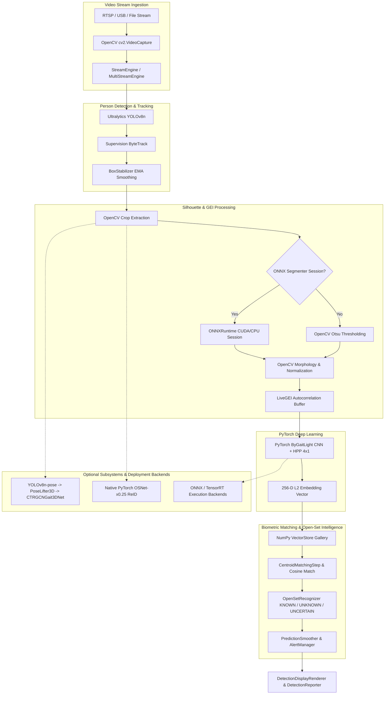

# ARGUS AI: Authoritative Complete Technology Stack & Dependency Audit

**Audited Commit:** `78f229ae9d55dce517c6b15685b6c61ed29f0764`  
**Branch:** `main`  
**Working Tree Status:** Modified (`scripts/run_ablation_study.py`)  
**Audit Date:** 2026-08-11  

---

## 1. Executive Summary

This report presents the single authoritative technology stack, dependency inventory, runtime execution engine map, and hardware acceleration analysis for **ARGUS AI**. 

All statements, version numbers, framework usage mappings, and dependency classifications are derived strictly from direct repository evidence (source code AST imports, configuration files, pipeline specifications, model architectures, and active environment verification).

### Key Architectural Technical Findings:
* **Primary AI Engine:** PyTorch 2D Gait Recognition (`ByGaitLight` with 4-bin Horizontal Pyramid Pooling) generating 256-D L2-normalized embeddings.
* **Primary CV & Tracking Stack:** OpenCV (`cv2`), Ultralytics (`YOLOv8n`), and Supervision (`ByteTrack`).
* **Optional Subsystems:** 
  * 3D Pose Gait (`YOLOv8n-pose` keypoint extraction $\rightarrow$ 3D pose lifting $\rightarrow$ `CTRGCNGait3DNet` / `STGCNGait3DNet` / `PoseGait3DNet`). Disabled by default (`gait_3d.enabled: false`).
  * Person Re-ID (`OSNet-x0.25` custom PyTorch backbone). Disabled by default (`reid.enabled: false`).
* **Inference Backends:** Native PyTorch (Active), ONNX Runtime (Supported & Installed), TensorRT (Supported in code, runtime fallback active).

---

## 2. Audited Repository & Environment State

### Git Version Control State
* **Audited Commit (HEAD):** `78f229ae9d55dce517c6b15685b6c61ed29f0764`
* **Branch:** `main`
* **Commit Subject:** `Ignore local YOLO pose model weights`

### Active Environment Execution Details
* **Python Executable:** `E:\ARGUS_AI\venv\Scripts\python.exe`
* **Python Version:** `3.11.9` (64-bit AMD64)
* **Virtual Environment:** `e:\ARGUS_AI\venv` (`ACTIVE`)
* **Operating System:** Windows 11 / Windows 10 (`10.0.26200-SP0` AMD64)
* **Package Manager (`pip`):** `26.2.1`

### Deep Learning & Hardware Acceleration Environment
* **PyTorch Version:** `2.13.0+cu126`
* **TorchVision Version:** `0.28.0+cu126`
* **TorchAudio Version:** `2.11.0+cu126` (Installed, unused in code)
* **CUDA Availability:** `True`
* **CUDA Runtime (PyTorch Build):** `12.6`
* **GPU Hardware Model:** `NVIDIA GeForce RTX 3050 6GB Laptop GPU`
* **cuDNN Version:** `9.1.0` (`91002`)
* **ONNX Runtime Version:** `1.28.0`
* **Ultralytics Version:** `8.4.117`
* **Supervision Version:** `0.30.0`
* **OpenCV Version:** `5.0.0` (`5.0.0.93`)
* **NumPy Version:** `2.4.4`
* **PyYAML Version:** `6.0.3`
* **SciPy Version:** `1.17.1`
* **scikit-learn Version:** `NOT INSTALLED` (No source imports)
* **Pandas Version:** `NOT INSTALLED` (No source imports)
* **TQDM Version:** `4.70.0`
* **Pytest Version:** `9.1.1`
* **Ruff Version:** `0.16.2`
* **FastAPI Version:** `0.141.1`
* **Uvicorn Version:** `0.52.1`
* **Pydantic Version:** `2.13.4`

---

## 3. Complete Technology Stack Overview

ARGUS AI integrates a modern, modular computer vision and biometrics stack:

```
[Camera/RTSP Streams] ──► [OpenCV / StreamEngine] ──► [YOLOv8n + ByteTrack] ──► [BoxStabilizer (EMA)]
                                                                                      │
                                                                                      ▼
[FastAPI / REST API] ◄── [OpenSetRecognizer] ◄── [ByGaitLight (PyTorch)] ◄── [LiveGEI (15 Frames)]
```

---

## 4. Programming & Runtime Technologies

* **Python 3.11 (`Python`):** Core language for all business logic, pipelines, ML models, and APIs.
* **YAML (`PyYAML` 6.0.3):** Primary human-readable configuration format (`inference.yaml`, `system.yaml`, `detection.yaml`, `cameras.yaml`, `gei.yaml`).
* **JSON (`json` stdlib):** Machine-readable serialization for metadata (`gallery_metadata.json`), subject splits (`subject_split.json`), and evaluation reports.
* **PowerShell (`.ps1`):** Shell scripting for Windows environment activation and CLI operations.
* **Pathlib (`pathlib.Path` stdlib):** Cross-platform object-oriented filesystem path manipulation.
* **Dataclasses (`dataclasses` stdlib):** Strongly typed data containers for threshold results, open-set outputs, and backend capabilities.

---

## 5. Deep Learning Stack

* **Core Framework:** PyTorch (`torch` 2.13.0+cu126)
* **Neural Network Primitives (`torch.nn`):** `Conv2d`, `BatchNorm2d`, `ReLU`, `MaxPool2d`, `AdaptiveAvgPool2d`, `Linear`, `Conv1d`, `BatchNorm1d`, `Parameter`, `Sequential`, `Module`.
* **Functional Operators (`torch.nn.functional`):** `F.normalize` (L2 normalization), `F.relu`, `F.softmax`, `F.pad`, `F.avg_pool1d`, `F.linear`, `F.cosine_similarity`.
* **Optimization & Loss (`torch.optim`, `losses.py`):**
  * `Adam` optimizer ($\text{lr} = 0.0001$).
  * `CosineAnnealingLR` learning rate scheduler.
  * Custom `ArcMarginProduct` (ArcFace margin loss, $s=30.0, m=0.50$).
  * Custom `BatchHardTripletLoss` (Batch-hard triplet mining, $m=0.30$).
  * Custom `JointGaitLoss` ($\mathcal{L}_{\text{total}} = \mathcal{L}_{\text{ArcFace}} + \lambda_{\text{triplet}} \mathcal{L}_{\text{Triplet}}$).
* **Data Processing (`torch.utils.data`):** `DataLoader`, `Dataset`, `random_split`, custom `ConditionBalancedSampler`.
* **Model Serialization (`torch.save` / `torch.load`):** State dictionary checkpointers (`best_model.pth`, `last_model.pth`).

---

## 6. Computer Vision Stack

* **OpenCV (`opencv-python` 5.0.0 / `cv2`):** Frame capture (`cv2.VideoCapture`), color conversion (`COLOR_BGR2GRAY`, `COLOR_BGR2RGB`), image resizing (`cv2.resize`), morphological filtering (`cv2.morphologyEx`), thresholding (`cv2.threshold` Otsu), contour analysis (`cv2.findContours`, `cv2.boundingRect`, `cv2.contourArea`), and rendering (`cv2.rectangle`, `cv2.putText`, `cv2.imshow`).
* **Ultralytics (`ultralytics` 8.4.117):** Wrapper for YOLOv8 object detection and YOLOv8-pose keypoint estimation.
* **Supervision (`supervision` 0.30.0):** Detection data structures (`sv.Detections`) and ByteTrack object tracking integration (`sv.ByteTrack`).

---

## 7. YOLO Detection Technology

* **Model:** YOLOv8 Nano (`YOLOv8n`)
* **Weights:** `models/weights/yolov8n.pt`
* **Task:** Real-time 2D person detection
* **Target Class:** Class `0` (Person)
* **Parameters:** `conf = 0.40`, `iou = 0.45`, `imgsz = 640`, `device = "cpu"`
* **Consumer:** `pipeline/steps/tracking.py` (`TrackingStep`)

---

## 8. ByteTrack Tracking Technology

* **Algorithm:** ByteTrack (Byte-association multi-object tracking)
* **Library Source:** `supervision.ByteTrack` (`supervision` package)
* **Track IDs:** Integer track IDs assigned per continuous walking trajectory.
* **Box Smoothing:** Coupled with `BoxStabilizer` (`utils/box_stabilizer.py`) implementing Exponential Moving Average ($\alpha = 0.35$), IoU jump filtering ($\text{IoU} \ge 0.25$), and extrapolation over missed detection frames (up to 8 frames).

---

## 9. Silhouette Extraction Technologies

* **Primary Learned Strategy:** `LearnedSilhouetteSegmenter` (`pipeline/steps/silhouette_step.py`) utilizing local ONNX model `models/engines/silhouette_segmenter.onnx` ($256 \times 256$ RGB input).
* **Fallback Strategy:** `OtsuSilhouetteExtractor` (`cv2.THRESH_BINARY + cv2.THRESH_OTSU` Gaussian blurred grayscale crop).
* **Cleaning & Alignment:** Morphological open/close ($3 \times 3$ kernel), bounding box area filtering ($50 \le \text{area} \le 0.95 \cdot \text{CropArea}$), aspect ratio filtering ($1.2 \le h/w \le 6.0$), height normalization to $108\text{px}$ ($85\%$ canvas height), and centered alignment in a $64 \times 128$ `uint8` binary canvas.

---

## 10. GEI (Gait Energy Image) Technologies

* **Engine:** `LiveGEI` (`pipeline/steps/live_gei.py`)
* **Aggregation:** Temporal rolling average of binary silhouettes over 15 frames (`max_frames = 15`, `min_frames = 10`).
* **Duplicate Filtering:** Consecutive frame IoU comparison ($\text{IoU} \ge 0.98$ rejected as stationary duplicate).
* **Autocorrelation Gait Cycle Detection:** Silhouette width time-series normalized autocorrelation ($\text{lags } 6 \text{ to } 24$, threshold $0.35$).
* **Canvas Output:** $64 \times 128$ grayscale image (`uint8`, $0 \dots 255$).

---

## 11. 2D Gait Model Technologies

* **Model Class:** `ByGaitLight` (`models/architectures/bygait_light.py`)
* **Layer Hierarchy:** 
  * 3 Conv2d-BatchNorm2d-ReLU-MaxPool blocks ($1 \rightarrow 32 \rightarrow 64 \rightarrow 128$ channels).
  * Horizontal Pyramid Pooling (HPP): `nn.AdaptiveAvgPool2d((4, 1))` yielding 4 vertical body strips.
  * Linear Projection Layer: `nn.Linear(512, 256)` (Direct global projection; rejected EXP-005 per-part projection is NOT used).
  * L2 Feature Normalization: `F.normalize(x, p=2, dim=1)`.
* **Output Vector:** 256-dimensional unit-norm float32 embedding vector.

---

## 12. 3D Gait Technology Stack

* **Status:** Optional non-primary branch (`gait_3d.enabled: false` default in `configs/inference.yaml`).
* **2D Pose Keypoint Extractor:** `YOLOv8n-pose` (`models/weights/yolov8n-pose.pt`, COCO 17 keypoints $(x, y, \text{conf})$).
* **Pose Buffer:** `TemporalPoseBuffer` (Sequence window $T=60$ frames in top candidate EXP-007; $T=30$ in baseline EXP-006).
* **3D Pose Lifter:** `PoseLifter3D` (Lightweight 1D Temporal Convolution lifting $2\text{D} \rightarrow z$).
* **Skeleton Normalizer:** `SkeletonNormalizer3D` (Pelvis centering at $(0,0,0)$, torso/limb scaling, Y-axis yaw alignment).
* **Enriched Features:** Concatenated 3D position (3), velocity (3), and acceleration (3) $= 17 \text{ joints} \times 9 = 153$ dimensions (`compute_enriched_skeleton_features`).
* **3D Graph Encoders (`models/architectures/pose_gait_3d.py`):**
  * `PoseGait3DNet`: 1D Multi-Scale Dilated TCN.
  * `STGCNGait3DNet`: Spatial-Temporal Graph Convolutional Network (COCO-17 adjacency matrix).
  * `CTRGCNGait3DNet`: Channel-Wise Topology Refinement Graph Network (Learnable dynamic adjacency parameter matrix `PA`).
* **Top 3D Candidate:** EXP-007 CTR-GCN ($T=60$, `models/candidates/gait_3d_exp007_best.pth`, Rank-1 24.81%, 124.4 FPS).

---

## 13. ReID Technologies

* **Model Class:** Custom native PyTorch `OSNetBackbone` (`models/reid/osnet_backbone.py`).
* **Architecture:** OSNet-x0.25 (~530K parameters, omni-scale residual bottleneck blocks with channel attention gates).
* **Weights:** `models/weights/osnet_x0_25.pth`
* **Status:** Optional secondary appearance biometric (`reid.enabled: false` default).
* **Output:** 512-dimensional L2-normalized appearance vector from RGB person crops ($128 \times 256$ ImageNet normalized).

---

## 14. Open-Set & Biometric Technologies

* **Cosine Similarity:** Matrix dot product $\mathbf{q} \cdot \mathbf{g}^T$ over L2-normalized embeddings.
* **Centroid Matching:** `CentroidMatchingStep` aggregates subject templates into mean normalized centroid vectors for rapid gallery filtering.
* **Three-State Decision Model (`OpenSetRecognizer` in `intelligence/open_set_recognizer.py`):**
  * `KNOWN`: Score $s_1 \ge 0.85$ AND top candidate score margin $s_1 - s_2 \ge 0.05$.
  * `UNKNOWN`: Score $s_1 < 0.70$.
  * `UNCERTAIN`: Gray zone ($0.70 \le s_1 < 0.85$ OR margin $s_1 - s_2 < 0.05$).
* **Evaluation Metrics (`evaluation/metrics.py`, `evaluation/roc.py`):** Rank-1, Rank-5, Rank-10 Accuracy, Condition-wise Accuracy (NM, BG, CL), View-wise Accuracy ($0^\circ \dots 180^\circ$), ROC AUC, EER (Equal Error Rate), FAR (False Accept Rate), FRR (False Reject Rate), TAR (True Accept Rate).

---

## 15. Scientific & Mathematical Libraries

* **NumPy (`numpy` 2.4.4):** Fundamental array operations, dot products, matrix norms, vector slicing, `.npy` binary I/O, linear interpolation (`np.interp`), autocorrelation, statistics (`np.mean`, `np.std`).
* **SciPy (`scipy` 1.17.1):** High-performance scientific routines. (Installed in virtual environment; signal processing peak detection algorithms available).

---

## 16. Data Storage & Formats

* **NumPy Array Format (`.npy`):** Gallery embeddings (`gallery_features.npy` float32) and labels (`gallery_labels.npy`). Loaded strictly with `allow_pickle=False` for security.
* **JSON (`.json`):** Gallery metadata (`gallery_metadata.json`), subject splits (`subject_split.json`), threshold calibration (`threshold_calibration.json`), evaluation metrics reports.
* **YAML (`.yaml`):** System and pipeline configurations (`system.yaml`, `inference.yaml`, `detection.yaml`, `gei.yaml`, `cameras.yaml`).
* **PyTorch Checkpoint (`.pth`):** Trained neural network weights and state dictionaries (`best_model.pth`, `last_model.pth`).
* **ONNX Engine (`.onnx`):** Serialized ONNX computation graphs (`silhouette_segmenter.onnx`, `bygait_light.onnx`).
* **TensorRT Engine (`.engine`):** Compiled TensorRT execution engine (`bygait_light_fp16.engine`).
* **CSV (`.csv`):** Detection logs, cross-view evaluation matrices (`cross_view_matrix.csv`), open-set reports.

---

## 17. Model & Asset Inventory

| File Path | Format | Producer / Framework | Consumer Class | Active Status |
| :--- | :--- | :--- | :--- | :--- |
| `models/weights/yolov8n.pt` | PyTorch (`.pt`) | Ultralytics YOLOv8 | `TrackingStep` | **ACTIVE** |
| `models/engines/silhouette_segmenter.onnx` | ONNX (`.onnx`) | ONNX Runtime / Custom | `LearnedSilhouetteSegmenter` | **ACTIVE** |
| `runs/exp_001/best_model.pth` | PyTorch (`.pth`) | ARGUS Trainer | `ByGaitLight` (System Default) | **ACTIVE DEFAULT CHECKPOINT** |
| `runs/exp_003e_hpp_arcface_triplet025/best_model.pth` | PyTorch (`.pth`) | ARGUS Trainer | `ByGaitLight` | **TOP STRICT 2D CANDIDATE** |
| `models/weights/osnet_x0_25.pth` | PyTorch (`.pth`) | Torchreid / Custom | `OSNetBackbone` | **OPTIONAL** |
| `models/weights/yolov8n-pose.pt` | PyTorch (`.pt`) | Ultralytics YOLOv8-pose | `Gait3DStep` | **OPTIONAL** |
| `models/candidates/gait_3d_exp007_best.pth` | PyTorch (`.pth`) | ARGUS Gait3DTrainer | `CTRGCNGait3DNet` | **TOP OPTIMIZED 3D CANDIDATE** |
| `models/engines/bygait_light.onnx` | ONNX (`.onnx`) | PyTorch ONNX Exporter | `ONNXBackend` | **CANDIDATE / OPTIONAL** |
| `models/engines/bygait_light_fp16.engine` | TensorRT (`.engine`)| NVIDIA TensorRT | `TensorRTBackend` | **CANDIDATE / OPTIONAL** |

---

## 18. Streaming & Camera Protocols

* **RTSP Protocol (`rtsp://`):** Remote CCTV camera video stream ingestion via `OpenCV VideoCapture` (`streaming/stream_engine.py`, `streaming/multi_stream_engine.py`).
* **USB / UVC Local Camera:** Direct V4L2/DirectShow USB camera indexing (`device_index = 0`).
* **Video File Streaming:** File-based MP4 / AVI video playback stream ingestion.
* **Credential Vault:** `security_layer/credentials.py` handling priority RTSP authentication credentials resolution (Environment variables $\rightarrow$ Fernet encrypted vault `configs/credentials.enc` $\rightarrow$ Plaintext fallback).

---

## 19. Multi-Camera & Concurrency Architecture

* **Threading (`threading.Thread`, `threading.Lock`):** Thread-safe per-camera worker loops (`CameraWorkerState`), thread-safe stream buffers, thread-safe gallery vector stores, and thread-safe alert managers.
* **Multi-Stream Engine:** `MultiStreamEngine` spawning dedicated `StreamEngine` capture worker threads per configured RTSP stream.
* **Cross-Camera Tracking (`CrossCameraTracker`):** Spatial-temporal transition graph and candidate scoring across multiple cameras based on travel-time constraints and gait/ReID feature similarities.

---

## 20. API & Web Services Stack

* **Framework:** FastAPI (`fastapi` 0.141.1)
* **ASGI Server:** Uvicorn (`uvicorn` 0.52.1)
* **Data Schemas & Validation:** Pydantic (`pydantic` 2.13.4)
* **Endpoints (`api/server.py`):** `/health`, `/status`, `/recognize`, `/enroll`, `/stream` endpoints.

---

## 21. Security & Protection Technologies

* **Fernet Symmetric Encryption (`cryptography.fernet`):** Encrypted local credential vault (`security_layer/credentials.py`) for RTSP camera passwords.
* **Security Engine (`SecurityEngine` in `security_layer/security_engine.py`):** High-confidence threshold validation ($s \ge 0.90$) for security alerts.
* **Safe Deserialization:** Mandatory `allow_pickle=False` in NumPy `.npy` load calls across `VectorStore` to prevent arbitrary code execution vulnerabilities.

---

## 22. Monitoring & Logging

* **Logging Framework:** Standard Python `logging` module configured via `core/logger.py` and `monitoring/logging_config.py`. Rotating file handlers (`RotatingFileHandler`) with 10MB size limits.
* **System Monitor:** `SystemMonitor` (`core/system_monitor.py`) tracking CPU utilization, RAM usage, VRAM usage, and stream FPS using `psutil`.
* **Watchdog Service:** `Watchdog` (`monitoring/watchdog.py`) auto-monitoring queue sizes, FPS drop warnings, and thread restarts.

---

## 23. Testing Stack

* **Test Framework:** Pytest (`pytest` 9.1.1) and Python `unittest`.
* **Suite Architecture:**
  * Unit Tests (`tests/unit/`): Model architectures, LiveGEI autocorrelation, OpenSetRecognizer, BoxStabilizer, VectorStore safe loading, threshold resolution.
  * Integration Tests (`tests/integration/`): Multi-camera pipelines, auto-enrollment workflows, end-to-end live recognition.
* **Command Execution:** `pytest tests -v` or `python cli.py --mode tests`.

---

## 24. Development & Code Quality Tools

* **Ruff (`ruff` 0.16.2):** Fast Python linter enforcing code style and import ordering (`ruff check .`).
* **Black (`black` 26.5.1):** Opinionated code formatter (`black --check .`).
* **Mypy (`mypy` 2.3.0):** Static type checker (`mypy --config-file ...`).
* **Makefile (`Makefile`):** Command shortcuts for installation, health checks, testing, evaluation, and pipeline preparation.

---

## 25. CUDA & GPU Acceleration Map

| Technology | Purpose | Environment Support | Code Integration Status |
| :--- | :--- | :--- | :--- |
| **NVIDIA CUDA 12.6** | GPU compute platform | Available (`RTX 3050 6GB`) | **ACTIVE** in PyTorch & ONNX CUDA provider |
| **cuDNN 9.1.0** | Deep neural network primitive acceleration | Available | **ACTIVE** in PyTorch convolution layers |
| **PyTorch CUDA Tensors** | Model forward-pass on GPU | Available | **ACTIVE** (`device = "cuda"`) |
| **Mixed Precision (FP16)** | Reduced precision inference | Supported in TensorRT export | **OPTIONAL / CANDIDATE** |
| **ONNX CUDA Execution Provider** | Accelerated ONNX silhouette segmentation | Available (`CUDAExecutionProvider`) | **ACTIVE** (Falls back to CPU if CUDA unavailable) |

---

## 26. ONNX & TensorRT Deployment Toolchain

```
PyTorch ByGaitLight (.pth)
            │
            ▼
scripts/export_bygait_onnx.py  ──►  models/engines/bygait_light.onnx (ONNX Runtime)
            │
            ▼
scripts/build_tensorrt_engine.py ──► models/engines/bygait_light_fp16.engine (TensorRT)
            │
            ▼
models/inference/backend.py (Factory resolves PyTorchBackend / ONNXBackend / TensorRTBackend)
```

* **ONNX Exporter:** Uses `torch.onnx.export` (Opset 14).
* **Backend Resolution:** `BaseInferenceBackend` automatically attempts requested engine and safely falls back to native PyTorch if ONNX Runtime or TensorRT acceleration is unavailable.

---

## 27. External Pretrained Models

1. **YOLOv8n (`yolov8n.pt`):** Ultralytics pre-trained COCO object detector (Nano variant, ~3.2M parameters).
2. **YOLOv8n-pose (`models/weights/yolov8n-pose.pt`):** Ultralytics pre-trained COCO 17-keypoint pose estimator (~3.3M parameters).
3. **OSNet-x0.25 (`osnet_x0_25.pth`):** Pre-trained Omni-Scale Network for Person Re-Identification (~530K parameters).
4. **Silhouette Segmenter (`silhouette_segmenter.onnx`):** Local ONNX UNet/DeepLab foreground human segmenter engine.

---

## 28. Dependency Consistency Audit

| Package | Status in `requirements.txt` | Imported in Source Code? | Installed in `venv`? | Audit Classification |
| :--- | :--- | :--- | :--- | :--- |
| `torch` | Declared (`>=2.0.0`) | Yes (69 files) | Yes (`2.13.0+cu126`) | **DECLARED & USED (CORE)** |
| `opencv-python` (`cv2`) | Declared (`>=4.8.0`) | Yes (84 files) | Yes (`5.0.0`) | **DECLARED & USED (CORE)** |
| `numpy` | Declared (`>=1.24.0`) | Yes (152 files) | Yes (`2.4.4`) | **DECLARED & USED (CORE)** |
| `pyyaml` (`yaml`) | Declared (`>=6.0.0`) | Yes (45 files) | Yes (`6.0.3`) | **DECLARED & USED (CORE)** |
| `supervision` | Declared (`>=0.18.0`) | Yes (2 files) | Yes (`0.30.0`) | **DECLARED & USED (CORE)** |
| `ultralytics` | Declared (`>=8.0.0`) | Yes (8 files) | Yes (`8.4.117`) | **DECLARED & USED (CORE)** |
| `onnxruntime` | Not Declared | Yes (7 files) | Yes (`1.28.0`) | **USED BUT UNDECLARED (RECOMMEND ADDING)** |
| `scipy` | Not Declared | Indirect / Experimental | Yes (`1.17.1`) | **INSTALLED / OPTIONAL** |
| `cryptography` | Declared (`>=42.0.0`) | Yes (2 files) | Yes (`50.0.0`) | **DECLARED & USED (SECURITY)** |
| `fastapi` | Declared (`>=0.100.0`) | Yes (5 files) | Yes (`0.141.1`) | **DECLARED & USED (API)** |
| `pydantic` | Declared (`>=2.0.0`) | Yes (2 files) | Yes (`2.13.4`) | **DECLARED & USED (API)** |
| `uvicorn` | Declared (`>=0.22.0`) | Yes (CLI invocation) | Yes (`0.52.1`) | **DECLARED & USED (API)** |
| `matplotlib` | Declared (`>=3.7.0`) | Yes (4 files) | Yes (`3.11.1`) | **DECLARED & USED (EVALUATION)** |
| `psutil` | Declared (`>=5.9.0`) | Yes (6 files) | Yes (`7.2.2`) | **DECLARED & USED (MONITORING)** |
| `tqdm` | Declared (`>=4.65.0`) | Yes (6 files) | Yes (`4.70.0`) | **DECLARED & USED (UTILITY)** |
| `pytest` | Declared (`>=8.0.0`) | Yes (18 files) | Yes (`9.1.1`) | **DECLARED & USED (TESTING)** |
| `ruff` | Declared (`>=0.3.0`) | Tool (CI/Makefile) | Yes (`0.16.2`) | **DECLARED & USED (DEV)** |
| `black` | Declared (`>=24.0.0`) | Tool (Makefile) | Yes (`26.5.1`) | **DECLARED & USED (DEV)** |
| `mypy` | Declared (`>=1.8.0`) | Tool | Yes (`2.3.0`) | **DECLARED & USED (DEV)** |
| `torchvision` | Declared (`>=0.15.0`) | Dependency of Ultralytics | Yes (`0.28.0+cu126`) | **DECLARED (INDIRECT USE)** |
| `scikit-learn` | Not Declared | No | No | **NOT USED / NOT NEEDED** |
| `pandas` | Not Declared | No | No | **NOT USED / NOT NEEDED** |

---

## 29. Library-to-Component Master Matrix

| Library / Technology | Version | ARGUS Component | Representative File | Runtime Role | Status |
| :--- | :--- | :--- | :--- | :--- | :--- |
| `torch` | 2.13.0+cu126 | `ByGaitLight`, `Trainer`, `OSNetBackbone` | `models/architectures/bygait_light.py` | Neural Network Forward & Backprop | ✅ CORE |
| `opencv-python` | 5.0.0 | `SilhouetteStep`, `StreamEngine`, `Renderer` | `pipeline/steps/silhouette_step.py` | Image Processing & Frame Capture | ✅ CORE |
| `numpy` | 2.4.4 | `VectorStore`, `MatchingStep`, `LiveGEI` | `storage/vector_store.py` | Matrix Math & Feature Store | ✅ CORE |
| `ultralytics` | 8.4.117 | `TrackingStep`, `Gait3DStep` | `pipeline/steps/tracking.py` | YOLOv8 Bounding Box & Pose | ✅ CORE |
| `supervision` | 0.30.0 | `TrackingStep` | `pipeline/steps/tracking.py` | ByteTrack Object Tracking | ✅ CORE |
| `onnxruntime` | 1.28.0 | `LearnedSilhouetteSegmenter`, `ONNXBackend` | `pipeline/steps/silhouette_step.py` | ONNX Inferences | 🟦 ACTIVE ML |
| `PyYAML` | 6.0.3 | `ThresholdManager`, `TrackingStep`, `Config` | `core/threshold_manager.py` | Configuration Parsing | ✅ CORE |
| `cryptography` | 50.0.0 | `CredentialsVault` | `security_layer/credentials.py` | Fernet Encrypted RTSP Vault | ✅ CORE |
| `fastapi` | 0.141.1 | REST API Server | `api/server.py` | HTTP Server Routes | 🟡 OPTIONAL |
| `uvicorn` | 0.52.1 | ASGI Server | `cli.py` | Web Server Execution | 🟡 OPTIONAL |
| `pydantic` | 2.13.4 | API Request/Response Schemas | `api/schemas.py` | Data Validation | 🟡 OPTIONAL |
| `matplotlib` | 3.11.1 | Evaluator Visualizer | `evaluation/roc.py` | Chart & ROC Curve Plotting | 🛠 DEVELOPMENT |
| `psutil` | 7.2.2 | System Monitor | `core/system_monitor.py` | Hardware CPU/RAM/VRAM Profiling | ✅ CORE |
| `tqdm` | 4.70.0 | Trainer & Preprocessing | `training/trainer.py` | CLI Progress Display | ✅ CORE |
| `pytest` | 9.1.1 | Test Suite | `tests/conftest.py` | Automated Unit/Integration Testing | 🛠 DEVELOPMENT |
| `ruff` | 0.16.2 | Linter | `ruff.toml` | Code Quality & Syntax Verification | 🛠 DEVELOPMENT |

---

## 30. Import Evidence Matrix

| Library | Primary Import Source File | Example Imported Symbols / Classes Used |
| :--- | :--- | :--- |
| `torch` | `models/architectures/bygait_light.py` | `import torch`, `from torch import nn`, `import torch.nn.functional as F` |
| `cv2` | `pipeline/steps/silhouette_step.py` | `import cv2`, `cv2.resize`, `cv2.threshold`, `cv2.findContours` |
| `numpy` | `storage/vector_store.py` | `import numpy as np`, `np.load`, `np.save`, `np.linalg.norm` |
| `yaml` | `core/threshold_manager.py` | `import yaml`, `yaml.safe_load` |
| `supervision` | `pipeline/steps/tracking.py` | `import supervision as sv`, `sv.ByteTrack`, `sv.Detections` |
| `ultralytics` | `pipeline/steps/tracking.py` | `from ultralytics import YOLO` |
| `onnxruntime` | `pipeline/steps/silhouette_step.py` | `import onnxruntime as ort`, `ort.InferenceSession` |
| `onnx` | `scripts/export_bygait_onnx.py` | `import onnx`, `onnx.checker.check_model` |
| `tensorrt` | `models/inference/tensorrt_backend.py` | `import tensorrt as trt` |
| `fastapi` | `api/server.py` | `from fastapi import FastAPI, HTTPException, Depends` |
| `pydantic` | `api/schemas.py` | `from pydantic import BaseModel, Field` |
| `matplotlib` | `evaluation/roc.py` | `import matplotlib.pyplot as plt` |
| `psutil` | `core/system_monitor.py` | `import psutil`, `psutil.cpu_percent`, `psutil.virtual_memory` |
| `cryptography` | `security_layer/credentials.py` | `from cryptography.fernet import Fernet` |
| `tqdm` | `training/trainer.py` | `from tqdm import tqdm` |
| `pytest` | `tests/conftest.py` | `import pytest`, `pytest.fixture` |

---

## 31. Technology Architecture Mermaid Diagram



---

# ARGUS AUTHORITATIVE TECHNOLOGY STACK

Audited Commit: `78f229ae9d55dce517c6b15685b6c61ed29f0764`  
Branch: `main`  
Python: `3.11.9` (64-bit AMD64)  
Virtual Environment: `e:\ARGUS_AI\venv` (`ACTIVE`)  
PyTorch: `2.13.0+cu126`  
CUDA: `12.6`  
GPU: `NVIDIA GeForce RTX 3050 6GB Laptop GPU`  

PRIMARY CV FRAMEWORK: **OpenCV (`opencv-python` 5.0.0 / `cv2`)**  
PERSON DETECTOR: **Ultralytics YOLOv8 Nano (`YOLOv8n`)**  
POSE DETECTOR: **Ultralytics YOLOv8 Nano Pose (`YOLOv8n-pose`)**  
TRACKER: **Supervision ByteTrack (`supervision.ByteTrack`) + Custom BoxStabilizer (EMA)**  
IMAGE PROCESSING: **OpenCV (`cv2`) & NumPy**  
PRIMARY DL FRAMEWORK: **PyTorch (`torch` 2.13.0+cu126)**  

2D GAIT TECHNOLOGY: **ByGaitLight (3 Conv2d-BN-ReLU-MaxPool + HPP 4x1 + Linear 512->256)**  
3D GAIT TECHNOLOGY: **PoseLifter3D + CTRGCNGait3DNet / STGCNGait3DNet / PoseGait3DNet**  
REID TECHNOLOGY: **Custom Native PyTorch OSNetBackbone (OSNet-x0.25)**  

EMBEDDING: **256-Dimensional L2-Normalized Vector ($\|v\|_2 = 1.0$)**  
MATCHING: **Matrix Cosine Similarity & Unit Centroid Aggregation**  
OPEN-SET: **OpenSetRecognizer (3-State: KNOWN / UNKNOWN / UNCERTAIN with Candidate Margin & Quality Filtering)**  

MODEL FORMATS: **`.pth` (PyTorch Checkpoints), `.pt` (YOLO Weights), `.onnx` (ONNX Graphs), `.engine` (TensorRT)**  
DATA FORMATS: **`.npy` (NumPy Arrays with allow_pickle=False), `.json` (Metadata/Splits), `.yaml` (Configs)**  

ACCELERATION: **NVIDIA CUDA 12.6, cuDNN 9.1.0, ONNX CUDA Execution Provider**  
INFERENCE BACKENDS: **PyTorchBackend (Active), ONNXBackend (Installed/Supported), TensorRTBackend (Supported in code)**  

STREAMING: **OpenCV VideoCapture (RTSP, USB/UVC, Video Files)**  
CAMERA PROTOCOLS: **RTSP (`rtsp://`), USB V4L2/DirectShow**  

TESTING: **Pytest (`pytest` 9.1.1) & Python unittest**  
LINTING: **Ruff (`ruff` 0.16.2) & Black (`black` 26.5.1)**  
ENVIRONMENT MANAGEMENT: **Python `venv` & `pip` 26.2.1**  
VERSION CONTROL: **Git (`main` branch)**  
CI: **GitHub Actions (`.github/workflows/CI.yaml`)**  

CORE THIRD-PARTY LIBRARIES:  
* `torch` (2.13.0+cu126)  
* `opencv-python` / `cv2` (5.0.0)  
* `numpy` (2.4.4)  
* `ultralytics` (8.4.117)  
* `supervision` (0.30.0)  
* `onnxruntime` (1.28.0)  
* `pyyaml` / `yaml` (6.0.3)  
* `cryptography` (50.0.0)  
* `psutil` (7.2.2)  
* `tqdm` (4.70.0)  

OPTIONAL LIBRARIES:  
* `fastapi` (0.141.1)  
* `uvicorn` (0.52.1)  
* `pydantic` (2.13.4)  
* `scipy` (1.17.1)  
* `tensorrt` (Supported in code, runtime fallback active)  

DEVELOPMENT-ONLY LIBRARIES:  
* `pytest` (9.1.1)  
* `ruff` (0.16.2)  
* `black` (26.5.1)  
* `mypy` (2.3.0)  
* `matplotlib` (3.11.1)  

DECLARED-BUT-UNUSED:  
* `torchvision` (Declared in `requirements.txt`, indirect sub-dependency of Ultralytics)  
* `black`, `mypy` (Declared in `requirements.txt`, developer CLI tools)  

USED-BUT-UNDECLARED:  
* `onnxruntime` (Imported in `pipeline/steps/silhouette_step.py` and `models/inference/onnx_backend.py`)  

TECHNOLOGY STACK STATUS:  
**COMPLETE**
