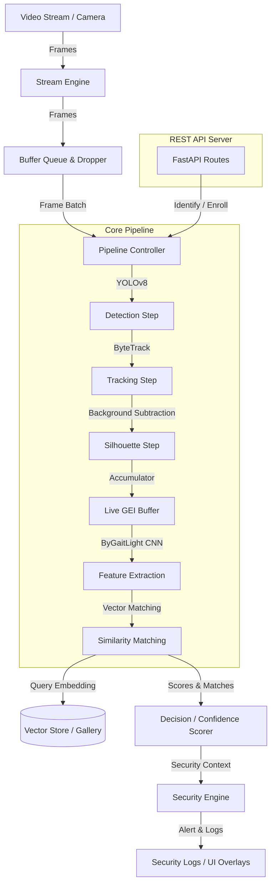

# ARGUS AI Surveillance System: Person Detection & Gait Recognition

ARGUS is a premium, state-of-the-art intelligent video surveillance and biometric identification system designed for real-time person detection, multi-target tracking, and gait-based recognition. By leveraging deep learning, temporal feature aggregation (Gait Energy Images - GEI), and vector similarity matching, ARGUS enables contactless, non-cooperative, and distance-resilient identification of individuals based solely on their unique walking pattern.

This repository represents a complete production-ready framework tailored for research, academic deployment, and surveillance integration as a final-year engineering project.

---

## 1. Project Overview

Biometric systems relying on face recognition or fingerprinting require close proximity or active participant cooperation. Gait recognition addresses these vulnerabilities by extracting behavioral signature metrics from long-range video streams, making it robust against illumination changes, masks, and low-resolution inputs.

ARGUS incorporates a modular pipeline that:
1. Detects persons in video feeds using high-accuracy deep models.
2. Tracks individuals across frames to generate continuous trajectory paths.
3. Segments silhouettes from cropped target boxes using adaptive background subtraction.
4. Synthesizes a rolling Gait Energy Image (GEI) representing the gait cycle.
5. Encodes the GEI into deep embeddings using a custom convolutional model (`ByGaitLight`).
6. Queries a vector store for real-time identification and executes safety policies.

---

## 2. Features

*   **Real-time Multi-Person Tracking:** Continuous identity tracking utilizing YOLOv8 object detection and ByteTrack association.
*   **Rolling Gait Energy Image (GEI) Synthesis:** Dynamically aggregates individual silhouette frames across a moving temporal window to capture dynamic walking signatures.
*   **Vector Database Search:** Fast, locally indexed gallery retrieval using Euclidean and cosine distance metrics optimized via NumPy.
*   **Multi-Tiered Safety & Security Engine:** Evaluates classification confidence scores to assign risk levels (`INFO`, `MEDIUM`, `HIGH`) and trigger actions (`ALLOW`, `REVIEW_REQUIRED`, `SECURITY_ALERT`), logging security logs in CSV.
*   **Asynchronous Streaming Optimization:** Integrates safe thread-locking buffer queues and frame-dropping thresholds to maintain zero lag on resource-constrained deployment setups.
*   **FASTApi Web Server:** Exposes Rest APIs for third-party integrations, supporting health reporting, single-image prediction, and directory-based person enrollment.
*   **Diagnostic Tools & Visualizers:** Generates automated accuracy bar charts, result distributions, and confidence frequency histograms.

---

## 3. System Architecture

ARGUS is built as a modular event-driven pipelined architecture:



---

## 4. Folder Structure

The repository is organized logically into isolated subsystems:

```
ARGUS_AI/
│
├── api/                       # FastAPI REST Interface
│   ├── routes/                # Endpoint router definitions (enrollment, inference, status)
│   └── schemas.py             # Pydantic request/response data shapes
│
├── configs/                   # YAML system settings configurations
│   ├── base.yaml              # Global default settings
│   ├── logging.yaml           # Logger output formats
│   └── mode_config.yaml       # Run mode specifications
│
├── core/                      # System Bootstrap & State Brain
│   ├── boot.py                # BootManager validating configurations and hardware
│   ├── context.py             # Global SystemContext runtime dictionary
│   ├── health_check.py        # Environmental compatibility verification routines
│   ├── orchestrator.py        # Brain routing execution paths
│   └── system.py              # Main system lifecycle coordinator
│
├── docs/                      # Project documentation and reports
│   └── README_DRAFT.md        # This document
│
├── enrollment/                # Biometric Subject Enrollment
│   ├── enrollment_manager.py  # Coordinates validation and enrollment workflows
│   ├── folder_watcher.py      # Automated disk scanning folder directory watcher
│   └── gallery_updater.py     # Writes newly extracted features to the database
│
├── evaluation/                # Performance assessment utilities
│   ├── evaluator.py           # Split-run verification evaluator
│   ├── metrics.py             # Accuracy metrics metrics tracking
│   └── visualizer.py          # Chart generation (matplotlib-based)
│
├── events/                    # Event-driven core communication
│   ├── event_bus.py           # Pub/sub event broker
│   └── event_types.py         # Event dictionary enums
│
├── intelligence/              # Security and decision routing
│   ├── confidence_scorer.py   # Confidence calibration
│   └── decision_engine.py     # Decision logic routing
│
├── models/                    # Neural Network Model definitions
│   ├── architectures/         # Custom structures (ByGaitLight, TripletLoss)
│   └── gallery/               # Gallery database vectors (.npy & metadata.json)
│
├── outputs/                   # System generated outputs
│   ├── evaluation_charts/     # Matplotlib visual performance graphs
│   ├── reports/               # Execution logs and benchmark JSONs
│   └── security_logs/         # Security logs and event records (CSV format)
│
├── pipeline/                  # Video frame processing orchestrators
│   ├── base_pipeline.py       # Pipeline abstract interface classes
│   ├── live_recognition.py    # Main camera surveillance pipeline
│   └── steps/                 # Pipeline steps (detection, tracking, silhouette, live_gei)
│
├── preprocessing/             # Image & silhouette datasets operations
│   ├── dataset_builder.py     # Batch image formatting utility
│   └── gei_builder.py         # Silhouette averaging and rendering
│
├── scripts/                   # Standalone scripts for testing and evaluation
│   ├── benchmark.py           # Throughput testing suite
│   ├── system_check.py        # Diagnostic validation script
│   └── test_*.py              # Subsystem verification scripts
│
├── security_layer/            # Real-time incident logs tracking
│   ├── security_engine.py     # Context verification engine
│   └── security_logger.py     # Incident CSV writer
│
├── storage/                   # Database files operations
│   ├── cache_manager.py       # Memory LRU Cache
│   ├── data_manager.py        # JSON read/write managers
│   └── vector_store.py        # Gallery vectors loader & saver
│
├── streaming/                 # Threaded stream buffering
│   ├── buffer_queue.py        # Safe thread queues
│   └── frame_dropper.py       # Lag drop policies
│
├── tests/                     # Standard testing folder
│   ├── integration/           # Integration tests
│   └── unit/                  # Unit tests
│
├── cli.py                     # Entry command line tool
├── main.py                    # Top-level script launcher
└── requirements.txt           # Active python packages definitions
```

---

## 5. Installation Guide

### Prerequisites
*   Python 3.10 or 3.11 (tested on Python 3.11.9)
*   Visual Studio Build Tools (for C++ compiling requirements of certain dependencies)

### Setup Steps
1.  **Clone the Repository:**
    ```bash
    git clone <repository_url>
    cd ARGUS_AI
    ```

2.  **Create a Virtual Environment:**
    ```bash
    python -m venv venv
    ```

3.  **Activate the Virtual Environment:**
    *   **Windows (PowerShell):**
        ```powershell
        .\venv\Scripts\Activate.ps1
        ```
    *   **Windows (CMD):**
        ```cmd
        .\venv\Scripts\activate.bat
        ```
    *   **Linux/macOS:**
        ```bash
        source venv/bin/activate
        ```

4.  **Install Dependencies:**
    ```bash
    pip install -r requirements.txt
    ```

5.  **Verify Setup:**
    ```bash
    python scripts/system_check.py
    ```

---

## 6. Dataset Preparation

ARGUS supports training and evaluation using the standard **CASIA-B** gait dataset.
1.  Download CASIA Dataset B (silhouettes).
2.  Store the dataset zip file in `data/` or extract it manually.
3.  Execute the preprocess script to extract zip contents and build GEIs:
    ```bash
    python scripts/preprocess_casia.py --zip-path data/GaitDatasetB-silh.zip --output-dir data/casia_processed
    ```

This aggregates silhouetted frames into 128x64 pixels average GEIs grouped under subject-ID folders (e.g. `data/casia_processed/gei/001/`).

---

## 7. Training Workflow

To train the custom `ByGaitLight` CNN model:
1.  Verify the dataset path in `configs/train.yaml`.
2.  Execute the training script:
    ```bash
    python scripts/train_model.py --epochs 20 --batch-size 32
    ```
3.  Model metrics and epoch checkpoints (`best_model.pth`) are saved in `runs/exp_001/`.

---

## 8. Evaluation Workflow

Evaluate the performance of a trained model against the validation dataset partition:
```bash
python scripts/evaluate_model.py --model-path runs/exp_001/best_model.pth --max-images 500
```

This runs a rank-1 matching validation across probe targets and generates performance statistics, saving output graphs in `outputs/evaluation_charts/`.

---

## 9. Enrollment Workflow

To register new people into the matching system:
1.  Create a folder named after the person (e.g., `034`) containing several of their walking GEIs or frames.
2.  Add this folder to the watch directory, or enroll via code:
    ```bash
    python -c "from enrollment.enrollment_manager import EnrollmentManager; EnrollmentManager().enroll_person('data/casia_processed/gei/034')"
    ```

Alternatively, run the automated folder watcher which listens for new directories and processes them instantly:
```bash
python scripts/test_folder_watcher.py
```

---

## 10. Live Recognition Workflow

The live recognition module runs real-time surveillance processing:
1.  Ensures YOLO weights (`yolov8n.pt`) are downloaded.
2.  Sets up camera device connection configuration.
3.  Runs the live recognition script:
    ```bash
    python scripts/test_live_recognition.py
    ```

*Controls:* Press `Q` inside the camera window feed to exit.

---

## 11. API Usage

ARGUS provides a REST interface powered by FastAPI.

### Start the Server
```bash
uvicorn api.server:app --reload
```

### Endpoints

*   **GET `/health`:** System status diagnostics check.
*   **POST `/identify`:** Extracts features from a target image path and returns identity and similarity matching confidence.
    ```json
    // POST Request Body
    {
      "image_path": "data/casia_processed/gei/034/034_nm-01_126.png"
    }
    ```
*   **POST `/enroll`:** Enrolls a new person via folder directory path.
    ```json
    // POST Request Body
    {
      "folder_path": "data/casia_processed/gei/034"
    }
    ```

---

## 12. CLI Usage

The command-line interface provides simplified operational commands:

```bash
# Start live recognition
python cli.py --mode live

# Launch FastAPI web server
python cli.py --mode api

# Run evaluation suite
python cli.py --mode evaluate

# System hardware and environment status check
python cli.py --mode health
```

---

## 13. Benchmark Results

A standard benchmark script was executed on the CPU-based system environment. The actual metrics are detailed below:

*   **Gallery Scale:** 13,750 embeddings representing 127 enrolled subjects.
*   **Gallery Load Speed:** **0.0104 seconds (10.4 milliseconds)**.
*   **Pipeline Initialization Latency:** **0.0249 seconds (24.9 milliseconds)**.
*   **Single Target Identification Match (CPU):** **0.0417 seconds (41.7 milliseconds)**.
*   **Total Benchmark Lifecycle Duration:** **0.0820 seconds (82.0 milliseconds)**.

---

## 14. Technologies Used

*   **Core Logic:** Python (3.11), PyTorch, Torchvision
*   **Computer Vision:** OpenCV (v4.13), YOLOv8 (Ultralytics), Supervision (ByteTrack)
*   **Performance & Vector Matching:** NumPy, Scikit-learn
*   **Database:** Local Vector Store (JSON & NumPy Serialization)
*   **REST Server:** FastAPI, Uvicorn, Pydantic
*   **Data Visualizations:** Matplotlib

---

## 15. Future Improvements

1.  **Skeleton-Based Modeling:** Integrate `preprocessing/skeleton_extractor.py` to compare keypoint trajectories against GEI silhouette performance.
2.  **GPU Acceleration Optimization:** Configure a GPU memory pool manager within `monitoring/gpu_tuner.py`.
3.  **Active Learning Loops:** Implement automated pipeline triggering to retrain model embeddings when a threshold of new subjects is reached.
4.  **Distributed Vector Search:** Integrate Faiss or Milvus for sub-millisecond lookups when scaling the gallery to millions of individuals.

---

## 16. License

This project is released under the **MIT License**. See `LICENSE` (if available) for complete details.
