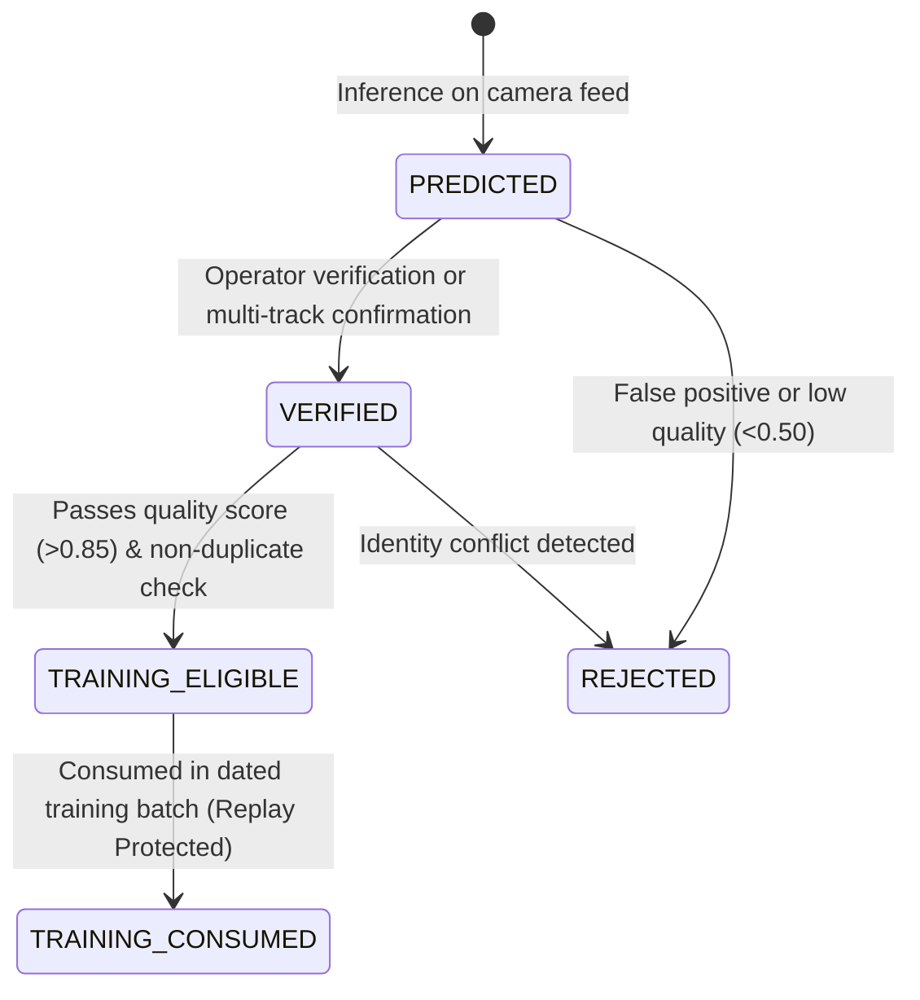

# ARGUS AI — Firestore Data Model & Schema Specifications

## 1. Collection Architecture

The production Firestore database for project `argus-17702` consists of the following primary collections:

```
argus-17702 (Firestore Root)
├── admins/                      # Administrator operator accounts
├── investigators/               # Investigator operator accounts
├── active_cameras/              # Deployed surveillance camera nodes
├── biometric_persons/           # Person/identity profiles and metadata
├── biometric_embeddings/        # 256D gait and 512D appearance embeddings
├── detections/                  # Live recognition and observation events
├── model_registry/              # ByGaitLight and OSNet model versions
├── learning_jobs/               # Date-aware continual learning batch jobs
└── audit_logs/                  # Tamper-evident continual learning audit trail
```

---

## 2. Collection Schemas

### 2.1 `biometric_embeddings` Collection
* **Document ID**: Deterministic format `emb_{modality[:4]}_{person_id}_{timestamp}_{sha256_slice}`.

| Field Name | Type | Required | Description |
| :--- | :--- | :--- | :--- |
| `embedding_id` | `string` | Yes | Unique deterministic identifier |
| `person_id` | `string` | Yes | Subject ID (also aliased as `identity_id`) |
| `modality` | `string` | Yes | `"gait"` (256D) or `"appearance"` (512D) |
| `embedding_dim` | `number` | Yes | Explicit dimensionality (256 or 512) |
| `vector` | `list[float]` | Yes | L2-normalized feature vector |
| `model_version` | `string` | Yes | Model checkpoint version (e.g. `"v1.0.0"`) |
| `model_architecture`| `string` | Yes | Architecture (e.g. `"ByGaitLight-CNN-256D"`) |
| `observation_date` | `string` | Yes | ISO date string (`"YYYY-MM-DD"`) for date-aware learning |
| `capture_timestamp` | `number` | Yes | Unix epoch timestamp of capture |
| `camera_id` | `string` | Yes | Node identifier where capture occurred |
| `track_id` | `number` | Yes | ByteTrack tracklet ID |
| `quality_score` | `number` | Yes | Silhouette/track quality assessment (0.0 - 1.0) |
| `confidence` | `number` | Yes | Recognition confidence |
| `operational_state`| `string` | Yes | State machine (`PREDICTED`, `VERIFIED`, `TRAINING_ELIGIBLE`, `TRAINING_CONSUMED`) |
| `training_consumed`| `boolean`| Yes | Replay protection flag (prevents re-training) |
| `consumed_by_model`| `string` | No | Version of model that consumed this sample |
| `provenance` | `map` | Yes | Camera, track, and detector lineage metadata |
| `created_at` | `number` | Yes | Creation timestamp |
| `updated_at` | `number` | Yes | Last modification timestamp |

---

### 2.2 `model_registry` Collection
* **Document ID**: `{model_type}_{model_version}` (e.g. `bygait_light_v1.0.0`, `dual_modal_fusion_v1.0.0`).

| Field Name | Type | Required | Description |
| :--- | :--- | :--- | :--- |
| `model_version` | `string` | Yes | Semantic version string |
| `model_type` | `string` | Yes | `"bygait_light"`, `"osnet_reid"`, `"dual_modal_fusion"` |
| `architecture` | `string` | Yes | CNN architecture identifier |
| `embedding_dim` | `number` | Yes | 256 for gait, 512 for appearance |
| `artifact_path` | `string` | Yes | Local weight path or Firebase Storage URI |
| `checksum_sha256` | `string` | Yes | Checksum of weight binary for integrity |
| `deployment_status`| `string`| Yes | `CANDIDATE`, `VALIDATING`, `VALIDATED`, `PROMOTED`, `ACTIVE`, `ARCHIVED`, `ROLLED_BACK`, `REJECTED` |
| `previous_production_version` | `string` | No | Model version to revert to on rollback |
| `validation_metrics`| `map` | Yes | Validation metrics (`rank1`, `mAP`, `tar`, `far`, `frr`) |
| `promotion_timestamp`| `number`| No | Unix epoch of promotion to `ACTIVE` |
| `created_at` | `number` | Yes | Creation epoch timestamp |

---

### 2.3 `audit_logs` Collection
* **Document ID**: `CLE-{timestamp}-{hex}`.

| Field Name | Type | Required | Description |
| :--- | :--- | :--- | :--- |
| `event_id` | `string` | Yes | Unique audit record identifier |
| `event_type` | `string` | Yes | Event category (`RETRAINING_EVALUATION`, `PROMOTION`, `ROLLBACK`) |
| `timestamp` | `number` | Yes | Event epoch timestamp |
| `trigger_date` | `string` | Yes | Date batch evaluated |
| `model_type` | `string` | Yes | Target model category |
| `baseline_version` | `string` | Yes | Current active model version |
| `candidate_version`| `string` | Yes | Candidate model under evaluation |
| `metric_deltas` | `map` | Yes | Performance differences between candidate and baseline |
| `validation_passed`| `boolean`| Yes | Whether candidate met all statistical safety gates |
| `promotion_status` | `string` | Yes | `PROMOTED`, `REJECTED`, `ROLLED_BACK` |
| `rejection_reasons`| `list[string]`| No | Detailed reason if candidate was rejected |

---

## 3. Embedding State Machine



### Transition Conditions
1. **PREDICTED**: Initial capture by operational camera worker during live inference.
2. **VERIFIED**: Identity confirmed either by authoritative enrollment or operator review.
3. **TRAINING_ELIGIBLE**: Sample passes quality assessment (`quality_score >= 0.85`), silhouette completeness, and is within approved date ranges.
4. **TRAINING_CONSUMED**: Consumed during continual learning batch run. `training_consumed = True` and `consumed_by_model_version = candidate_version`. The sample is permanently locked against reuse in future training runs to prevent replay attacks and bias drift.
