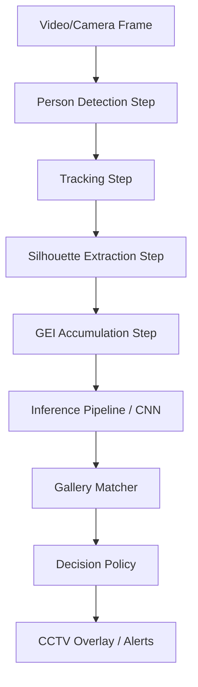

# GitHub Repository Showcase: ARGUS AI Gait Recognition

This document serves as a reviewer-friendly walkthrough of the code architecture, highlighting the core design patterns, pipeline modularity, and key modules that drive this **FYP-level gait recognition research prototype**.

---

## 1. Modular Processing Pipeline

ARGUS AI is designed around a decoupled pipeline pattern. Rather than having monolith files handling multiple tasks, each phase of processing is isolated into a self-contained "Step" inside the [pipeline/steps/](file:///e:/ARGUS_AI/pipeline/steps/) directory.

### Core Pipeline Steps:
1. **Person Detection (`detection.py`):** Uses YOLOv8 via Ultralytics to identify bounding boxes around humans.
2. **Multi-Target Tracking (`tracking.py`):** Uses ByteTrack to maintain identity continuity across successive frames.
3. **Silhouette Segmentation (`silhouette_step.py`):** Extracts human contours using a customized frame-by-frame background subtraction technique.
4. **GEI Synthesis (`live_gei.py`):** Computes Gait Energy Images (GEIs) by averaging extracted silhouettes over a walking cycle (defaulting to a sliding window of 15 frames).

---

## 2. Model & Embedding Layer

The core of the biometric representation is a lightweight convolutional neural network called `ByGaitLight`.

- **Architecture:** Described in [models/architectures/bygait_light.py](file:///e:/ARGUS_AI/models/architectures/bygait_light.py). It consists of alternating 2D convolutions, max-pooling layers, and a fully connected projection head designed to compile low-dimensional embeddings (e.g., size 128) from 128x64 GEIs.
- **Biometric Matching:** Embeddings are cross-referenced with enrolled templates in the gallery using a vectorized cosine similarity lookup defined in [storage/vector_store.py](file:///e:/ARGUS_AI/storage/vector_store.py).

---

## 3. Security Decision Engine

To showcase real-world applicability in a structured way, matches are fed into the [security_layer/](file:///e:/ARGUS_AI/security_layer/).

- **Decision Policy (`security_engine.py`):** Implements an adaptive decision framework. It checks if the top-1 matching similarity exceeds a configurable threshold, and incorporates centroid margin checks to handle open-set "unknown" subjects.
- **Structured Auditing (`security_logger.py`):** Emits thread-safe events to log files (CSV/JSONL format) with specific security classification tags:
  - `CONFIRMED`: A gallery profile match is found.
  - `UNKNOWN`: Subject detected and tracked, but did not match the gallery database.
  - `DETECTION`/`TRACKING`: Temporal phase prior to GEI readiness.

---

## 4. Multi-Camera Architecture

The prototype includes a multi-camera simulation engine inside [streaming/stream_engine.py](file:///e:/ARGUS_AI/streaming/stream_engine.py) and [pipeline/multi_camera_runner.py](file:///e:/ARGUS_AI/pipeline/multi_camera_runner.py).
- **Concurrency:** Launches independent execution threads per configured stream (based on [configs/cameras.yaml](file:///e:/ARGUS_AI/configs/cameras.yaml)).
- **Resource Efficiency:** Threads process separate camera tracking instances but share a single, read-only PyTorch model instance in CPU/GPU memory, avoiding redundant weights instantiation.
