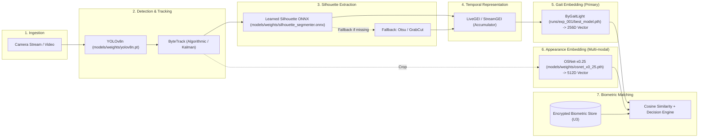
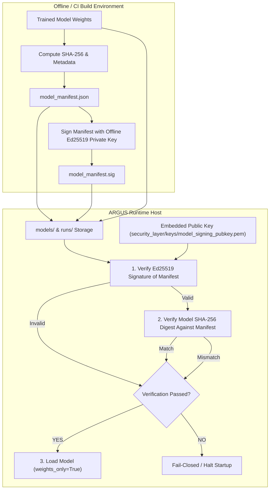

# U5 — Model Checkpoint & AI Model Asset Protection: Security Audit & Architecture Design

**Date**: 2026-09-16
**Repository**: `ARGUS_AI` (`chanuka8/argus-gait-recognition`)
**Target**: Historical Finding U5 — Model Checkpoint / AI Model Asset Protection
**Current Status**: **AUDIT & DESIGN ONLY — IMPLEMENTATION NOT AUTHORIZED**
**Final Audit Recommendation**: **CONDITIONAL GO**

---

## 1. Historical U5 Evidence

### 1.1 Historical Authoritative Evidence
In the foundational thesis security audit (`docs/thesis_audit/08_security_and_privacy.md`, recovered from git commit `b18e69f^`):
- **Section 8.1 (Implemented vs Proposed Security Features)**:
  - **Feature**: `Model Security`
  - **Status**: `Not addressed`
  - **Implementation**: `Model files stored unprotected`
  - **Assessment**: `Not implemented`
  - **Security Impact**: `Model theft, reverse engineering`
  - **Original Recommended Remediation**: `Encrypt or obfuscate model files`
- **Section 8.2 (Assets Inventory)**:
  - **Asset**: `Model Checkpoint`
  - **Sensitivity**: `MEDIUM`
  - **Location**: `runs/exp_001/best_model.pth`
- **Section 8.2 (STRIDE Threat Analysis)**:
  - **Threat**: `Steal model checkpoint`
  - **Category**: `Information Disclosure`
  - **Asset**: `Model`
  - **Attack Surface**: `Filesystem`
  - **Current Mitigation**: `None`
  - **Risk Level**: `LOW`

### 1.2 Intermediate Security Reports
In `docs/security/sec10_identification.md` (§4) and `docs/security/next_security_item_identification.md` (§5):
- Finding cataloged as: `U5 — Model Checkpoint Protection (Asset Protection)`
- Scope noted: `PyTorch model weight files (runs/exp_001/best_model.pth, ByGaitLight checkpoints) are stored unencrypted on disk.`

### 1.3 Historical Scope vs Current Operational Findings
- **Historical Authoritative Scope**:
  - Model theft
  - Reverse engineering
  - Unprotected model files
  - Recommendation to encrypt or obfuscate model files
  - *Authenticity, digital signatures, digest verification, and safe deserialization were NOT part of the original historical thesis audit wording.*
- **Current Operational Findings (Source-Code Audit)**:
  - Checkpoint tampering & malicious replacement
  - Wrong-model substitution
  - Unsafe PyTorch deserialization (pickle arbitrary code execution risk via default `weights_only=False` in PyTorch 2.5.1 and vulnerable fallback in `osnet_backbone.py`)
  - Unsigned and unverified model downloads
  - Lack of runtime authenticity verification

---

## 2. Complete Model Inventory

A comprehensive scan of all model formats (`.pt`, `.pth`, `.ckpt`, `.pkl`, `.pickle`, `.onnx`, `.engine`, `.bin`, `.safetensors`, `.tflite`, `.weights`) across the repository was conducted:

| Model Asset | Path | Size (Bytes) | Format | Purpose | Runtime Loader | Git Tracked? | Integrity Protection | Confidentiality Protection |
|---|---|---|---|---|---|---|---|---|
| **ByGaitLight Primary** | `runs/exp_001/best_model.pth` | 770,037 | PyTorch state_dict | Primary 256D gait feature extractor | `torch.load` + `ByGaitLight.load_state_dict` | Ignored (`.gitignore`) | **None** | **Plaintext** |
| **ByGaitLight CE-726** | `runs/exp_001/best_model_ce_726.pth` | 566,709 | PyTorch state_dict | Intermediate training checkpoint | Manual evaluation | Ignored (`.gitignore`) | **None** | **Plaintext** |
| **ByGaitLight Legacy 128D** | `runs/exp_001/best_model_legacy_128.pth` | 770,037 | PyTorch state_dict | Legacy 128D checkpoint | Manual evaluation | Ignored (`.gitignore`) | **None** | **Plaintext** |
| **ByGaitLight Last Epoch** | `runs/exp_001/last_model.pth` | 770,037 | PyTorch state_dict | Last epoch (50) checkpoint | Training checkpoint | Ignored (`.gitignore`) | **None** | **Plaintext** |
| **YOLOv8n Detector** | `models/weights/yolov8n.pt` | 6,549,796 | Ultralytics PyTorch Bundle | Person bounding box detector | `ultralytics.YOLO()` | Ignored (`.gitignore`) | **None** | **Plaintext** |
| **YOLOv8n Pose** | `models/weights/yolov8n-pose.pt` | 6,832,633 | Ultralytics PyTorch Bundle | 3D Gait / Skeleton Keypoint Estimator | `ultralytics.YOLO()` | Ignored (`.gitignore`) | **None** | **Plaintext** |
| **OSNet-x0.25 ReID** | `models/weights/osnet_x0_25.pth` | 3,057,863 | PyTorch state_dict | Appearance / ReID 512D feature extractor | `torch.load` + `_OSNet.load_state_dict` | Ignored (`.gitignore`) | **None** | **Plaintext** |
| **OSNet-x0.25 MSMT17** | `models/weights/osnet_x0_25_msmt17.pt` | 3,057,863 | PyTorch state_dict | MSMT17 pretrained alternate | Evaluation / export | Ignored (`.gitignore`) | **None** | **Plaintext** |
| **Silhouette Segmenter UNet** | `models/weights/silhouette_segmenter.pth` | 31,117,663 | PyTorch state_dict | Learned silhouette segmentation | PyTorch UNet loader | Ignored (`.gitignore`) | **None** | **Plaintext** |
| **Silhouette Segmenter ONNX** | `models/weights/silhouette_segmenter.onnx` | 31,050,793 | ONNX Protobuf | Primary learned silhouette segmenter | `onnxruntime.InferenceSession` | Ignored (`.gitignore`) | **None** | **Plaintext** |
| **Silhouette Segmenter Engine** | `models/engines/silhouette_segmenter.onnx` | 31,050,793 | ONNX Protobuf | Alternate ONNX engine mirror | `onnxruntime.InferenceSession` | Ignored (`.gitignore`) | **None** | **Plaintext** |
| **ByGaitLight ONNX Engine** | `models/engines/bygait_light.onnx` | 505,589 | ONNX Protobuf | Exported ONNX gait encoder | ONNX inference backend | Ignored (`.gitignore`) | **None** | **Plaintext** |
| **Candidate Models (Ablations)** | `models/candidates/*.pth` (3 files) | ~1MB - 4MB | PyTorch state_dict | Continual learning / candidate research | Evaluation / fine-tuner | Ignored (`.gitignore`) | SHA-256 in test metadata | **Plaintext** |
| **Ablation Runs** | `runs/exp_002_*` to `runs/exp_008_*` (28 files) | ~570KB - 4.1MB | PyTorch state_dict | Research experiments (ArcFace, 3D, ST-GCN) | Offline evaluation scripts | Ignored (`.gitignore`) | **None** | **Plaintext** |

---

## 3. Model-to-Pipeline Mapping

The locked ARGUS surveillance inference pipeline operates as follows:



### Exact Artifacts by Pipeline Stage:
1. **Person Detection**: `models/weights/yolov8n.pt` (Fallback: Ultralytics internal download `yolov8n.pt`).
2. **Person Tracking**: `pipeline/steps/tracking.py` (ByteTrack algorithm; no neural network checkpoint).
3. **Silhouette Segmentation**: `models/weights/silhouette_segmenter.onnx` or `models/weights/silhouette_segmenter.pth` (Fallback: Classical morphological Otsu thresholding in `pipeline/steps/silhouette_step.py`).
4. **GEI Generation**: `pipeline/steps/live_gei.py` / `pipeline/gei/stream_gei_builder.py` (Algorithmic temporal accumulation of 64x128 silhouettes; no weights).
5. **Gait Embedding (Primary Biometric Pipeline)**: `runs/exp_001/best_model.pth` loaded into `ByGaitLight`, generating 256-D L2-normalized float32 embeddings.
6. **Appearance / ReID Feature Extraction (Multi-modal)**: `models/weights/osnet_x0_25.pth` loaded into `_OSNet`, generating 512-D float32 embeddings.
7. **Similarity Scoring**: Cosine similarity against encrypted gallery templates (`models/live_gallery/gallery_features.enc` / `models/appearance_gallery/gallery_features.enc` under U3 protection).

---

## 4. Loader Inventory

Every model loader in the active repository was inspected:

| Source File | Function / Context | Model Path | Format | Trusted Input Assumption | Arbitrary Deserialization Risk? | Integrity Verified Before Load? |
|---|---|---|---|---|---|---|
| `models/inference/pytorch_backend.py:35` | `_load_model()` | Configurable (`best_model.pth`) | PyTorch state_dict | Assumed trusted | **NO** (`weights_only=True` explicitly set) | **NO** |
| `pipeline/steps/feature_extraction.py:38` | `_load_model()` | `runs/exp_001/best_model.pth` | PyTorch state_dict | Assumed trusted | **YES** (`weights_only` omitted -> defaults to False) | **NO** |
| `pipeline/live_recognition.py:582` | `_load_model()` | `runs/exp_001/best_model.pth` | PyTorch state_dict | Assumed trusted | **YES** (`weights_only` omitted -> defaults to False) | **NO** |
| `pipeline/video_recognition.py:590` | `_load_model()` | `runs/exp_001/best_model.pth` | PyTorch state_dict | Assumed trusted | **YES** (`weights_only` omitted -> defaults to False) | **NO** |
| `pipeline/multi_camera_recognition.py:726` | `_load_model()` | `runs/exp_001/best_model.pth` | PyTorch state_dict | Assumed trusted | **YES** (`weights_only` omitted -> defaults to False) | **NO** |
| `pipeline/steps/gait_3d_step.py:61` | `__init__()` | Configurable (`best_model.pth`) | PyTorch state_dict | Assumed trusted | **YES** (`weights_only` omitted -> defaults to False) | **NO** |
| `models/reid/osnet_backbone.py:484-494` | `_ensure_model()` | `models/weights/osnet_x0_25.pth` | PyTorch state_dict | Assumed trusted | **YES** (Tries `weights_only=True`, then catches exception and falls back to `weights_only=False`!) | **NO** |
| `pipeline/detection/person_detector.py:40` | `__init__()` | `models/weights/yolov8n.pt` | Ultralytics PT bundle | Assumed trusted | **YES** (YOLO calls internal PyTorch unpickler) | **NO** |
| `pipeline/steps/detection.py:18` | `__init__()` | `models/weights/yolov8n.pt` | Ultralytics PT bundle | Assumed trusted | **YES** (YOLO calls internal PyTorch unpickler) | **NO** |
| `pipeline/steps/tracking.py:52` | `__init__()` | `models/weights/yolov8n.pt` | Ultralytics PT bundle | Assumed trusted | **YES** (YOLO calls internal PyTorch unpickler) | **NO** |
| `pipeline/steps/silhouette_step.py:53` | `__init__()` | `models/weights/silhouette_segmenter.onnx` | ONNX Protobuf | Assumed trusted | **NO** (ONNX C++ parser; memory safety bugs possible, but not Python pickle RCE) | **NO** |
| `tools/data/download_osnet_weights.py:57` | `download_and_verify()` | `models/weights/osnet_x0_25.pth` | PyTorch state_dict | Untrusted web download | **YES** (`weights_only` omitted on untrusted download) | **NO** |

---

## 5. Serialization / Deserialization Assessment

### 5.1 PyTorch Version & Runtime Verification
- **Installed Runtime**: `PyTorch 2.5.1+cu121` on Python 3.11.9 (Windows x64).
- **Inspect Signature**: `torch.load(..., weights_only=None)`
- **Observed Behavior**:
  ```
  FutureWarning: You are using `torch.load` with `weights_only=False` (the current default value), which uses the default pickle module implicitly. It is possible to construct malicious pickle data which will execute arbitrary code during unpickling...
  ```
  In PyTorch 2.5.1, when `weights_only` is omitted or passed as `None`, PyTorch defaults to `weights_only=False`.

### 5.2 Specific Deserialization Findings
1. **Omission in Production Recognition Pipelines**:
   `pipeline/live_recognition.py`, `pipeline/video_recognition.py`, `pipeline/multi_camera_recognition.py`, and `pipeline/steps/feature_extraction.py` all execute:
   ```python
   checkpoint = torch.load(model_path, map_location="cpu")
   ```
   Because `weights_only=True` is not specified, any maliciously crafted checkpoint replacing `best_model.pth` will achieve immediate arbitrary code execution upon system boot or pipeline start.
2. **Vulnerable Fallback in OSNet Backbone**:
   `models/reid/osnet_backbone.py` lines 483–495:
   ```python
   try:
       checkpoint = torch.load(self.model_path, map_location="cpu", weights_only=True)
   except (RuntimeError, ValueError, TypeError, OSError, EOFError, AttributeError):
       checkpoint = torch.load(self.model_path, map_location="cpu", weights_only=False)
   ```
   If a payload is structured to fail during restricted unpickling, the code immediately re-executes `torch.load` with `weights_only=False`, bypassing the restriction.
3. **Compatibility Proof**:
   All 3 production PyTorch checkpoints were independently verified with `weights_only=True`:
   - `runs/exp_001/best_model.pth`: **100% compatible** (pure `collections.OrderedDict`, 26 tensor keys).
   - `models/weights/osnet_x0_25.pth`: **100% compatible** (pure `collections.OrderedDict`, 567 tensor keys).
   - `models/weights/silhouette_segmenter.pth`: **100% compatible** (pure `collections.OrderedDict`, 118 tensor keys).
   Zero custom Python classes or pickled executable code exist in the legitimate model checkpoints.

---

## 6. Model Integrity Controls

- **Current Status**: **NONE (ZERO INTEGRITY VERIFICATION AT RUNTIME)**.
- **Evidence**:
  - No checksums, SHA-256 hashes, HMACs, or signatures are evaluated when models are loaded by the recognition pipelines.
  - While candidate models generated during offline fine-tuning compute SHA-256 for audit logging (`intelligence/nn_fine_tuner.py`), production model loading performs zero pre-load verification.
- **Error/Corruption Detection vs Adversarial Tamper Protection**:
  - *Accidental corruption*: A naked SHA-256 hash or file-size check can catch incomplete downloads or disk bitrot.
  - *Adversarial tampering*: A plain hash stored in a local `.json` or `.yaml` file offers **zero security against a local attacker**; an attacker who can modify `best_model.pth` can also recalculate the hash in the manifest.
  - *Authenticity requirement*: Authentic verification requires an asymmetric digital signature created offline by a private release key and verified by the application using a trusted public key.

---

## 7. Model Confidentiality Controls

- **Current Status**: **PLAINTEXT ON DISK**.
- **Evidence**:
  - All model files (`.pth`, `.pt`, `.onnx`) reside unencrypted in the local filesystem.
- **Scope & Limitations of Model Encryption at Rest**:
  - Encrypting weights at rest protects proprietary weights from offline theft (e.g. cold-disk imaging, unprivileged file exfiltration).
  - **Memory Disclosure Limitation**: Model encryption at rest provides **zero protection once weights are decrypted into RAM / GPU VRAM** during inference. Any root user, debugger, or kernel-level memory scraper can inspect process memory.
  - **Integrity Warning**: Encryption without cryptographic authentication (e.g. naive CBC mode) does not prevent tampering or substitution. Authenticity and safe deserialization are higher security priorities than confidentiality.

---

## 8. Model Authenticity Threat Model

| ID | Threat Name | Description | Current Protection | Realistic Prerequisite | Proposed Control | Residual Risk |
|---|---|---|---|---|---|---|
| **T1** | Accidental Model Corruption | Bitrot, aborted download, or incomplete write leaves model truncated. | None (PyTorch/ONNX crash or silent NaN embeddings) | Filesystem error, interrupted update | SHA-256 digest validation against signed manifest | Negligible |
| **T2** | Unauthorized Checkpoint Replacement | Malicious actor replaces `best_model.pth` with weights that facilitate evasion. | None (Default Windows ACLs allow Authenticated Users write access) | Local write access or compromised CI/installer | Ed25519 digitally signed manifest + fail-closed validation | Compromise of offline private signing key |
| **T3** | Malicious Checkpoint Injection | Operator or attacker changes config path to load an unauthorized checkpoint. | Minimal (Config validator only checks path existence) | Local write access to `configs/` or CLI args | Domain-bound manifest; only pre-approved model roles & IDs loaded | Root privilege modifying both binary and public key |
| **T4** | Unsafe Deserialization | Crafted pickle file in `.pth` executes arbitrary shell commands on load. | Inconsistent (Only `pytorch_backend.py` uses `weights_only=True`) | Ability to supply or replace `.pth` checkpoint | Mandatory `weights_only=True` on all loaders; verify signature BEFORE `torch.load` | Zero-day parser flaw in PyTorch C++ tensor deserializer |
| **T5** | Model Backdooring | Checkpoint contains a trojan trigger (e.g. specific clothing pattern yields spoof match). | None | Compromised training data / fine-tuning environment | Offline signing gates release; hash tracking; reproducible training splits | Poisoning introduced prior to signing |
| **T6** | Model Theft / IP Extraction | Adversary steals trained weights for commercial reuse or reverse engineering. | None (Plaintext on disk) | Local read access to host storage | Full Disk Encryption (BitLocker/LUKS) or envelope encryption at rest | Memory inspection while process is active |
| **T7** | Checkpoint Rollback (Downgrade) | Attacker replaces patched model with an older, validly signed model with known flaws. | None | Write access to model folder and ability to supply old signed manifest | Monotonic model version check / minimum version enforcement in app config | Replay of latest known vulnerable version if not revoked |
| **T8** | Wrong-Model Substitution | Administrative error or swap places OSNet weights in ByGaitLight directory. | Partial (Crashes on layer shape mismatch, or loads partially if `strict=False`) | Accidental file rename or misconfiguration | Manifest binds `model_role` and `model_id` to expected tensor architecture | None |
| **T9** | Model-Path Redirection | Attacker modifies YAML config to load model from `/tmp/malicious.pth`. | None | Write access to YAML config files | Strict path canonicalization; enforce models reside only in trusted model directories | Host root compromise |
| **T10** | Supply-Chain Compromise | Pretrained weights (YOLO, OSNet) compromised on upstream host (HuggingFace/GitHub). | None (Auto-download scripts verify no hashes) | Upstream repository breach or DNS interception | Pin exact SHA-256 digests in manifest; disable unauthenticated auto-downloads | Upstream maintainer compromised before initial hash pinning |

---

## 9. Model File Permissions & Storage

### 9.1 Storage Structure
- Primary weights: `runs/exp_001/best_model.pth`
- Auxiliary weights: `models/weights/` (`yolov8n.pt`, `osnet_x0_25.pth`, `silhouette_segmenter.onnx`)
- Candidate storage: `models/candidates/`
- Engine mirrors: `models/engines/`

### 9.2 Git Tracking
- All model directories (`models/weights/*`, `models/candidates/*`, `models/engines/*`, `runs/*`, `*.pth`) are explicitly ignored in `.gitignore`.
- None of the production model weights are tracked in git history.

### 9.3 Windows Filesystem ACL Evidence
Filesystem ACL inspection of `models/weights` and `runs/exp_001` revealed:
```
NT AUTHORITY\Authenticated Users: Allow Modify, Synchronize
BUILTIN\Users: Allow ReadAndExecute, Synchronize
BUILTIN\Administrators: Allow FullControl
NT AUTHORITY\SYSTEM: Allow FullControl
```
**Critical Risk**: Under the default inherited permissions on this volume, any standard local user (`Authenticated Users`) possesses `Modify` rights over the model directories. An unprivileged local attacker can overwrite `best_model.pth` without needing administrator escalation.

---

## 10. Model Distribution & Download Paths

1. **`tools/data/download_osnet_weights.py`**:
   - Downloads `osnet_x0_25.pth` from Hugging Face or Google Drive via HTTPS.
   - **Vulnerability**: Checks only `len(resp.content) > 100000`. **No SHA-256 or signature is verified**.
   - Immediately invokes `torch.load(dest_path)` without `weights_only=True`.
2. **Ultralytics YOLO Auto-Download**:
   - `pipeline/detection/person_detector.py`, `pipeline/steps/detection.py`, and `pipeline/steps/tracking.py` all fallback to `YOLO("yolov8n.pt")` if the local path is absent.
   - Ultralytics initiates an automated HTTPS download from GitHub release assets.
   - The application performs no pre-download or post-download hash verification.
3. **`automation/download_manager.py`**:
   - Downloads PyTorch CUDA wheels from PyTorch.org CDN without checksum validation.
4. **`tools/data/download_package.py`**:
   - Supports an optional `--sha256` flag, but checksum verification is not mandatory.

---

## 11. Model Version & Identity

- **Current State**:
  - Model versions in ARGUS are identified purely by **arbitrary string paths and directory labels** (e.g. `"exp_001"`, `"best_model.pth"`, `"osnet_x0_25"`).
  - No cryptographic identity exists.
- **Distinction**:
  - **Model Version Label**: A non-cryptographic metadata label (e.g. `v1.0.0` or `best_model.pth`). Provides zero tamper resistance or provenance proof.
  - **Cryptographic Model Identity**: An immutable binding `(model_role, model_id, version, sha256_digest, byte_size, signature)`. Any alteration of weights or metadata breaks verification.

---

## 12. Wrong-Model Substitution

- **Risk**: An attacker or errant operator copies `runs/exp_002_hpp_arcface/best_model.pth` into `runs/exp_001/best_model.pth`.
- **Result**: Both checkpoints share the ByGaitLight architecture and load cleanly into memory without throwing shape exceptions. However, the recognition thresholds and embedding space differ significantly, degrading surveillance accuracy and allowing false negatives or spoofing.
- **Mitigation**: The manifest must bind `model_role` (e.g. `"gait_encoder"`) and `model_id` (e.g. `"bygait_light_casia_b_256d"`) to the specific digest, preventing unauthorized swap of structurally compatible checkpoints.

---

## 13. Rollback Limitations

- **Freshness Limitation**:
  - A valid Ed25519 digital signature proves that a model was produced by the authorized release key at some point in time.
  - A signature alone **does NOT prove freshness**; an attacker can replace a newly deployed model (v1.2) with an older validly signed model (v1.0) that has a known biometric blindspot.
- **Determination**:
  - Independent rollback detection: **NO**.
  - Without a trusted monotonic hardware counter (TPM) or an external online timestamping authority, local software cannot independently verify absolute monotonic freshness.
  - Mitigation within application bounds: Pin a mandatory `min_model_version` in application configuration, rejecting manifests with `model_version < min_model_version`.

---

## 14. Remediation Options Comparison

| Option | Architecture | Tamper Protection | Authenticity Proof | Deserialization Safety | Key Management Complexity | Recommendation |
|---|---|---|---|---|---|---|
| **A. SHA-256 Manifest Only** | Flat checksum file next to models | Detects accidental corruption only | **None** (Attacker updates hash) | No protection | None | Insufficient |
| **B. HMAC Manifest** | Symmetric HMAC-SHA256 of manifest | Tamper-proof if key secret | High (Symmetric) | Must pair with `weights_only` | High (Verifier holds signing secret; key leaks if host disk compromised) | Suboptimal |
| **C. Digital Signature (Public-Key)** | Ed25519 signature of manifest; offline private key | Strong tamper resistance | **Strong (Asymmetric)** | Must pair with `weights_only` | Low on host (Host holds public key only; private key stays offline/CI) | **RECOMMENDED** |
| **D. Model Encryption at Rest** | AES-256-GCM encrypted weights file | High if authenticated | Moderate (Symmetric) | No deserialization protection once decrypted | High (Host must store decryption key) | Optional Defense-in-Depth |
| **E. Safer Serialization (Safetensors)** | Replace `.pth` with `.safetensors` | Eliminates pickle RCE | None without signing | Complete against pickle | Low | Excellent for PyTorch weights; ONNX/YOLO separate |

---

## 15. Recommended Architecture: Layered Model Verification



1. **Step 1 — Offline Manifest Signing**:
   - Release tooling calculates SHA-256 for all deployment model weights.
   - Generates deterministic JSON manifest (`models/model_manifest.json`).
   - Signs manifest with offline private Ed25519 key, generating `models/model_manifest.sig`.
2. **Step 2 — Startup Signature Gating**:
   - ARGUS loads `model_manifest.json` and verifies its signature against the trusted public key.
   - If invalid or missing, startup halts immediately.
3. **Step 3 — Digest & Role Verification**:
   - Before any framework loader is invoked, ARGUS reads the model file bytes and verifies `sha256(bytes) == manifest.models[role].sha256`.
4. **Step 4 — Safe Deserialization**:
   - PyTorch models are loaded strictly with `weights_only=True`. Fallback to `weights_only=False` is prohibited.

---

## 16. Public-Key Management Design

- **Cryptographic Primitive**: Ed25519 (RFC 8032) via the `cryptography` Python package (already installed in `.venv`).
- **Private Signing Key**: Stored strictly in an offline vault / CI secret store. **Never present in the repository, git history, or deployment environments**.
- **Public Verification Key**: Bundled with the application at `security_layer/keys/model_signing_pubkey.pem` or provisioned via environment variable `ARGUS_MODEL_SIGNING_PUBLIC_KEY`.
- **Key Identifiers**: Manifest contains `signing_key_id` (e.g. `argus-ed25519-rel-2026-v1`).
- **Key Rotation**: The application supports a trusted keyring dictionary mapping `key_id -> public_key`. New keys can be enrolled in updates; retired keys can be revoked.

---

## 17. Manifest Design

Deterministic JSON model manifest specification (`models/model_manifest.json`):

```json
{
  "manifest_version": "1.0",
  "manifest_id": "argus-manifest-2026-09",
  "created_at": "2026-09-16T12:00:00Z",
  "signing_key_id": "argus-ed25519-rel-2026-v1",
  "models": {
    "gait_encoder_primary": {
      "model_id": "bygait_light_casia_b",
      "model_role": "gait_encoder",
      "model_version": "1.0.0",
      "filename": "runs/exp_001/best_model.pth",
      "sha256": "4b7b25842ea04bbbe47a61d0f507ffc8350b91d2950cebebe353eecfa6c1bf87",
      "size_bytes": 770037,
      "framework": "pytorch_state_dict",
      "input_shape": [1, 1, 64, 128],
      "output_dim": 256
    },
    "appearance_reid": {
      "model_id": "osnet_x0_25_msmt17",
      "model_role": "appearance_reid",
      "model_version": "1.0.0",
      "filename": "models/weights/osnet_x0_25.pth",
      "sha256": "7a35cb99b66236b92a5433d7b936d8d6411e7456d2b56e6d18227b9c9e831ad7",
      "size_bytes": 3057863,
      "framework": "pytorch_state_dict",
      "input_shape": [1, 3, 256, 128],
      "output_dim": 512
    },
    "person_detector": {
      "model_id": "yolov8n",
      "model_role": "person_detector",
      "model_version": "8.0.0",
      "filename": "models/weights/yolov8n.pt",
      "sha256": "9b19bf3db2f676231eb96d13ab3ae37a28ebf0367e997a3cfad562a27ffb2c8a",
      "size_bytes": 6549796,
      "framework": "ultralytics_yolo"
    },
    "silhouette_segmenter": {
      "model_id": "unet_silhouette_segmenter",
      "model_role": "silhouette_segmentation",
      "model_version": "1.0.0",
      "filename": "models/weights/silhouette_segmenter.onnx",
      "sha256": "2cfbd2de581ec20ea2189ff4c679261a86847c1b85848bb37e1a3848b8941da7",
      "size_bytes": 31050793,
      "framework": "onnx"
    }
  }
}
```

---

## 18. Strict-Mode Behavior

In production strict mode (`ARGUS_REQUIRE_SIGNED_MODELS=true`):
- **Missing Model**: Raises `ModelIntegrityError: Model file does not exist: ...` -> Startup terminates.
- **Missing Manifest**: Raises `ModelIntegrityError: Model manifest missing: models/model_manifest.json` -> Startup terminates.
- **Missing Signature**: Raises `ModelIntegrityError: Model signature missing: models/model_manifest.sig` -> Startup terminates.
- **Invalid Signature / Wrong Key**: Raises `ModelIntegrityError: Cryptographic signature verification failed` -> Startup terminates.
- **Digest Mismatch**: Raises `ModelIntegrityError: SHA-256 digest mismatch for ...: expected X, got Y` -> Startup terminates.
- **Model Role Mismatch**: Raises `ModelIntegrityError: Model role ... not bound in manifest` -> Startup terminates.
- **Fail-Closed Guarantee**: Under no circumstance in strict mode does the application log a warning and proceed to load an unverifiable model.

---

## 19. Development Compatibility

In development / research mode (`ARGUS_REQUIRE_SIGNED_MODELS=false`):
- If a manifest or signature is absent, a high-severity security warning is emitted via the logger:
  ```
  [SECURITY WARNING] Loading unsigned model in development mode: runs/exp_001/best_model.pth. Do not use in production.
  ```
- **Mandatory Non-Negotiable Deserialization Rule**: Even in development mode, all PyTorch model loads must enforce `weights_only=True`. The avoidance of arbitrary pickle execution applies across all environments.

---

## 20. Model Encryption Requirement Assessment

### Direct Question: Does U5 Historical Evidence Require Encryption?
- **Answer**:
  - **Historical Scope**: The historical thesis audit explicitly recorded: *"Model theft, reverse engineering -> Encrypt or obfuscate model files"*. In terms of authoritative historical text, encryption/obfuscation was the sole explicitly recommended control.
  - **Current Operational Findings**: Authenticity, digital signing, digest verification, and safe deserialization are newly identified operational requirements from present source-code analysis. They were not part of the historical text, but are critical to prevent arbitrary code execution and malicious model replacement.
  - **Scope Distinction**: U5 Phase 1 implements **Model Authenticity, Integrity, and Safe Deserialization**. Model encryption at rest is deferred to Phase 2 as an intellectual property / confidentiality remediation.

---

## 21. Recognition-Equivalence Constraints

Any future implementation of model asset protection must satisfy strict recognition equivalence:
1. **Bit-Level Exactness**: After signature verification, the exact unaltered bytes of the model checkpoint must be passed to the loader.
2. **Zero Metric Drift**: Embeddings generated by `ByGaitLight` (256D) and `OSNet` (512D) must be bitwise identical (`np.testing.assert_allclose(..., atol=0.0)`).
3. **Pipeline Invariance**: No retraining, quantization, weight prunning, or structural modifications to neural architectures are permitted under U5.

---

## 22. Performance Considerations

- **Design Characteristic**:
  Verification is designed as a model-load/startup operation and is not expected to execute per inference frame.
- **Startup Latency**:
  SHA-256 calculation and Ed25519 signature verification occur once during pipeline or service initialization. Exact durations will be measured empirically during implementation.
- **Per-Frame Inference Impact**:
  No cryptographic model verification executes in the per-frame inference loop. Runtime inference latency and FPS are completely unaffected.

---

## 23. Proposed Implementation Files (When Authorized)

If future implementation is authorized by the maintainer, the planned changes are confined to:
1. `security_layer/model_integrity.py` [NEW]: Verification engine (Ed25519 signature verification, manifest validation, SHA-256 calculation).
2. `tools/security/sign_model_manifest.py` [NEW]: Offline release tool to generate and sign `model_manifest.json`.
3. `pipeline/steps/feature_extraction.py` [MODIFY]: Route model loading through verification engine; add `weights_only=True`.
4. `pipeline/live_recognition.py` [MODIFY]: Add `weights_only=True` to `_load_model()`.
5. `pipeline/video_recognition.py` [MODIFY]: Add `weights_only=True` to `_load_model()`.
6. `pipeline/multi_camera_recognition.py` [MODIFY]: Add `weights_only=True` to `_load_model()`.
7. `models/reid/osnet_backbone.py` [MODIFY]: Remove vulnerable `weights_only=False` fallback.
8. `configs/production.yaml` [MODIFY]: Add `model_security: {require_signed_models: true}`.
9. `tests/integration/backend/test_model_checkpoint_security.py` [NEW]: Comprehensive 22-test verification suite.

---

## 24. Proposed Test Plan

A synthetic test suite (`tests/integration/backend/test_model_checkpoint_security.py`) will evaluate:
1. `test_valid_signed_model_accepted`: Valid manifest and Ed25519 signature successfully load.
2. `test_model_byte_tamper_rejected`: 1-byte mutation in `.pth` causes SHA-256 mismatch and aborts.
3. `test_manifest_tamper_rejected`: Tampered manifest digest breaks Ed25519 signature verification.
4. `test_invalid_signature_rejected`: Corrupted signature bytes trigger `ModelIntegrityError`.
5. `test_wrong_public_key_rejected`: Signature verified against untrusted key fails.
6. `test_missing_signature_rejected_in_strict_mode`: Strict mode halts if `.sig` missing.
7. `test_missing_manifest_rejected_in_strict_mode`: Strict mode halts if manifest missing.
8. `test_wrong_digest_rejected`: Valid signature with mismatched model hash fails.
9. `test_wrong_model_role_binding_rejected`: Swapping OSNet into ByGaitLight role fails role validation.
10. `test_wrong_filename_binding_rejected`: Checkpoint renamed outside manifest mapping rejected.
11. `test_unsupported_manifest_version_rejected`: Future unsupported schema rejected.
12. `test_malformed_manifest_rejected`: Malformed JSON syntax handled gracefully.
13. `test_legacy_unsigned_model_allowed_in_dev_mode_with_warning`: Dev mode logs warning.
14. `test_strict_production_unsigned_model_rejected`: Production mode strictly fails closed.
15. `test_no_verification_failure_fallback`: Verification failure never falls back to loading anyway.
16. `test_model_loader_called_only_after_verification_passes`: Loader mock verified uncalled on failure.
17. `test_recognized_model_bytes_unchanged`: Loaded weights match exact expected tensor values.
18. `test_gait_pipeline_functional_equivalence`: 256D embeddings identical to baseline.
19. `test_u2_audit_log_regression_unaffected`: Security logger HMAC integrity remains passing.
20. `test_u3_biometric_encryption_regression_unaffected`: Biometric template encryption remains passing.
21. `test_u4_camera_transport_security_unaffected`: RTSP transport security remains passing.
22. `test_no_private_signing_key_in_repository`: Security check asserts private key never exists in repo.

---

## 25. Current Regression Baseline

Executed synchronously to verify clean pre-implementation state:

| Check | Command | Output | Status |
|---|---|---|---|
| **Ruff Linter** | `.venv\Scripts\ruff.exe check api/ services/ security_layer/ storage/ tests/` | `All checks passed!` | **PASS** (0 errors) |
| **Ruff Formatter** | `.venv\Scripts\ruff.exe format --check api/ services/ security_layer/ storage/ tests/` | `190 files already formatted` | **PASS** (0 changes) |
| **Bytecode Compilation** | `.venv\Scripts\python.exe -m compileall api/ services/ security_layer/ storage/ tests/` | Clean compilation across all modules | **PASS** (clean, 0 syntax/compilation errors) |
| **Git Diff Whitespace** | `git diff --check` | Clean | **PASS** (0 whitespace/conflict errors) |
| **Backend Integration Suite** | `.venv\Scripts\python.exe -m pytest tests/integration/backend/ -q` | `356 passed in 526.80s` | **PASS** (100% passing) |

---

## 26. Prior-Control Status & SEC Numbering

### Prior Control Status:
- **SEC-01 through SEC-09**: **PASS**
- **U2 — Audit Log Integrity / Tamper Evidence**: **PASS — CLOSED**
- **U3 — Biometric Template Encryption at Rest**: **PASS — CLOSED**
- **U4 — Camera / RTSP Stream Transport Security**:
  - **U4 APPLICATION HARDENING PASS**
  - **U4 DEPLOYMENT REMEDIATION PENDING**
  - **U4 FULLY CLOSED**: **NO**

### SEC Numbering Assessment:
- **Is historical U5 authoritative?** YES, originating from `docs/thesis_audit/08_security_and_privacy.md`.
- **Is it currently unresolved?** YES, runtime models have zero integrity verification or safe deserialization guarantees.
- **Is it mapped to SEC-10 by repository evidence?** **NO.** In accordance with the Zero False Positive Evidence-Based Policy, `SEC-10` remains completely undefined in repository version control and documentation.
- **Verdict**:
  ```
  U5 is a historical security finding.
  SEC-10 remains undefined.
  ```

---

## 27. Final Audit Recommendation

```
CONDITIONAL GO
```

**Justification**:
- The implementation requirements, threat model, safe deserialization controls (`weights_only=True`), and asymmetric public-key signature verification architecture are fully mapped and proven technically feasible without altering the locked gait pipeline.
- The condition is **CONDITIONAL GO** because:
  1. A formal offline release signing procedure and public-key provisioning mechanism must be authorized before implementation begins.
  2. The maintainer must clarify whether Phase 1 should focus strictly on **Integrity & Authenticity (Signing + Safe Deserialization)** or whether **Model Encryption at Rest** must be implemented simultaneously.
