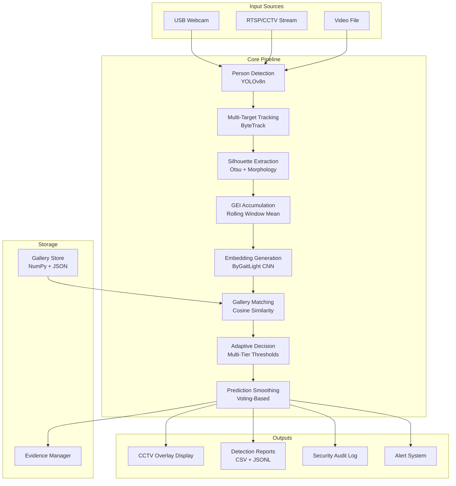
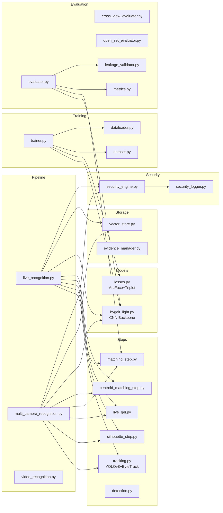
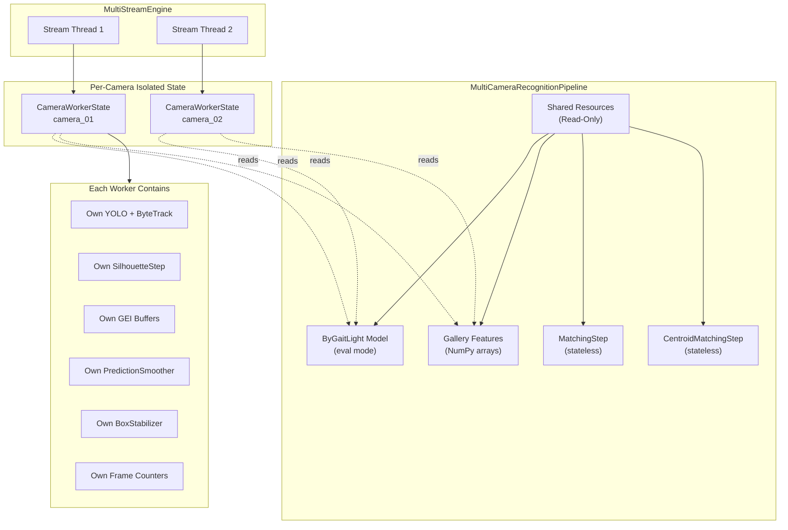
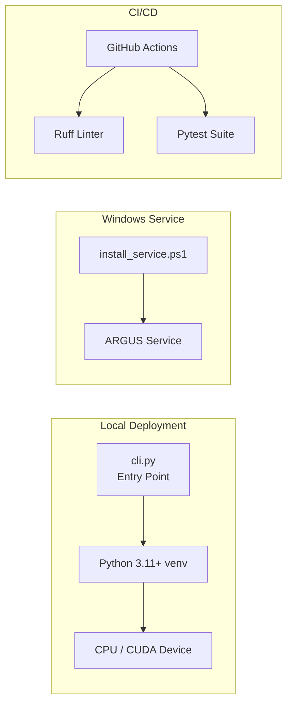
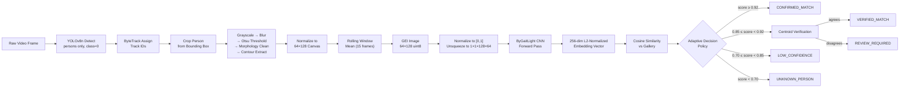

# Phase 2 — System Architecture

## 2.1 High-Level Architecture

## 2.2 Module Dependency Map

## 2.3 Multi-Camera Architecture

## 2.4 Deployment Architecture

## 2.5 Data Flow Diagram

## 2.6 Technology Stack

| Layer | Technology | Version |
|---|---|---|
| Language | Python | 3.11+ (CI), 3.14.6 (local) |
| Deep Learning | PyTorch | ≥2.0.0 |
| Object Detection | Ultralytics YOLOv8n | ≥8.0.0 |
| Multi-Target Tracking | Supervision ByteTrack | ≥0.18.0 |
| Image Processing | OpenCV | ≥4.8.0 |
| Numerical Computing | NumPy | ≥1.24.0 |
| API Framework | FastAPI + Uvicorn | ≥0.100.0 |
| Configuration | PyYAML | ≥6.0.0 |
| Logging | Python stdlib logging | Built-in |
| Testing | Pytest | ≥8.0.0 |
| Linting | Ruff | ≥0.3.0 |
| CI/CD | GitHub Actions | Ubuntu-latest |
| Deployment | PowerShell service scripts | Windows |
