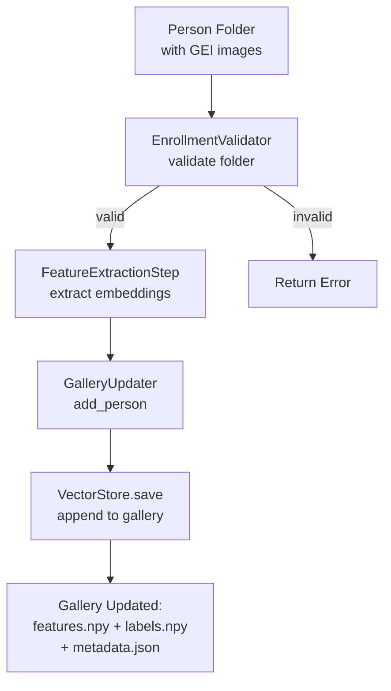
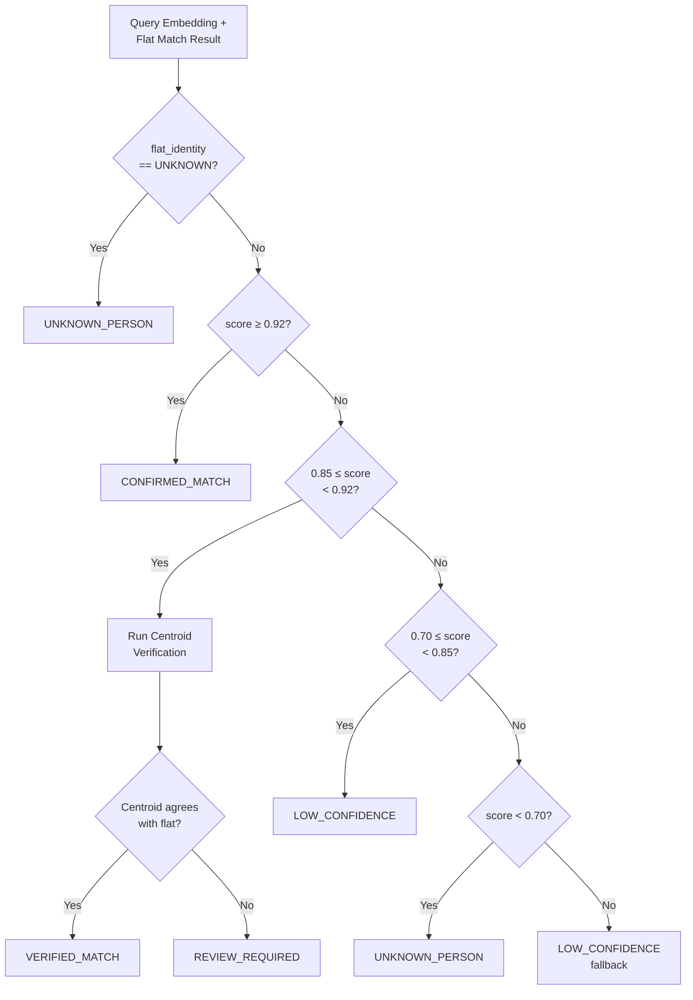

# Phase 5 — Gallery, Matching, and Decision Logic

## 6.1 Gallery Storage

**File:** `storage/vector_store.py::VectorStore`

| Property | Value |
|---|---|
| **Gallery directory** | `models/gallery/` (evaluation) or `models/live_gallery/` (live) |
| **Features file** | `gallery_features.npy` (NumPy float32 array, shape: [N, 256]) |
| **Labels file** | `gallery_labels.npy` (NumPy string array, shape: [N]) |
| **Metadata file** | `gallery_metadata.json` (per-identity status + embedding count) |
| **Current gallery size** | 13,869,184 bytes (~13.2 MB, ~54,176 embeddings at 256-dim float32) |
| **Persistence** | Disk-based (NumPy .npy + JSON) |
| **Encryption** | None |

### Metadata Schema

```json
{
    "subject_id": {
        "embeddings": 110,
        "status": "ACTIVE",
        "enabled": true,
        "updated_at": 1721234567.89
    }
}
```

## 6.2 Enrollment Workflow



### Key Enrollment Files
- `enrollment/enrollment_manager.py` — orchestrates gait and appearance enrollment
- `enrollment/enrollment_validator.py` — validates folder structure
- `enrollment/gallery_updater.py` — appends embeddings to gallery store
- `enrollment/auto_enrollment_service.py` — automated video-based enrollment
- `enrollment/folder_watcher.py` — monitors folder for new enrollment data

## 6.3 Cosine Similarity Matching

**File:** `pipeline/steps/matching_step.py::MatchingStep`

### Mathematical Operation

Given query embedding **q** and gallery embedding **g**, both L2-normalized:

```
similarity(q, g) = q · g / (‖q‖ × ‖g‖) = q · g    (since ‖q‖ = ‖g‖ = 1)
```

### Implementation

```python
# L2-normalize gallery and query
gallery_features = gallery_features / (norms + 1e-8)
query_feature = query_feature / (norm + 1e-8)

# Cosine similarity via dot product
scores = np.dot(gallery_features, query_feature)  # shape: [N]

# Best match
best_index = np.argmax(scores)
best_score = scores[best_index]
```

### Gallery Filtering

Before matching, the gallery is filtered by metadata:
- Only entries with `status == "ACTIVE"` AND `enabled == True` are included
- This allows disabling identities without removing them

## 6.4 Centroid Matching

**File:** `pipeline/steps/centroid_matching_step.py::CentroidMatchingStep`

### Centroid Building

For each identity, compute the mean of all gallery embeddings:

```
centroid_i = mean(gallery_features[labels == identity_i])
centroid_i = L2_normalize(centroid_i)
```

### Matching Modes

| Mode | Description |
|---|---|
| `flat` | Standard per-sample matching (delegates to MatchingStep) |
| `centroid` | Match against per-identity centroids |
| `centroid_margin` | Centroid + margin rule: reject if (best - second_best) < margin |
| `centroid_margin_topk` | Centroid + margin + top-k consensus voting in flat features |

### Top-K Consensus Logic

1. Compute centroid scores → get best identity
2. Apply margin rule: `best_score - second_best_score ≥ margin (0.05)`
3. Apply threshold: `best_score ≥ threshold`
4. Compute flat top-k scores → get top-5 labels
5. Count votes for best identity in top-5
6. Accept if `votes[best_identity] > k/2` (majority)

## 6.5 Adaptive Decision Policy

**File:** `pipeline/live_recognition.py::_adaptive_decision()`



### Decision Thresholds (from `configs/inference.yaml`)

| Parameter | Value | Purpose |
|---|---|---|
| `confirmed_threshold` | 0.92 | Above this: confirmed identity |
| `verify_low` | 0.85 | Start of verification zone |
| `verify_high` | 0.92 | End of verification zone |
| `low_confidence_low` | 0.70 | Start of low-confidence zone |
| `low_confidence_high` | 0.85 | End of low-confidence zone |
| `unknown_ceiling` | 0.70 | Below this: unknown person |
| `centroid_threshold` | 0.85 | Threshold for centroid matcher |
| `margin` | 0.05 | Minimum margin between top-2 centroids |
| `top_k` | 5 | Top-k for consensus voting |
| `min_stable_votes` | 3 | Minimum votes for prediction smoothing |
| `history_size` | 10 | Smoothing window size |

## 6.6 Prediction Smoothing

**File:** `utils/prediction_smoother.py::PredictionSmoother`

### Algorithm

1. Maintain per-track sliding window of `(prediction, score)` tuples (max 10)
2. Count votes: only predictions where `score ≥ threshold` and `prediction != "UNKNOWN"` are counted
3. If best prediction has ≥ `min_stable_votes` (3): confirm that identity
4. If a previously confirmed identity still has ≥1 vote: persist it
5. Otherwise: return UNKNOWN

### Purpose

Prevents rapid identity flickering when a track alternates between matches due to noisy GEIs.

## 6.7 Gallery Template Structure

| Property | Value |
|---|---|
| **Template type** | Raw per-sample embeddings (not averaged) |
| **Templates per identity** | Variable (typically 110 per subject for full gallery) |
| **Template averaging** | Not done at storage time; centroid matching computes averages at query time |
| **Multiple samples** | Yes — each GEI (per angle × per sequence) generates one embedding |

## 6.8 Unknown Rejection

The system rejects unknown identities at multiple levels:

1. **MatchingStep**: Returns UNKNOWN if `best_score < threshold`
2. **Adaptive Decision**: Returns UNKNOWN_PERSON if `flat_identity == UNKNOWN` or `score < 0.70`
3. **Centroid Verification**: Returns REVIEW_REQUIRED if centroid disagrees with flat match
4. **Prediction Smoothing**: Returns UNKNOWN if no prediction achieves ≥3 votes

## 6.9 Threshold Calibration

**Source:** `runs/exp_001/evaluation_subject_disjoint/threshold_calibration.json`

| Property | Value |
|---|---|
| **Calibration data** | Validation subjects only (063-074) |
| **Known val subjects** | 063-068 |
| **Unknown val subjects** | 069-074 |
| **Criterion** | min_eer (minimize Equal Error Rate) |
| **Selected threshold** | 0.9913 |
| **Score range** | 0.975 – 0.9989 |
| **Total val probes** | 792 |
| **Sweep samples** | 201 thresholds tested |

> [!IMPORTANT]
> The high threshold (0.9913) indicates very high similarity scores between gallery and probe embeddings. This is consistent with a model trained on all subjects (since training embeddings are very close in the learned space). After retraining on a clean split, this threshold will likely decrease.

## 6.10 Security Considerations

| Threat | Status | Mitigation |
|---|---|---|
| **Gallery poisoning** | Risk exists | No authentication required for enrollment |
| **Template theft** | Risk exists | Gallery stored as plaintext NumPy files |
| **Adversarial attacks** | Not addressed | No adversarial robustness measures |
| **Replay attacks** | Not addressed | No liveness detection |
| **Template encryption** | **Not implemented** | Gallery features stored unencrypted |
| **Biometric template protection** | **Not implemented** | Raw embeddings stored directly |
