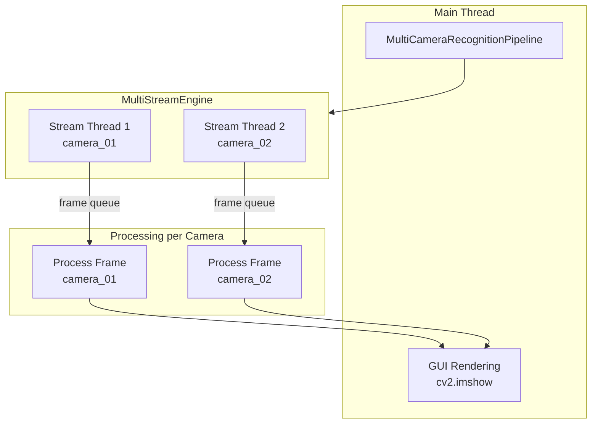
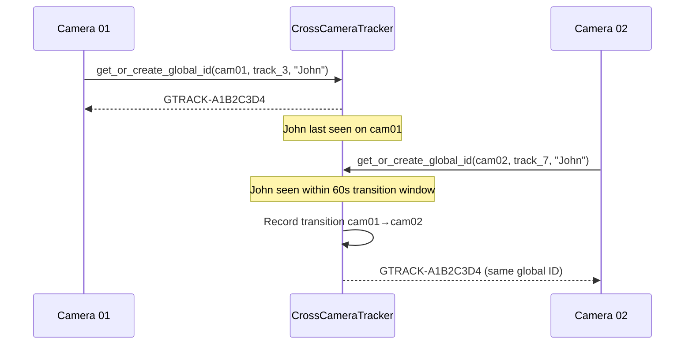

# Phase 6 — Multi-Camera and Surveillance Architecture

## 7.1 Supported Input Types

| Type | Config Key | Source | Status |
|---|---|---|---|
| USB Webcam | `type: usb` | `device_index: 0` | Implemented and tested |
| RTSP Stream | `type: rtsp` | `url: rtsp://...` | Implemented, requires network cameras |
| Video File | `type: file` | `file_path: "..."` | Implemented and tested |

## 7.2 Camera Configuration

**File:** `configs/cameras.yaml`

| Camera | Name | Type | Enabled |
|---|---|---|---|
| camera_01 | Main Entrance | RTSP | ✅ |
| camera_02 | Side Entrance | RTSP | ✅ |
| camera_03 | Parking Lot | RTSP | ❌ |

## 7.3 Multi-Camera Pipeline Architecture

**File:** `pipeline/multi_camera_recognition.py::MultiCameraRecognitionPipeline`

### Shared (Read-Only) Resources
- `ByGaitLight` model (eval mode)
- Gallery features + labels + metadata
- `MatchingStep` (stateless)
- `CentroidMatchingStep` (stateless)
- `EventLogger` (thread-safe)
- `AlertManager` (thread-safe)
- `SecurityEngine` (thread-safe)
- `DetectionDisplayRenderer` (stateless)
- `DetectionReporter` (thread-safe)

### Per-Camera Isolated State (`CameraWorkerState`)
- Own `TrackingStep` (YOLOv8 + ByteTrack instance)
- Own `SilhouetteStep`
- Own `BoxStabilizer`
- Own GEI buffers (`dict[int, LiveGEI]`)
- Own `PredictionSmoother`
- Own frame counters, recognition queues, track state

### Thread Architecture

## 7.4 Streaming Components

| Component | File | Purpose |
|---|---|---|
| `StreamEngine` | `streaming/stream_engine.py` | Single camera OpenCV capture |
| `MultiStreamEngine` | `streaming/multi_stream_engine.py` | Multi-camera stream manager |
| `BufferQueue` | `streaming/buffer_queue.py` | Thread-safe frame queue |
| `FrameDropper` | `streaming/frame_dropper.py` | Frame skipping under load |
| `WorkerPool` | `streaming/worker_pool.py` | Thread pool management |
| `CameraScheduler` | `streaming/camera_scheduler.py` | Camera priority scheduling |
| `LoadBalancer` | `streaming/load_balancer.py` | Load distribution logic |
| `PerformanceOptimizer` | `streaming/performance_optimizer.py` | Runtime optimization |

## 7.5 Cross-Camera Intelligence

| Component | File | Status | Purpose |
|---|---|---|---|
| `CrossCameraTracker` | `intelligence/cross_camera_tracker.py` | **Implemented** | Global track ID assignment, camera transitions |
| `IdentityPersistence` | `intelligence/identity_persistence.py` | **Implemented** | Score accumulation, alert suppression |
| `MissingPersonWorkflow` | `intelligence/missing_person_workflow.py` | **Implemented** | Watchlist management, evidence triggers |
| `ReIDCache` | `intelligence/reid_cache.py` | **Implemented** | TTL-based embedding cache |
| `ConfidenceScorer` | `intelligence/confidence_scorer.py` | **Implemented** | Confidence scoring logic |
| `AlertManager` | `intelligence/alert_manager.py` | **Placeholder** (64 bytes) | Not implemented |
| `DecisionEngine` | `intelligence/decision_engine.py` | **Placeholder** (64 bytes) | Not implemented |
| `PolicyEngine` | `intelligence/policy_engine.py` | **Placeholder** (64 bytes) | Not implemented |

### Cross-Camera Tracking Logic

## 7.6 Camera Services

| Component | File | Purpose | Status |
|---|---|---|---|
| `ARGUSService` | `services/argus_service.py` | Main service orchestrator | Implemented |
| `CameraService` | `services/camera_service.py` | Camera lifecycle management | Implemented |
| `CameraWorker` | `services/camera_worker.py` | Per-camera processing worker | Implemented |
| `CameraManager` | `services/camera_manager.py` | Camera pool management | Implemented |
| `CameraDiscovery` | `services/camera_discovery.py` | Network camera discovery | Implemented |
| `ONVIFClient` | `services/onvif_client.py` | ONVIF protocol support | Implemented |
| `VendorAdapters` | `services/vendor_adapters.py` | Vendor-specific camera adapters | Implemented |

## 7.7 Monitoring

| Component | File | Purpose | Status |
|---|---|---|---|
| `Watchdog` | `monitoring/watchdog.py` | Health monitoring, auto-restart | **Implemented** |
| `CameraMonitor` | `monitoring/camera_monitor.py` | Per-camera health monitoring | **Implemented** |
| `LoggingConfig` | `monitoring/logging_config.py` | Structured logging setup | **Implemented** |
| `CrashGuard` | `monitoring/crash_guard.py` | Crash recovery | **Placeholder** |
| `GPUTuner` | `monitoring/gpu_tuner.py` | GPU optimization | **Placeholder** |
| `MetricsCollector` | `monitoring/metrics_collector.py` | Performance metrics | **Placeholder** |
| `PerformanceProfiler` | `monitoring/performance_profiler.py` | Profiling | **Placeholder** |

## 7.8 Crowd Control

**Source:** `configs/inference.yaml::crowd_control`

| Parameter | Value | Purpose |
|---|---|---|
| `max_tracked_people_per_camera` | 50 | Cap tracked persons per camera |
| `max_recognitions_per_frame` | 3 | Cap recognition attempts per frame |
| `recognition_queue_size` | 100 | Max queued recognition tasks |
| `track_timeout_frames` | 90 | Remove inactive tracks after N frames |
| `min_box_height` | 60 | Minimum bounding box height |
| `min_box_area_ratio` | 0.003 | Minimum box area ratio |
| `priority_update_interval` | 10 | Frames between queue priority updates |

## 7.9 Functionality Classification

| Feature | Classification |
|---|---|
| Single-camera live recognition | **Fully working** |
| Multi-camera pipeline with isolated state | **Implemented and unit-tested** |
| CCTV-style display overlay | **Fully working** |
| Detection reporting (JSONL/CSV) | **Fully working** |
| Crowd control queue | **Implemented** |
| Box stabilization | **Implemented** |
| ONVIF discovery | **Implemented, requires network hardware** |
| Cross-camera tracking | **Implemented, not integration-tested** |
| Missing person workflow | **Implemented, not integration-tested** |
| Identity persistence | **Implemented, not integration-tested** |
| Watchdog auto-restart | **Implemented and tested** |
| GPU tuning | **Placeholder only** |
| Crash guard | **Placeholder only** |
| Performance profiler | **Placeholder only** |
