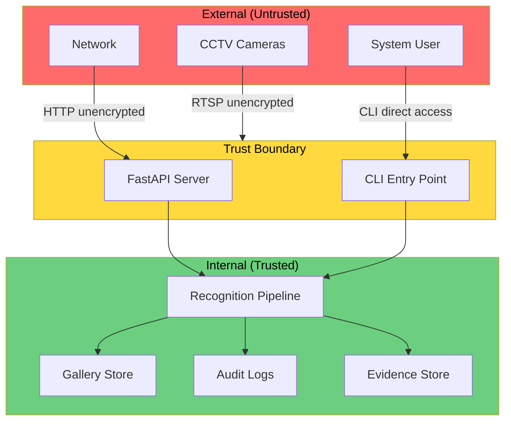

# Phase 7 — Privacy, Security, and Access-Control Analysis

## 8.1 Security Control Matrix

| Security Requirement | Current Control | Evidence | Status | Residual Risk | Recommendation |
|---|---|---|---|---|---|
| **Zero-Trust Architecture** | Conceptual design in docs | `docs/THESIS_ARCHITECTURE_COMPLIANCE_REPORT.md` | Architecture proposal only | Full trust assumed for internal components | Implement mutual authentication between components |
| **Role-Based Access Control** | Not implemented | No RBAC module exists | Not implemented | Any user can access all functions | Implement RBAC with role definitions |
| **Attribute-Based Access Control** | Not implemented | No ABAC module exists | Not implemented | No attribute-based policies | Consider ABAC for fine-grained control |
| **Authentication** | Not implemented | API has no auth middleware | Not implemented | Unauthenticated API access | Add JWT or API key authentication |
| **Authorization** | Not implemented | No authorization checks | Not implemented | Any request accepted | Implement authorization middleware |
| **Audit Logging** | **Implemented** | `security_layer/security_logger.py` | Implemented and verified | Logs are plaintext CSV; no tamper protection | Add cryptographic hashing |
| **Security Engine** | **Implemented** | `security_layer/security_engine.py` | Implemented | Rule-based only (UNKNOWN → ALERT, low score → REVIEW) | Enhance with risk scoring |
| **Case-Isolated Investigations** | Not implemented | No case isolation exists | Not implemented | All data accessible to all users | Implement case-based data partitioning |
| **Template Encryption** | Not implemented | Gallery stored as plaintext `.npy` | Not implemented | Templates extractable by anyone with file access | Encrypt gallery files at rest |
| **Data Encryption at Rest** | Not implemented | All files stored unencrypted | Not implemented | Data exposed if disk compromised | Implement filesystem encryption |
| **Data Encryption in Transit** | Not assessed | RTSP streams may be unencrypted | Not implemented | Eavesdropping on video streams | Use RTSPS or VPN tunnels |
| **Key Management** | Not implemented | No key management system | Not implemented | No keys to manage | Implement KMS when encryption is added |
| **Secure Storage** | Partially implemented | Gallery in local filesystem | Partially implemented | File-level access only protection | Add encrypted storage backend |
| **Data Retention** | **Implemented** | `storage/evidence_manager.py::enforce_retention_policy()` | Implemented | 30-day default retention | Make configurable per deployment |
| **Secure Deletion** | Not implemented | Standard file deletion only | Not implemented | Data recoverable from disk | Implement secure overwrite |
| **Insider Threat Protection** | Not implemented | No access controls exist | Not implemented | Any insider has full access | Implement principle of least privilege |
| **API Security** | Not implemented | FastAPI scaffold without auth | Not implemented | Open API endpoints | Add authentication, rate limiting, input validation |
| **Session Management** | Not implemented | No sessions exist | Not implemented | N/A (no authentication) | Implement when auth is added |
| **Input Validation** | Partially implemented | Some parameter validation in enrollment | Partially implemented | Potential for malformed input | Add comprehensive input validation |
| **Logging of Sensitive Info** | Risk exists | Security logs contain identity IDs and scores | Partially addressed | PII in logs | Pseudonymize identity IDs in logs |
| **Model Security** | Not addressed | Model files stored unprotected | Not implemented | Model theft, reverse engineering | Encrypt or obfuscate model files |
| **Gallery Poisoning** | Not addressed | Open enrollment without verification | Not implemented | Attacker can inject false identities | Add enrollment authentication |
| **Adversarial Attacks** | Not addressed | No adversarial robustness | Not implemented | Adversarial GEIs could fool model | Research adversarial defence for gait |
| **Replay Attacks** | Not addressed | No liveness detection | Not implemented | Pre-recorded video replay | Not applicable to gait surveillance context |
| **Template Theft** | Risk exists | Raw embeddings in plaintext files | Not implemented | Embeddings extractable | Implement biometric template protection |

## 8.2 Threat Model (STRIDE Analysis)

### Assets

| Asset | Sensitivity | Location |
|---|---|---|
| Raw Video Frames | HIGH | Camera streams, in-memory |
| Silhouettes | MEDIUM | In-memory (not persisted) |
| GEI Images | MEDIUM | In-memory, evidence manager |
| Gait Embeddings (256-dim) | HIGH | Gallery `.npy` files, in-memory |
| Identity Records | HIGH | Gallery metadata, security logs |
| Gallery Templates | HIGH | `models/gallery/` and `models/live_gallery/` |
| Audit Logs | HIGH | `outputs/security_logs/security_events.csv` |
| Investigation Evidence | HIGH | `outputs/evidence/` |
| Detection Reports | MEDIUM | `outputs/detection_reports/` |
| Model Checkpoint | MEDIUM | `runs/exp_001/best_model.pth` |
| Credentials (RTSP) | HIGH | `configs/cameras.yaml` (plaintext) |
| Configuration Files | LOW | `configs/` |

### STRIDE Threat Analysis

| Threat | Category | Asset | Attack Surface | Current Mitigation | Risk Level |
|---|---|---|---|---|---|
| Unauthorized identity lookup | **Spoofing** | Gallery | API / filesystem | None | HIGH |
| Inject false identity into gallery | **Tampering** | Gallery | Enrollment endpoint / filesystem | None | HIGH |
| Deny surveillance observation occurred | **Repudiation** | Audit logs | Log files | CSV logging (no integrity protection) | MEDIUM |
| Extract biometric templates | **Information Disclosure** | Embeddings | Filesystem / API | None (plaintext files) | HIGH |
| Flood system with fake camera feeds | **Denial of Service** | Pipeline | RTSP streams | Basic reconnect logic | MEDIUM |
| Escalate access to admin functions | **Elevation of Privilege** | All | CLI / API | None (no auth) | HIGH |
| Intercept RTSP video streams | **Information Disclosure** | Raw video | Network | None | MEDIUM |
| Modify security audit logs | **Tampering** | Audit logs | Filesystem | Thread-safe writes only | HIGH |
| Steal model checkpoint | **Information Disclosure** | Model | Filesystem | None | LOW |
| RTSP credential extraction | **Information Disclosure** | Credentials | `cameras.yaml` | None (plaintext) | HIGH |

### Trust Boundary Diagram

> [!CAUTION]
> **No trust boundary enforcement exists.** All components within the system trust each other implicitly. The API has no authentication. The CLI provides unrestricted access. Gallery files can be read or modified by any process with filesystem access. RTSP credentials are stored in plaintext YAML.

## 8.3 Implemented Security Features Detail

### 8.3.1 Security Engine

**File:** `security_layer/security_engine.py`

- Evaluates recognition events and assigns severity
- Rule: UNKNOWN → `SECURITY_ALERT` (severity HIGH)
- Rule: score < threshold → `REVIEW_REQUIRED` (severity MEDIUM)
- Otherwise: `ALLOW` (severity INFO)
- **Classification:** Implemented. Basic rule-based decision engine.

### 8.3.2 Security Logger

**File:** `security_layer/security_logger.py`

- Thread-safe CSV writer with locking
- Fields: timestamp, track_id, identity, score, severity, decision, camera_id
- Creates header row on first write
- **Classification:** Implemented. Provides audit trail but without integrity protection.

### 8.3.3 Evidence Manager

**File:** `storage/evidence_manager.py`

- Saves snapshots, GEI images, and metadata per detection event
- Organized folder structure: `{base_dir}/{target_id}/{datetime}_{camera_id}/`
- Includes retention policy enforcement (default 30 days)
- Thread-safe with locking
- **Classification:** Implemented. Basic evidence management.

## 8.4 Recommendations for Thesis

1. **Clearly distinguish** between implemented security controls and proposed architecture
2. **Do not claim** the system is "secure" or "Zero-Trust compliant" — it has security *components* but not a complete security posture
3. **Report** the security audit logging as an implemented contribution
4. **Identify** the gap between the security architecture vision and current implementation
5. **Frame** future work around implementing RBAC, encryption, and tamper-proof logging
