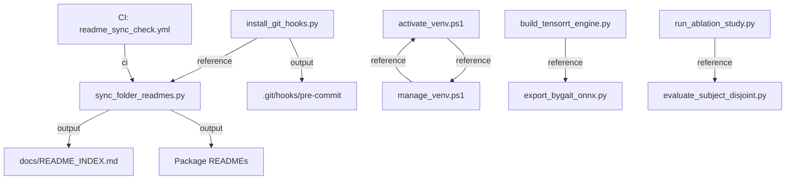
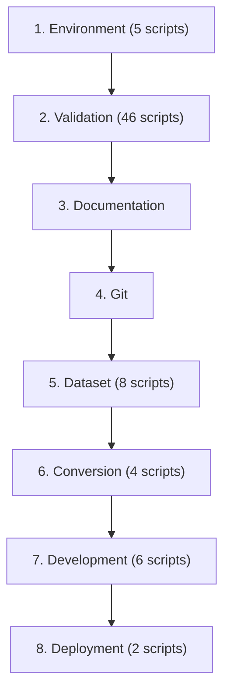
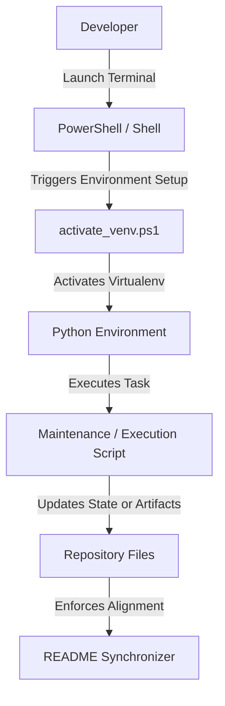

# Scripts

The `scripts/` folder serves as the central automation, maintenance, and utility hub for the ARGUS AI project.

## Folder Purpose

This folder contains project maintenance, automation, development, validation, evaluation, dataset processing, and repository utility scripts. These scripts automate key developer workflows, ensure environment consistency, run offline scientific evaluations, and maintain documentation alignment across the codebase.

## Script Inventory

<!-- BEGIN SYNC: KEY_MODULES -->
| Script | Purpose | Primary Usage |
|---|---|---|
| [activate_venv.ps1](activate_venv.ps1) | ARGUS AI - Automatic Python virtual environment activation. | `powershell -ExecutionPolicy Bypass -File scripts/activate_venv.ps1` |
| [analyze_cl_part_similarity.py](analyze_cl_part_similarity.py) | EXP-004B CL Root Cause Analysis: HPP Part-Level Similarity Investigation. | `python scripts/analyze_cl_part_similarity.py` |
| [analyze_open_set_and_cl.py](analyze_open_set_and_cl.py) | Utility script for analyze open set and cl. | `python scripts/analyze_open_set_and_cl.py` |
| [benchmark.py](benchmark.py) | Performance benchmark script for benchmark. | `python scripts/benchmark.py` |
| [benchmark_crowd_performance.py](benchmark_crowd_performance.py) | Performance Measurement Benchmark for Crowd Intelligence Features. | `python scripts/benchmark_crowd_performance.py` |
| [benchmark_inference_backends.py](benchmark_inference_backends.py) | Inference Backend Performance and Parity Benchmark Script for ARGUS AI. | `python scripts/benchmark_inference_backends.py` |
| [benchmark_silhouette_segmenters.py](benchmark_silhouette_segmenters.py) | Performance benchmark script for benchmark silhouette segmenters. | `python scripts/benchmark_silhouette_segmenters.py` |
| [bootstrap_env.ps1](bootstrap_env.ps1) | ARGUS AI - Production-Grade Automated Environment Bootstrap & Repair. | `powershell -ExecutionPolicy Bypass -File scripts/bootstrap_env.ps1` |
| [build_gallery.py](build_gallery.py) | Utility script for build gallery. | `python scripts/build_gallery.py` |
| [build_tensorrt_engine.py](build_tensorrt_engine.py) | Build TensorRT engine from ONNX model file and verify output parity. | `python scripts/build_tensorrt_engine.py` |
| [clean_live_gallery.py](clean_live_gallery.py) | Clean contaminated identities from ARGUS live gallery | `python scripts/clean_live_gallery.py` |
| [demo_confidence_scorer.py](demo_confidence_scorer.py) | Utility script for demo confidence scorer. | `python scripts/demo_confidence_scorer.py` |
| [demo_enrollment.py](demo_enrollment.py) | Utility script for demo enrollment. | `python scripts/demo_enrollment.py` |
| [demo_events.py](demo_events.py) | Utility script for demo events. | `python scripts/demo_events.py` |
| [demo_gei.py](demo_gei.py) | Utility script for demo gei. | `python scripts/demo_gei.py` |
| [demo_security_layer.py](demo_security_layer.py) | Utility script for demo security layer. | `python scripts/demo_security_layer.py` |
| [demo_silhouette.py](demo_silhouette.py) | Utility script for demo silhouette. | `python scripts/demo_silhouette.py` |
| [demo_streaming_optimization.py](demo_streaming_optimization.py) | Utility script for demo streaming optimization. | `python scripts/demo_streaming_optimization.py` |
| [detect_environment.py](detect_environment.py) | ARGUS AI Hardware & Compute Environment Detector CLI. | `python scripts/detect_environment.py` |
| [doctor.py](doctor.py) | ARGUS AI Non-Destructive Deployment Health Checker CLI (doctor.py). | `python scripts/doctor.py` |
| [download_gdrive_osnet.py](download_gdrive_osnet.py) | Test downloading Google Drive weights with session cookies and confirmation tokens. | `python scripts/download_gdrive_osnet.py` |
| [download_osnet_weights.py](download_osnet_weights.py) | Add project root to sys.path | `python scripts/download_osnet_weights.py` |
| [download_package.py](download_package.py) | ARGUS AI Real-Time Package & Large File Streaming Downloader. | `python scripts/download_package.py` |
| [evaluate_appearance_recognition.py](evaluate_appearance_recognition.py) | Evaluation script for appearance recognition. | `python scripts/evaluate_appearance_recognition.py` |
| [evaluate_cross_view.py](evaluate_cross_view.py) | Evaluate ARGUS Cross-View Gait Recognition Metrics | `python scripts/evaluate_cross_view.py` |
| [evaluate_dual_modal_recognition.py](evaluate_dual_modal_recognition.py) | Evaluation script for dual modal recognition. | `python scripts/evaluate_dual_modal_recognition.py` |
| [evaluate_exp004.py](evaluate_exp004.py) | EXP-004 Evaluation & Reporting Script. | `python scripts/evaluate_exp004.py` |
| [evaluate_model.py](evaluate_model.py) | Evaluate ARGUS gait recognition model | `python scripts/evaluate_model.py` |
| [evaluate_open_set.py](evaluate_open_set.py) | Evaluate ARGUS Open-Set Gait Recognition Metrics | `python scripts/evaluate_open_set.py` |
| [evaluate_open_set_threshold_sweep.py](evaluate_open_set_threshold_sweep.py) | Evaluate ARGUS Open-Set Threshold and Matching Mode Sweep | `python scripts/evaluate_open_set_threshold_sweep.py` |
| [evaluate_subject_disjoint.py](evaluate_subject_disjoint.py) | Run Full ARGUS Subject-Disjoint Baseline Evaluation Pipeline | `python scripts/evaluate_subject_disjoint.py` |
| [evaluate_threshold_sweep.py](evaluate_threshold_sweep.py) | Evaluate ARGUS thresholds via sweep evaluation | `python scripts/evaluate_threshold_sweep.py` |
| [export_bygait_onnx.py](export_bygait_onnx.py) | Export PyTorch ByGaitLight model checkpoint to ONNX format and verify numerical parity. | `python scripts/export_bygait_onnx.py` |
| [export_silhouette_unet_onnx.py](export_silhouette_unet_onnx.py) | Utility script for export silhouette unet onnx. | `python scripts/export_silhouette_unet_onnx.py` |
| [extract_casia_skeletons.py](extract_casia_skeletons.py) | Extract per-frame 2D COCO-17 pose keypoints from raw CASIA-B video frame sequences | `python scripts/extract_casia_skeletons.py` |
| [generate_visualizer_charts.py](generate_visualizer_charts.py) | Utility script for generate visualizer charts. | `python scripts/generate_visualizer_charts.py` |
| [install_git_hooks.py](install_git_hooks.py) | Installs Git pre-commit hooks for automated ARGUS AI README synchronization. | `python scripts/install_git_hooks.py` |
| [manage_venv.ps1](manage_venv.ps1) | ARGUS AI - Safe Virtual Environment Manager for Windows. | `powershell -ExecutionPolicy Bypass -File scripts/manage_venv.ps1` |
| [migrate_output_layout.py](migrate_output_layout.py) | One-time runtime output layout migration script. | `python scripts/migrate_output_layout.py` |
| [preprocess_casia.py](preprocess_casia.py) | Build GEI images from CASIA-B ZIP dataset | `python scripts/preprocess_casia.py` |
| [process_runner.py](process_runner.py) | ARGUS AI Real-Time Subprocess Execution & Streamer. | `python scripts/process_runner.py` |
| [remove_gallery_identity.py](remove_gallery_identity.py) | Remove an identity from ARGUS gallery | `python scripts/remove_gallery_identity.py` |
| [remove_numeric_gallery_identities.py](remove_numeric_gallery_identities.py) | Remove numeric CASIA-B identities from ARGUS gallery | `python scripts/remove_numeric_gallery_identities.py` |
| [run_ablation_study.py](run_ablation_study.py) | Run Full ARGUS Gait Ablation Study (EXP-003A..E) | `python scripts/run_ablation_study.py` |
| [run_auto_enrollment.py](run_auto_enrollment.py) | ARGUS auto enrollment service | `python scripts/run_auto_enrollment.py` |
| [run_exp004_ablations.py](run_exp004_ablations.py) | Run EXP-004 Open-Set & CL Robustness Ablations | `python scripts/run_exp004_ablations.py` |
| [run_exp006_3d.py](run_exp006_3d.py) | EXP-006 Controlled Experiment: | `python scripts/run_exp006_3d.py` |
| [run_exp006_full.py](run_exp006_full.py) | EXP-006 End-to-End Runner: | `python scripts/run_exp006_full.py` |
| [run_exp007_ablations.py](run_exp007_ablations.py) | EXP-007 Controlled Ablation Study and Optimization: | `python scripts/run_exp007_ablations.py` |
| [run_folder_recognition.py](run_folder_recognition.py) | ARGUS folder-based GEI recognition | `python scripts/run_folder_recognition.py` |
| [run_folder_watcher.py](run_folder_watcher.py) | Utility script for run folder watcher. | `python scripts/run_folder_watcher.py` |
| [run_gallery_match.py](run_gallery_match.py) | Utility script for run gallery match. | `python scripts/run_gallery_match.py` |
| [run_inference_pipeline.py](run_inference_pipeline.py) | Utility script for run inference pipeline. | `python scripts/run_inference_pipeline.py` |
| [run_live_gei.py](run_live_gei.py) | Utility script for run live gei. | `python scripts/run_live_gei.py` |
| [run_live_recognition.py](run_live_recognition.py) | Utility script for run live recognition. | `python scripts/run_live_recognition.py` |
| [run_optimization.py](run_optimization.py) | Utility script for run optimization. | `python scripts/run_optimization.py` |
| [run_tracking.py](run_tracking.py) | Utility script for run tracking. | `python scripts/run_tracking.py` |
| [run_video_recognition.py](run_video_recognition.py) | ARGUS video-file gait recognition | `python scripts/run_video_recognition.py` |
| [run_webcam_detection.py](run_webcam_detection.py) | Utility script for run webcam detection. | `python scripts/run_webcam_detection.py` |
| [set_gallery_identity_status.py](set_gallery_identity_status.py) | Set ARGUS gallery identity status | `python scripts/set_gallery_identity_status.py` |
| [setup_silhouette_model.py](setup_silhouette_model.py) | Silhouette Model Setup and Asset Verification Helper for ARGUS AI. | `python scripts/setup_silhouette_model.py` |
| [simulate_date_aware_learning.py](simulate_date_aware_learning.py) | Real Integration Simulation Script for ARGUS AI Date-Aware Continuous Embedding Learning. | `python scripts/simulate_date_aware_learning.py` |
| [smoke_test_deployment.py](smoke_test_deployment.py) | Automated Native Deployment Smoke Test for ARGUS AI. | `python scripts/smoke_test_deployment.py` |
| [start_system.bat](start_system.bat) | System startup launcher script. | `scripts/start_system.bat` |
| [start_system.sh](start_system.sh) | System startup launcher script. | `scripts/start_system.sh` |
| [sync_folder_readmes.py](sync_folder_readmes.py) | Automated README synchronization script for ARGUS AI package folders. | `python scripts/sync_folder_readmes.py` |
| [system_check.py](system_check.py) | Environment and dependency verification script. | `python scripts/system_check.py` |
| [train_model.py](train_model.py) | Train ARGUS ByGaitLight model with metric learning (HPP + ArcFace + Triplet). | `python scripts/train_model.py` |
| [validate_appearance_runtime.py](validate_appearance_runtime.py) | Full Real-Runtime Appearance Model Validation Script for ARGUS AI. | `python scripts/validate_appearance_runtime.py` |
| [validate_continuous_improvement_lifecycle.py](validate_continuous_improvement_lifecycle.py) | End-to-End Demonstration and Validation Script for ARGUS AI Continuous Improvement Architecture, | `python scripts/validate_continuous_improvement_lifecycle.py` |
| [verify_environment.py](verify_environment.py) | ARGUS AI Complete Environment & Model Verification Suite. | `python scripts/verify_environment.py` |
| [verify_firebase_persistence.py](verify_firebase_persistence.py) | Verification and Health Check Script for Firebase Durable Embedding Persistence Layer. | `python scripts/verify_firebase_persistence.py` |
| [verify_real_nn_learning.py](verify_real_nn_learning.py) | ARGUS AI — Real Neural Network Learning & Weight Update Verification Script. | `python scripts/verify_real_nn_learning.py` |
<!-- END SYNC: KEY_MODULES -->

## Script Metadata

<!-- BEGIN SYNC: SCRIPT_METADATA_TABLE -->
| Script | Category | CLI | Auto | Used by CI | Used by Hook | Description |
|---|---|---|---|---|---|---|
| [activate_venv.ps1](activate_venv.ps1) | Environment | No | Yes | No | No | ARGUS AI - Automatic Python virtual environment activation. |
| [analyze_cl_part_similarity.py](analyze_cl_part_similarity.py) | Development | No | No | No | No | EXP-004B CL Root Cause Analysis: HPP Part-Level Similarit... |
| [analyze_open_set_and_cl.py](analyze_open_set_and_cl.py) | Development | No | No | No | No | Utility script for analyze open set and cl. |
| [benchmark.py](benchmark.py) | Validation | No | No | No | No | Performance benchmark script for benchmark. |
| [benchmark_crowd_performance.py](benchmark_crowd_performance.py) | Validation | No | No | No | No | Performance Measurement Benchmark for Crowd Intelligence ... |
| [benchmark_inference_backends.py](benchmark_inference_backends.py) | Validation | Yes | No | No | No | Inference Backend Performance and Parity Benchmark Script... |
| [benchmark_silhouette_segmenters.py](benchmark_silhouette_segmenters.py) | Validation | No | No | No | No | Performance benchmark script for benchmark silhouette seg... |
| [bootstrap_env.ps1](bootstrap_env.ps1) | Environment | No | No | No | No | ARGUS AI - Production-Grade Automated Environment Bootstr... |
| [build_gallery.py](build_gallery.py) | Dataset | No | No | No | No | Utility script for build gallery. |
| [build_tensorrt_engine.py](build_tensorrt_engine.py) | Conversion | Yes | No | No | No | Build TensorRT engine from ONNX model file and verify out... |
| [clean_live_gallery.py](clean_live_gallery.py) | Dataset | Yes | No | No | No | Clean contaminated identities from ARGUS live gallery |
| [demo_confidence_scorer.py](demo_confidence_scorer.py) | Validation | No | No | No | No | Utility script for demo confidence scorer. |
| [demo_enrollment.py](demo_enrollment.py) | Validation | No | No | No | No | Utility script for demo enrollment. |
| [demo_events.py](demo_events.py) | Validation | No | No | No | No | Utility script for demo events. |
| [demo_gei.py](demo_gei.py) | Validation | No | No | No | No | Utility script for demo gei. |
| [demo_security_layer.py](demo_security_layer.py) | Validation | No | No | No | No | Utility script for demo security layer. |
| [demo_silhouette.py](demo_silhouette.py) | Validation | No | No | No | No | Utility script for demo silhouette. |
| [demo_streaming_optimization.py](demo_streaming_optimization.py) | Validation | No | No | No | No | Utility script for demo streaming optimization. |
| [detect_environment.py](detect_environment.py) | Validation | Yes | No | No | No | ARGUS AI Hardware & Compute Environment Detector CLI. |
| [doctor.py](doctor.py) | Validation | No | No | No | No | ARGUS AI Non-Destructive Deployment Health Checker CLI (d... |
| [download_gdrive_osnet.py](download_gdrive_osnet.py) | Development | No | No | No | No | Test downloading Google Drive weights with session cookie... |
| [download_osnet_weights.py](download_osnet_weights.py) | Development | No | No | No | No | Add project root to sys.path |
| [download_package.py](download_package.py) | Environment | Yes | No | No | No | ARGUS AI Real-Time Package & Large File Streaming Downloa... |
| [evaluate_appearance_recognition.py](evaluate_appearance_recognition.py) | Validation | No | No | No | No | Evaluation script for appearance recognition. |
| [evaluate_cross_view.py](evaluate_cross_view.py) | Validation | Yes | No | No | No | Evaluate ARGUS Cross-View Gait Recognition Metrics |
| [evaluate_dual_modal_recognition.py](evaluate_dual_modal_recognition.py) | Validation | No | No | No | No | Evaluation script for dual modal recognition. |
| [evaluate_exp004.py](evaluate_exp004.py) | Validation | Yes | No | No | No | EXP-004 Evaluation & Reporting Script. |
| [evaluate_model.py](evaluate_model.py) | Validation | Yes | No | No | No | Evaluate ARGUS gait recognition model |
| [evaluate_open_set.py](evaluate_open_set.py) | Validation | Yes | No | No | No | Evaluate ARGUS Open-Set Gait Recognition Metrics |
| [evaluate_open_set_threshold_sweep.py](evaluate_open_set_threshold_sweep.py) | Validation | Yes | No | No | No | Evaluate ARGUS Open-Set Threshold and Matching Mode Sweep |
| [evaluate_subject_disjoint.py](evaluate_subject_disjoint.py) | Validation | Yes | No | No | No | Run Full ARGUS Subject-Disjoint Baseline Evaluation Pipeline |
| [evaluate_threshold_sweep.py](evaluate_threshold_sweep.py) | Validation | Yes | No | No | No | Evaluate ARGUS thresholds via sweep evaluation |
| [export_bygait_onnx.py](export_bygait_onnx.py) | Conversion | Yes | No | No | No | Export PyTorch ByGaitLight model checkpoint to ONNX forma... |
| [export_silhouette_unet_onnx.py](export_silhouette_unet_onnx.py) | Conversion | No | No | No | No | Utility script for export silhouette unet onnx. |
| [extract_casia_skeletons.py](extract_casia_skeletons.py) | Dataset | Yes | No | No | No | Extract per-frame 2D COCO-17 pose keypoints from raw CASI... |
| [generate_visualizer_charts.py](generate_visualizer_charts.py) | Validation | No | No | No | No | Utility script for generate visualizer charts. |
| [install_git_hooks.py](install_git_hooks.py) | Git | No | No | No | No | Installs Git pre-commit hooks for automated ARGUS AI READ... |
| [manage_venv.ps1](manage_venv.ps1) | Environment | No | No | No | No | ARGUS AI - Safe Virtual Environment Manager for Windows. |
| [migrate_output_layout.py](migrate_output_layout.py) | Conversion | Yes | No | No | No | One-time runtime output layout migration script. |
| [preprocess_casia.py](preprocess_casia.py) | Dataset | Yes | No | No | No | Build GEI images from CASIA-B ZIP dataset |
| [process_runner.py](process_runner.py) | Environment | Yes | No | No | No | ARGUS AI Real-Time Subprocess Execution & Streamer. |
| [remove_gallery_identity.py](remove_gallery_identity.py) | Dataset | Yes | No | No | No | Remove an identity from ARGUS gallery |
| [remove_numeric_gallery_identities.py](remove_numeric_gallery_identities.py) | Dataset | Yes | No | No | No | Remove numeric CASIA-B identities from ARGUS gallery |
| [run_ablation_study.py](run_ablation_study.py) | Validation | Yes | No | No | No | Run Full ARGUS Gait Ablation Study (EXP-003A..E) |
| [run_auto_enrollment.py](run_auto_enrollment.py) | Dataset | Yes | No | No | No | ARGUS auto enrollment service |
| [run_exp004_ablations.py](run_exp004_ablations.py) | Validation | Yes | No | No | No | Run EXP-004 Open-Set & CL Robustness Ablations |
| [run_exp006_3d.py](run_exp006_3d.py) | Validation | No | No | No | No | EXP-006 Controlled Experiment: |
| [run_exp006_full.py](run_exp006_full.py) | Validation | No | No | No | No | EXP-006 End-to-End Runner: |
| [run_exp007_ablations.py](run_exp007_ablations.py) | Validation | No | No | No | No | EXP-007 Controlled Ablation Study and Optimization: |
| [run_folder_recognition.py](run_folder_recognition.py) | Validation | Yes | No | No | No | ARGUS folder-based GEI recognition |
| [run_folder_watcher.py](run_folder_watcher.py) | Validation | No | No | No | No | Utility script for run folder watcher. |
| [run_gallery_match.py](run_gallery_match.py) | Validation | No | No | No | No | Utility script for run gallery match. |
| [run_inference_pipeline.py](run_inference_pipeline.py) | Validation | No | No | No | No | Utility script for run inference pipeline. |
| [run_live_gei.py](run_live_gei.py) | Validation | No | No | No | No | Utility script for run live gei. |
| [run_live_recognition.py](run_live_recognition.py) | Validation | No | No | No | No | Utility script for run live recognition. |
| [run_optimization.py](run_optimization.py) | Validation | No | No | No | No | Utility script for run optimization. |
| [run_tracking.py](run_tracking.py) | Validation | No | No | No | No | Utility script for run tracking. |
| [run_video_recognition.py](run_video_recognition.py) | Validation | Yes | No | No | No | ARGUS video-file gait recognition |
| [run_webcam_detection.py](run_webcam_detection.py) | Validation | No | No | No | No | Utility script for run webcam detection. |
| [set_gallery_identity_status.py](set_gallery_identity_status.py) | Dataset | Yes | No | No | No | Set ARGUS gallery identity status |
| [setup_silhouette_model.py](setup_silhouette_model.py) | Development | No | No | No | No | Silhouette Model Setup and Asset Verification Helper for ... |
| [simulate_date_aware_learning.py](simulate_date_aware_learning.py) | Validation | No | No | No | No | Real Integration Simulation Script for ARGUS AI Date-Awar... |
| [smoke_test_deployment.py](smoke_test_deployment.py) | Validation | No | No | No | No | Automated Native Deployment Smoke Test for ARGUS AI. |
| [start_system.bat](start_system.bat) | Deployment | No | No | No | No | System startup launcher script. |
| [start_system.sh](start_system.sh) | Deployment | No | No | No | No | System startup launcher script. |
| [sync_folder_readmes.py](sync_folder_readmes.py) | Documentation | Yes | Yes | Yes | Yes | Automated README synchronization script for ARGUS AI pack... |
| [system_check.py](system_check.py) | Validation | No | No | No | No | Environment and dependency verification script. |
| [train_model.py](train_model.py) | Development | Yes | No | No | No | Train ARGUS ByGaitLight model with metric learning (HPP +... |
| [validate_appearance_runtime.py](validate_appearance_runtime.py) | Validation | No | No | No | No | Full Real-Runtime Appearance Model Validation Script for ... |
| [validate_continuous_improvement_lifecycle.py](validate_continuous_improvement_lifecycle.py) | Validation | No | No | No | No | End-to-End Demonstration and Validation Script for ARGUS ... |
| [verify_environment.py](verify_environment.py) | Validation | No | No | No | No | ARGUS AI Complete Environment & Model Verification Suite. |
| [verify_firebase_persistence.py](verify_firebase_persistence.py) | Validation | No | No | No | No | Verification and Health Check Script for Firebase Durable... |
| [verify_real_nn_learning.py](verify_real_nn_learning.py) | Validation | No | No | No | No | ARGUS AI — Real Neural Network Learning & Weight Update V... |
<!-- END SYNC: SCRIPT_METADATA_TABLE -->

## CLI Reference

<!-- BEGIN SYNC: CLI_REFERENCE -->
<details>
<summary><strong>benchmark_inference_backends.py</strong> — Benchmark ARGUS inference backends.</summary>

**Usage**: `python scripts/benchmark_inference_backends.py`

| Flag / Argument | Type | Required | Default | Description |
|---|---|---|---|---|
| `--samples` | int | No | 50 | Number of benchmark iterations |
| `--device` | str | No | `auto` | Device choice (auto, cpu, cuda) |
| `--precision` | str | No | `fp32` | Precision (fp32, fp16) |
| `--save-report` | flag | No | None | Save JSON report |

**Examples**:

```bash
python scripts/benchmark_inference_backends.py
python scripts/benchmark_inference_backends.py --samples 50 --device auto
```

</details>

<details>
<summary><strong>build_tensorrt_engine.py</strong> — Build TensorRT engine from ONNX model.</summary>

**Usage**: `python scripts/build_tensorrt_engine.py`

| Flag / Argument | Type | Required | Default | Description |
|---|---|---|---|---|
| `--onnx-path` | str | No | `models/engines/bygait_light.onnx` | Path to ONNX file |
| `--engine-path` | str | No | `models/engines/bygait_light_fp16.engine` | Output engine path |
| `--precision` | str | No | `fp16` | Precision mode (choices: fp32, fp16) |

**Examples**:

```bash
python scripts/build_tensorrt_engine.py
python scripts/build_tensorrt_engine.py --onnx-path models/engines/bygait_light.onnx --engine-path models/engines/bygait_light_fp16.engine
```

</details>

<details>
<summary><strong>clean_live_gallery.py</strong> — Clean contaminated identities from ARGUS live gallery</summary>

**Usage**: `python scripts/clean_live_gallery.py`

| Flag / Argument | Type | Required | Default | Description |
|---|---|---|---|---|
| `--gallery-dir` | — | No | `models/live_gallery` | — |
| `--person-id` | — (repeatable) | Yes | None | Identity to remove. Can be used multiple times. |

**Examples**:

```bash
python scripts/clean_live_gallery.py
python scripts/clean_live_gallery.py --gallery-dir models/live_gallery
```

</details>

<details>
<summary><strong>detect_environment.py</strong> — ARGUS Hardware & Environment Detector</summary>

**Usage**: `python scripts/detect_environment.py`

| Flag / Argument | Type | Required | Default | Description |
|---|---|---|---|---|
| `--json` | flag | No | None | Output results in JSON format |

**Examples**:

```bash
python scripts/detect_environment.py
python scripts/detect_environment.py --json
```

</details>

<details>
<summary><strong>download_package.py</strong> — ARGUS AI Live Streaming Downloader</summary>

**Usage**: `python scripts/download_package.py`

| Flag / Argument | Type | Required | Default | Description |
|---|---|---|---|---|
| `url` | — | No | None | Download URL |
| `output` | — | No | None | Destination file path |
| `--name` | — | No | None | Display package name |
| `--version` | — | No | None | Package version string |
| `--platform` | — | No | None | Platform tag |
| `--source` | — | No | None | Download source label |
| `--sha256` | — | No | None | Expected SHA-256 hash |
| `--retries` | int | No | None | Maximum retry attempts |

**Examples**:

```bash
python scripts/download_package.py
```

</details>

<details>
<summary><strong>evaluate_cross_view.py</strong> — Evaluate ARGUS Cross-View Gait Recognition Metrics</summary>

**Usage**: `python scripts/evaluate_cross_view.py`

| Flag / Argument | Type | Required | Default | Description |
|---|---|---|---|---|
| `--max-images` | int | No | 500 | Max images to evaluate. Default: 500. |
| `--gallery-ratio` | float | No | 0.5 | Ratio of features to keep in gallery. Default: 0.5. |
| `--threshold` | float | No | 0.75 | Recognition threshold. Default: 0.75. |

**Examples**:

```bash
python scripts/evaluate_cross_view.py
python scripts/evaluate_cross_view.py --max-images 500 --gallery-ratio 0.5
```

</details>

<details>
<summary><strong>evaluate_exp004.py</strong> — EXP-004 Evaluation & Reporting Script.</summary>

**Usage**: `python scripts/evaluate_exp004.py`

| Flag / Argument | Type | Required | Default | Description |
|---|---|---|---|---|
| `--model-path` | — | Yes | None | — |
| `--output-dir` | — | Yes | None | — |
| `--gei-root` | — | No | `data/casia_processed/gei` | — |
| `--split-config` | — | No | `configs/subject_split.json` | — |
| `--margin-threshold` | float | No | 0.08 | Top1/Top2 margin threshold for EXP-004B open-set policy |

**Examples**:

```bash
python scripts/evaluate_exp004.py
```

</details>

<details>
<summary><strong>evaluate_model.py</strong> — Evaluate ARGUS gait recognition model</summary>

**Usage**: `python scripts/evaluate_model.py`

| Flag / Argument | Type | Required | Default | Description |
|---|---|---|---|---|
| `--max-images` | int | No | 500 | — |
| `--gallery-ratio` | float | No | 0.5 | — |

**Examples**:

```bash
python scripts/evaluate_model.py
python scripts/evaluate_model.py --max-images 500 --gallery-ratio 0.5
```

</details>

<details>
<summary><strong>evaluate_open_set.py</strong> — Evaluate ARGUS Open-Set Gait Recognition Metrics</summary>

**Usage**: `python scripts/evaluate_open_set.py`

| Flag / Argument | Type | Required | Default | Description |
|---|---|---|---|---|
| `--max-images` | int | No | 500 | Max images to evaluate. Default: 500. |
| `--gallery-ratio` | float | No | 0.5 | Ratio of features to keep in gallery for known subjects. Default: 0.5. |
| `--threshold` | float | No | 0.85 | Rejection threshold. Default: 0.85. |
| `--known-ratio` | float | No | 0.6 | Ratio of subjects to treat as known. Default: 0.6. |
| `--matching-mode` | str | No | `flat` | Matching step algorithm to evaluate. Default: flat. (choices: flat, centroid, centroid_margin, centroid_margin_topk) |

**Examples**:

```bash
python scripts/evaluate_open_set.py
python scripts/evaluate_open_set.py --max-images 500 --gallery-ratio 0.5
```

</details>

<details>
<summary><strong>evaluate_open_set_threshold_sweep.py</strong> — Evaluate ARGUS Open-Set Threshold and Matching Mode Sweep</summary>

**Usage**: `python scripts/evaluate_open_set_threshold_sweep.py`

| Flag / Argument | Type | Required | Default | Description |
|---|---|---|---|---|
| `--max-images` | int | No | 500 | Max images to evaluate per configuration. Default: 500. |
| `--gallery-ratio` | float | No | 0.5 | Ratio of features to keep in gallery. Default: 0.5. |
| `--known-ratio` | float | No | 0.6 | Ratio of subjects to treat as known. Default: 0.6. |

**Examples**:

```bash
python scripts/evaluate_open_set_threshold_sweep.py
python scripts/evaluate_open_set_threshold_sweep.py --max-images 500 --gallery-ratio 0.5
```

</details>

<details>
<summary><strong>evaluate_subject_disjoint.py</strong> — Run Full ARGUS Subject-Disjoint Baseline Evaluation Pipeline</summary>

**Usage**: `python scripts/evaluate_subject_disjoint.py`

| Flag / Argument | Type | Required | Default | Description |
|---|---|---|---|---|
| `--model-path` | str | No | `runs/exp_001/best_model.pth` | — |
| `--gei-root` | str | No | `data/casia_processed/gei` | — |
| `--split-config` | str | No | `configs/subject_split.json` | — |
| `--output-dir` | str | No | `runs/exp_001/evaluation_subject_disjoint` | — |
| `--calibration-criterion` | str | No | `min_eer` | — (choices: min_eer, max_f1, target_far) |

**Examples**:

```bash
python scripts/evaluate_subject_disjoint.py
python scripts/evaluate_subject_disjoint.py --model-path runs/exp_001/best_model.pth --gei-root data/casia_processed/gei
```

</details>

<details>
<summary><strong>evaluate_threshold_sweep.py</strong> — Evaluate ARGUS thresholds via sweep evaluation</summary>

**Usage**: `python scripts/evaluate_threshold_sweep.py`

| Flag / Argument | Type | Required | Default | Description |
|---|---|---|---|---|
| `--max-images` | int | No | None | Max test images to process (None for all) |
| `--gallery-ratio` | float | No | 0.5 | Ratio of features to keep in gallery |

**Examples**:

```bash
python scripts/evaluate_threshold_sweep.py
python scripts/evaluate_threshold_sweep.py --gallery-ratio 0.5
```

</details>

<details>
<summary><strong>export_bygait_onnx.py</strong> — Export ARGUS ByGaitLight PyTorch model to ONNX.</summary>

**Usage**: `python scripts/export_bygait_onnx.py`

| Flag / Argument | Type | Required | Default | Description |
|---|---|---|---|---|
| `--model-path` | str | No | `runs/exp_001/best_model.pth` | Path to PyTorch checkpoint |
| `--output-path` | str | No | `models/engines/bygait_light.onnx` | Output ONNX file path |
| `--precision` | str | No | `fp32` | Model precision (choices: fp32, fp16) |

**Examples**:

```bash
python scripts/export_bygait_onnx.py
python scripts/export_bygait_onnx.py --model-path runs/exp_001/best_model.pth --output-path models/engines/bygait_light.onnx
```

</details>

<details>
<summary><strong>extract_casia_skeletons.py</strong> — Extract per-frame 2D COCO-17 pose keypoints from raw CASIA-B video frame sequences</summary>

**Usage**: `python scripts/extract_casia_skeletons.py`

| Flag / Argument | Type | Required | Default | Description |
|---|---|---|---|---|
| `--min-sub` | int | No | 1 | — |
| `--max-sub` | int | No | 124 | — |

**Examples**:

```bash
python scripts/extract_casia_skeletons.py
python scripts/extract_casia_skeletons.py --min-sub 1 --max-sub 124
```

</details>

<details>
<summary><strong>migrate_output_layout.py</strong> — Migrate ARGUS AI output layout.</summary>

**Usage**: `python scripts/migrate_output_layout.py`

| Flag / Argument | Type | Required | Default | Description |
|---|---|---|---|---|
| `--dry-run` | flag | No | None | Log movements without executing. |
| `--outputs-dir` | — | No | `outputs` | Path to outputs directory. |

**Examples**:

```bash
python scripts/migrate_output_layout.py
python scripts/migrate_output_layout.py --dry-run --outputs-dir outputs
```

</details>

<details>
<summary><strong>preprocess_casia.py</strong> — Build GEI images from CASIA-B ZIP dataset</summary>

**Usage**: `python scripts/preprocess_casia.py`

| Flag / Argument | Type | Required | Default | Description |
|---|---|---|---|---|
| `--zip` | — | No | `data/casia_b_raw.zip` | Path to CASIA-B ZIP file |
| `--output` | — | No | `data/casia_processed/gei` | Output directory for generated GEI images |
| `--min-frames` | int | No | 15 | Minimum frames required to build a GEI |
| `--max-sequences` | int | No | None | Limit number of sequences for testing |

**Examples**:

```bash
python scripts/preprocess_casia.py
python scripts/preprocess_casia.py --zip data/casia_b_raw.zip --output data/casia_processed/gei
```

</details>

<details>
<summary><strong>process_runner.py</strong> — ARGUS Subprocess Streaming Runner</summary>

**Usage**: `python scripts/process_runner.py`

| Flag / Argument | Type | Required | Default | Description |
|---|---|---|---|---|
| `--tag` | — | No | None | Prefix tag for output lines (e.g. PIP) |
| `--cwd` | — | No | None | Working directory |
| `--timeout` | int | No | None | Timeout in seconds |
| `command` | — | No | None | Command and arguments to execute |

**Examples**:

```bash
python scripts/process_runner.py
```

</details>

<details>
<summary><strong>remove_gallery_identity.py</strong> — Remove an identity from ARGUS gallery</summary>

**Usage**: `python scripts/remove_gallery_identity.py`

| Flag / Argument | Type | Required | Default | Description |
|---|---|---|---|---|
| `--person-id` | — | Yes | None | — |
| `--gallery-dir` | — | No | `models/live_gallery` | — |

**Examples**:

```bash
python scripts/remove_gallery_identity.py
python scripts/remove_gallery_identity.py --gallery-dir models/live_gallery
```

</details>

<details>
<summary><strong>remove_numeric_gallery_identities.py</strong> — Remove numeric CASIA-B identities from ARGUS gallery</summary>

**Usage**: `python scripts/remove_numeric_gallery_identities.py`

| Flag / Argument | Type | Required | Default | Description |
|---|---|---|---|---|
| `--dry-run` | flag | No | None | Show what would be removed without saving changes |

**Examples**:

```bash
python scripts/remove_numeric_gallery_identities.py
python scripts/remove_numeric_gallery_identities.py --dry-run
```

</details>

<details>
<summary><strong>run_ablation_study.py</strong> — Run Full ARGUS Gait Ablation Study (EXP-003A..E)</summary>

**Usage**: `python scripts/run_ablation_study.py`

| Flag / Argument | Type | Required | Default | Description |
|---|---|---|---|---|
| `--epochs` | int | No | 25 | — |
| `--batch-size` | int | No | 16 | — |
| `--lr` | float | No | 0.0001 | — |

**Examples**:

```bash
python scripts/run_ablation_study.py
python scripts/run_ablation_study.py --epochs 25 --batch-size 16
```

</details>

<details>
<summary><strong>run_auto_enrollment.py</strong> — ARGUS auto enrollment service</summary>

**Usage**: `python scripts/run_auto_enrollment.py`

| Flag / Argument | Type | Required | Default | Description |
|---|---|---|---|---|
| `--input` | — | No | `data/new_input` | Folder containing person folders for auto enrollment |
| `--processed` | — | No | `data/auto_enrollment/gei` | Folder used to store generated enrollment GEI images |
| `--watch` | flag | No | None | Continuously watch for new enrollment data |
| `--force` | flag | No | None | Force re-enrollment even if marker files already exist |
| `--scan-interval` | int | No | 5 | Seconds between folder scans in watch mode |
| `--gei-frames` | int | No | 15 | Number of silhouette frames required to build one GEI |
| `--video-stride` | int | No | 10 | Frame interval used when saving GEIs from video |

**Examples**:

```bash
python scripts/run_auto_enrollment.py
python scripts/run_auto_enrollment.py --input data/new_input --processed data/auto_enrollment/gei
```

</details>

<details>
<summary><strong>run_exp004_ablations.py</strong> — Run EXP-004 Open-Set & CL Robustness Ablations</summary>

**Usage**: `python scripts/run_exp004_ablations.py`

| Flag / Argument | Type | Required | Default | Description |
|---|---|---|---|---|
| `--mode` | — | No | `decision` | — (choices: decision, retrain_f, retrain_g, retrain_h, retrain_all, all) |

**Examples**:

```bash
python scripts/run_exp004_ablations.py
python scripts/run_exp004_ablations.py --mode decision
```

</details>

<details>
<summary><strong>run_folder_recognition.py</strong> — ARGUS folder-based GEI recognition</summary>

**Usage**: `python scripts/run_folder_recognition.py`

| Flag / Argument | Type | Required | Default | Description |
|---|---|---|---|---|
| `--folder` | — | Yes | None | Folder containing GEI images |
| `--threshold` | float | No | 0.7 | Minimum cosine similarity score required for identity acceptance |
| `--output` | — | No | None | Optional CSV output path |

**Examples**:

```bash
python scripts/run_folder_recognition.py
python scripts/run_folder_recognition.py --threshold 0.7
```

</details>

<details>
<summary><strong>run_video_recognition.py</strong> — ARGUS video-file gait recognition</summary>

**Usage**: `python scripts/run_video_recognition.py`

| Flag / Argument | Type | Required | Default | Description |
|---|---|---|---|---|
| `--video` | — | Yes | None | Path to walking video file |
| `--model` | — | No | `runs/exp_001/best_model.pth` | Path to trained ByGaitLight model checkpoint |
| `--threshold` | float | No | 0.75 | Minimum cosine similarity score required for identity acceptance |
| `--alert-threshold` | float | No | 0.8 | Confidence threshold for alert manager |
| `--security-threshold` | float | No | 0.8 | Confidence threshold for security decision engine |
| `--gei-frames` | int | No | 15 | Number of silhouettes required to build one live GEI |
| `--recognition-interval` | int | No | 10 | Frame interval between repeated recognition attempts per track |
| `--max-frames` | int | No | None | Optional maximum number of frames to process |
| `--output` | — | No | None | Optional CSV output report path |
| `--show` | flag | No | None | Display annotated video while processing |

**Examples**:

```bash
python scripts/run_video_recognition.py
python scripts/run_video_recognition.py --model runs/exp_001/best_model.pth
```

</details>

<details>
<summary><strong>set_gallery_identity_status.py</strong> — Set ARGUS gallery identity status</summary>

**Usage**: `python scripts/set_gallery_identity_status.py`

| Flag / Argument | Type | Required | Default | Description |
|---|---|---|---|---|
| `--person-id` | — | Yes | None | — |
| `--status` | — | Yes | None | — (choices: ACTIVE, DISABLED, ARCHIVED, active, disabled, archived) |
| `--gallery-dir` | — | No | `models/live_gallery` | — |

**Examples**:

```bash
python scripts/set_gallery_identity_status.py
```

</details>

<details>
<summary><strong>sync_folder_readmes.py</strong> — Synchronize ARGUS AI folder README files.</summary>

**Usage**: `python scripts/sync_folder_readmes.py`

| Flag / Argument | Type | Required | Default | Description |
|---|---|---|---|---|
| `--check` | flag | No | None | Check if folder READMEs are synchronized (CI mode). |
| `--update` | flag | No | None | Update folder README key modules tables. |
| `--root-dir` | — | No | `.` | Root workspace directory. |

**Examples**:

```bash
python scripts/sync_folder_readmes.py
python scripts/sync_folder_readmes.py --check --update
```

</details>

<details>
<summary><strong>train_model.py</strong> — Train ARGUS ByGaitLight model with metric learning (HPP + ArcFace + Triplet).</summary>

**Usage**: `python scripts/train_model.py`

| Flag / Argument | Type | Required | Default | Description |
|---|---|---|---|---|
| `--epochs` | int | No | 25 | — |
| `--batch-size` | int | No | 16 | — |
| `--lr` | float | No | 0.0001 | — |
| `--run-dir` | str | No | `runs/exp_002_hpp_arcface` | Directory to save experiment checkpoints and logs. |
| `--part-bins` | int | No | 4 | Horizontal Part Pooling (HPP) part bins. |
| `--split-config` | str | No | `configs/subject_split.json` | Subject split manifest configuration path. |
| `--max-classes` | int | No | None | — |
| `--max-samples` | int | No | None | — |
| `--triplet-margin` | float | No | 0.3 | — |
| `--triplet-weight` | float | No | 0.5 | Weight for Batch-Hard Triplet loss. |
| `--loss-mode` | str | No | `ce_arcface` | Loss mode to use. Default is ArcFace ('ce_arcface'). (choices: ce, ce_arcface) |
| `--arcface-scale` | float | No | 30.0 | Scale parameter for ArcFace loss. |
| `--arcface-margin` | float | No | 0.5 | Margin parameter for ArcFace loss. |

**Examples**:

```bash
python scripts/train_model.py
python scripts/train_model.py --epochs 25 --batch-size 16
```

</details>

<!-- END SYNC: CLI_REFERENCE -->

## Common Commands

### Documentation

`python scripts/sync_folder_readmes.py`

- **What it does**: Validates and synchronizes package folder `README.md` files and `docs/README_INDEX.md` with active source files across the codebase.
- **When it should be used**: Automatically invoked by the pre-commit Git hook, CI pipeline check, or manually after adding/modifying package modules or utility scripts.
- **Expected output**: Clean verification status (`[OK]`) or updated README files (`[UPDATED]`) without errors.

### Git Hooks

`python scripts/install_git_hooks.py`

- **Purpose**: Installs local `.git/hooks/pre-commit` script to enforce automated README synchronization before every commit.
- **Installation**: Run `python scripts/install_git_hooks.py` once during initial developer workspace setup.
- **Workflow**: Intercepts `git commit`, executes `sync_folder_readmes.py`, stages modified `README.md` files, and prevents commits if synchronization fails.

### Environment

`activate_venv.ps1`

- **Automatic activation**: Triggered automatically when opening a PowerShell terminal session inside the ARGUS AI repository.
- **Manual activation**: `powershell -ExecutionPolicy Bypass -File scripts/activate_venv.ps1`
- **Startup process**: Resolves workspace paths, validates python venv interpreter, deactivates foreign environments, and sets prompt context cleanly without side effects.

### Validation

Validation scripts perform environment health verification and component sanity tests:

<!-- BEGIN SYNC: VALIDATION_SCRIPTS -->
- **[benchmark.py](benchmark.py)**: Performance benchmark script for benchmark. (`python scripts/benchmark.py`)
- **[benchmark_crowd_performance.py](benchmark_crowd_performance.py)**: Performance Measurement Benchmark for Crowd Intelligence Features. (`python scripts/benchmark_crowd_performance.py`)
- **[benchmark_inference_backends.py](benchmark_inference_backends.py)**: Inference Backend Performance and Parity Benchmark Script for ARGUS AI. (`python scripts/benchmark_inference_backends.py`)
- **[benchmark_silhouette_segmenters.py](benchmark_silhouette_segmenters.py)**: Performance benchmark script for benchmark silhouette segmenters. (`python scripts/benchmark_silhouette_segmenters.py`)
- **[demo_confidence_scorer.py](demo_confidence_scorer.py)**: Utility script for demo confidence scorer. (`python scripts/demo_confidence_scorer.py`)
- **[demo_enrollment.py](demo_enrollment.py)**: Utility script for demo enrollment. (`python scripts/demo_enrollment.py`)
- **[demo_events.py](demo_events.py)**: Utility script for demo events. (`python scripts/demo_events.py`)
- **[demo_gei.py](demo_gei.py)**: Utility script for demo gei. (`python scripts/demo_gei.py`)
- **[demo_security_layer.py](demo_security_layer.py)**: Utility script for demo security layer. (`python scripts/demo_security_layer.py`)
- **[demo_silhouette.py](demo_silhouette.py)**: Utility script for demo silhouette. (`python scripts/demo_silhouette.py`)
- **[demo_streaming_optimization.py](demo_streaming_optimization.py)**: Utility script for demo streaming optimization. (`python scripts/demo_streaming_optimization.py`)
- **[detect_environment.py](detect_environment.py)**: ARGUS AI Hardware & Compute Environment Detector CLI. (`python scripts/detect_environment.py`)
- **[doctor.py](doctor.py)**: ARGUS AI Non-Destructive Deployment Health Checker CLI (doctor.py). (`python scripts/doctor.py`)
- **[evaluate_appearance_recognition.py](evaluate_appearance_recognition.py)**: Evaluation script for appearance recognition. (`python scripts/evaluate_appearance_recognition.py`)
- **[evaluate_cross_view.py](evaluate_cross_view.py)**: Evaluate ARGUS Cross-View Gait Recognition Metrics (`python scripts/evaluate_cross_view.py`)
- **[evaluate_dual_modal_recognition.py](evaluate_dual_modal_recognition.py)**: Evaluation script for dual modal recognition. (`python scripts/evaluate_dual_modal_recognition.py`)
- **[evaluate_exp004.py](evaluate_exp004.py)**: EXP-004 Evaluation & Reporting Script. (`python scripts/evaluate_exp004.py`)
- **[evaluate_model.py](evaluate_model.py)**: Evaluate ARGUS gait recognition model (`python scripts/evaluate_model.py`)
- **[evaluate_open_set.py](evaluate_open_set.py)**: Evaluate ARGUS Open-Set Gait Recognition Metrics (`python scripts/evaluate_open_set.py`)
- **[evaluate_open_set_threshold_sweep.py](evaluate_open_set_threshold_sweep.py)**: Evaluate ARGUS Open-Set Threshold and Matching Mode Sweep (`python scripts/evaluate_open_set_threshold_sweep.py`)
- **[evaluate_subject_disjoint.py](evaluate_subject_disjoint.py)**: Run Full ARGUS Subject-Disjoint Baseline Evaluation Pipeline (`python scripts/evaluate_subject_disjoint.py`)
- **[evaluate_threshold_sweep.py](evaluate_threshold_sweep.py)**: Evaluate ARGUS thresholds via sweep evaluation (`python scripts/evaluate_threshold_sweep.py`)
- **[generate_visualizer_charts.py](generate_visualizer_charts.py)**: Utility script for generate visualizer charts. (`python scripts/generate_visualizer_charts.py`)
- **[run_ablation_study.py](run_ablation_study.py)**: Run Full ARGUS Gait Ablation Study (EXP-003A..E) (`python scripts/run_ablation_study.py`)
- **[run_exp004_ablations.py](run_exp004_ablations.py)**: Run EXP-004 Open-Set & CL Robustness Ablations (`python scripts/run_exp004_ablations.py`)
- **[run_exp006_3d.py](run_exp006_3d.py)**: EXP-006 Controlled Experiment: (`python scripts/run_exp006_3d.py`)
- **[run_exp006_full.py](run_exp006_full.py)**: EXP-006 End-to-End Runner: (`python scripts/run_exp006_full.py`)
- **[run_exp007_ablations.py](run_exp007_ablations.py)**: EXP-007 Controlled Ablation Study and Optimization: (`python scripts/run_exp007_ablations.py`)
- **[run_folder_recognition.py](run_folder_recognition.py)**: ARGUS folder-based GEI recognition (`python scripts/run_folder_recognition.py`)
- **[run_folder_watcher.py](run_folder_watcher.py)**: Utility script for run folder watcher. (`python scripts/run_folder_watcher.py`)
- **[run_gallery_match.py](run_gallery_match.py)**: Utility script for run gallery match. (`python scripts/run_gallery_match.py`)
- **[run_inference_pipeline.py](run_inference_pipeline.py)**: Utility script for run inference pipeline. (`python scripts/run_inference_pipeline.py`)
- **[run_live_gei.py](run_live_gei.py)**: Utility script for run live gei. (`python scripts/run_live_gei.py`)
- **[run_live_recognition.py](run_live_recognition.py)**: Utility script for run live recognition. (`python scripts/run_live_recognition.py`)
- **[run_optimization.py](run_optimization.py)**: Utility script for run optimization. (`python scripts/run_optimization.py`)
- **[run_tracking.py](run_tracking.py)**: Utility script for run tracking. (`python scripts/run_tracking.py`)
- **[run_video_recognition.py](run_video_recognition.py)**: ARGUS video-file gait recognition (`python scripts/run_video_recognition.py`)
- **[run_webcam_detection.py](run_webcam_detection.py)**: Utility script for run webcam detection. (`python scripts/run_webcam_detection.py`)
- **[simulate_date_aware_learning.py](simulate_date_aware_learning.py)**: Real Integration Simulation Script for ARGUS AI Date-Aware Continuous Embedding Learning. (`python scripts/simulate_date_aware_learning.py`)
- **[smoke_test_deployment.py](smoke_test_deployment.py)**: Automated Native Deployment Smoke Test for ARGUS AI. (`python scripts/smoke_test_deployment.py`)
- **[system_check.py](system_check.py)**: Environment and dependency verification script. (`python scripts/system_check.py`)
- **[validate_appearance_runtime.py](validate_appearance_runtime.py)**: Full Real-Runtime Appearance Model Validation Script for ARGUS AI. (`python scripts/validate_appearance_runtime.py`)
- **[validate_continuous_improvement_lifecycle.py](validate_continuous_improvement_lifecycle.py)**: End-to-End Demonstration and Validation Script for ARGUS AI Continuous Improvement Architecture, (`python scripts/validate_continuous_improvement_lifecycle.py`)
- **[verify_environment.py](verify_environment.py)**: ARGUS AI Complete Environment & Model Verification Suite. (`python scripts/verify_environment.py`)
- **[verify_firebase_persistence.py](verify_firebase_persistence.py)**: Verification and Health Check Script for Firebase Durable Embedding Persistence Layer. (`python scripts/verify_firebase_persistence.py`)
- **[verify_real_nn_learning.py](verify_real_nn_learning.py)**: ARGUS AI — Real Neural Network Learning & Weight Update Verification Script. (`python scripts/verify_real_nn_learning.py`)
<!-- END SYNC: VALIDATION_SCRIPTS -->

### Dataset

Dataset utility scripts handle CASIA-B raw preprocessing, GEI generation, gallery construction, and live gallery cleanup:

<!-- BEGIN SYNC: DATASET_SCRIPTS -->
- **[build_gallery.py](build_gallery.py)**: Utility script for build gallery. (`python scripts/build_gallery.py`)
- **[clean_live_gallery.py](clean_live_gallery.py)**: Clean contaminated identities from ARGUS live gallery (`python scripts/clean_live_gallery.py`)
- **[extract_casia_skeletons.py](extract_casia_skeletons.py)**: Extract per-frame 2D COCO-17 pose keypoints from raw CASIA-B video frame sequences (`python scripts/extract_casia_skeletons.py`)
- **[preprocess_casia.py](preprocess_casia.py)**: Build GEI images from CASIA-B ZIP dataset (`python scripts/preprocess_casia.py`)
- **[remove_gallery_identity.py](remove_gallery_identity.py)**: Remove an identity from ARGUS gallery (`python scripts/remove_gallery_identity.py`)
- **[remove_numeric_gallery_identities.py](remove_numeric_gallery_identities.py)**: Remove numeric CASIA-B identities from ARGUS gallery (`python scripts/remove_numeric_gallery_identities.py`)
- **[run_auto_enrollment.py](run_auto_enrollment.py)**: ARGUS auto enrollment service (`python scripts/run_auto_enrollment.py`)
- **[set_gallery_identity_status.py](set_gallery_identity_status.py)**: Set ARGUS gallery identity status (`python scripts/set_gallery_identity_status.py`)
<!-- END SYNC: DATASET_SCRIPTS -->

### Conversion

Export and conversion scripts handle model format conversion, acceleration engine compilation, and schema migrations:

<!-- BEGIN SYNC: CONVERSION_SCRIPTS -->
- **[build_tensorrt_engine.py](build_tensorrt_engine.py)**: Build TensorRT engine from ONNX model file and verify output parity. (`python scripts/build_tensorrt_engine.py`)
- **[export_bygait_onnx.py](export_bygait_onnx.py)**: Export PyTorch ByGaitLight model checkpoint to ONNX format and verify numerical parity. (`python scripts/export_bygait_onnx.py`)
- **[export_silhouette_unet_onnx.py](export_silhouette_unet_onnx.py)**: Utility script for export silhouette unet onnx. (`python scripts/export_silhouette_unet_onnx.py`)
- **[migrate_output_layout.py](migrate_output_layout.py)**: One-time runtime output layout migration script. (`python scripts/migrate_output_layout.py`)
<!-- END SYNC: CONVERSION_SCRIPTS -->

### Development

Development helper scripts run benchmarks, evaluations, training pipelines, and interactive recognition tasks:

<!-- BEGIN SYNC: DEVELOPMENT_SCRIPTS -->
- **[analyze_cl_part_similarity.py](analyze_cl_part_similarity.py)**: EXP-004B CL Root Cause Analysis: HPP Part-Level Similarity Investigation. (`python scripts/analyze_cl_part_similarity.py`)
- **[analyze_open_set_and_cl.py](analyze_open_set_and_cl.py)**: Utility script for analyze open set and cl. (`python scripts/analyze_open_set_and_cl.py`)
- **[download_gdrive_osnet.py](download_gdrive_osnet.py)**: Test downloading Google Drive weights with session cookies and confirmation tokens. (`python scripts/download_gdrive_osnet.py`)
- **[download_osnet_weights.py](download_osnet_weights.py)**: Add project root to sys.path (`python scripts/download_osnet_weights.py`)
- **[setup_silhouette_model.py](setup_silhouette_model.py)**: Silhouette Model Setup and Asset Verification Helper for ARGUS AI. (`python scripts/setup_silhouette_model.py`)
- **[train_model.py](train_model.py)**: Train ARGUS ByGaitLight model with metric learning (HPP + ArcFace + Triplet). (`python scripts/train_model.py`)
<!-- END SYNC: DEVELOPMENT_SCRIPTS -->

## Command Index

<!-- BEGIN SYNC: COMMAND_INDEX -->
| Command | Description |
|---|---|
| `powershell -ExecutionPolicy Bypass -File scripts/activate_venv.ps1` | ARGUS AI - Automatic Python virtual environment activation. |
| `python scripts/analyze_cl_part_similarity.py` | EXP-004B CL Root Cause Analysis: HPP Part-Level Similarity Investig... |
| `python scripts/analyze_open_set_and_cl.py` | Utility script for analyze open set and cl. |
| `python scripts/benchmark.py` | Performance benchmark script for benchmark. |
| `python scripts/benchmark_crowd_performance.py` | Performance Measurement Benchmark for Crowd Intelligence Features. |
| `python scripts/benchmark_inference_backends.py` | Inference Backend Performance and Parity Benchmark Script for ARGUS... |
| `python scripts/benchmark_silhouette_segmenters.py` | Performance benchmark script for benchmark silhouette segmenters. |
| `powershell -ExecutionPolicy Bypass -File scripts/bootstrap_env.ps1` | ARGUS AI - Production-Grade Automated Environment Bootstrap & Repair. |
| `python scripts/build_gallery.py` | Utility script for build gallery. |
| `python scripts/build_tensorrt_engine.py` | Build TensorRT engine from ONNX model file and verify output parity. |
| `python scripts/clean_live_gallery.py` | Clean contaminated identities from ARGUS live gallery |
| `python scripts/demo_confidence_scorer.py` | Utility script for demo confidence scorer. |
| `python scripts/demo_enrollment.py` | Utility script for demo enrollment. |
| `python scripts/demo_events.py` | Utility script for demo events. |
| `python scripts/demo_gei.py` | Utility script for demo gei. |
| `python scripts/demo_security_layer.py` | Utility script for demo security layer. |
| `python scripts/demo_silhouette.py` | Utility script for demo silhouette. |
| `python scripts/demo_streaming_optimization.py` | Utility script for demo streaming optimization. |
| `python scripts/detect_environment.py` | ARGUS AI Hardware & Compute Environment Detector CLI. |
| `python scripts/doctor.py` | ARGUS AI Non-Destructive Deployment Health Checker CLI (doctor.py). |
| `python scripts/download_gdrive_osnet.py` | Test downloading Google Drive weights with session cookies and conf... |
| `python scripts/download_osnet_weights.py` | Add project root to sys.path |
| `python scripts/download_package.py` | ARGUS AI Real-Time Package & Large File Streaming Downloader. |
| `python scripts/evaluate_appearance_recognition.py` | Evaluation script for appearance recognition. |
| `python scripts/evaluate_cross_view.py` | Evaluate ARGUS Cross-View Gait Recognition Metrics |
| `python scripts/evaluate_dual_modal_recognition.py` | Evaluation script for dual modal recognition. |
| `python scripts/evaluate_exp004.py` | EXP-004 Evaluation & Reporting Script. |
| `python scripts/evaluate_model.py` | Evaluate ARGUS gait recognition model |
| `python scripts/evaluate_open_set.py` | Evaluate ARGUS Open-Set Gait Recognition Metrics |
| `python scripts/evaluate_open_set_threshold_sweep.py` | Evaluate ARGUS Open-Set Threshold and Matching Mode Sweep |
| `python scripts/evaluate_subject_disjoint.py` | Run Full ARGUS Subject-Disjoint Baseline Evaluation Pipeline |
| `python scripts/evaluate_threshold_sweep.py` | Evaluate ARGUS thresholds via sweep evaluation |
| `python scripts/export_bygait_onnx.py` | Export PyTorch ByGaitLight model checkpoint to ONNX format and veri... |
| `python scripts/export_silhouette_unet_onnx.py` | Utility script for export silhouette unet onnx. |
| `python scripts/extract_casia_skeletons.py` | Extract per-frame 2D COCO-17 pose keypoints from raw CASIA-B video ... |
| `python scripts/generate_visualizer_charts.py` | Utility script for generate visualizer charts. |
| `python scripts/install_git_hooks.py` | Installs Git pre-commit hooks for automated ARGUS AI README synchro... |
| `powershell -ExecutionPolicy Bypass -File scripts/manage_venv.ps1` | ARGUS AI - Safe Virtual Environment Manager for Windows. |
| `python scripts/migrate_output_layout.py` | One-time runtime output layout migration script. |
| `python scripts/preprocess_casia.py` | Build GEI images from CASIA-B ZIP dataset |
| `python scripts/process_runner.py` | ARGUS AI Real-Time Subprocess Execution & Streamer. |
| `python scripts/remove_gallery_identity.py` | Remove an identity from ARGUS gallery |
| `python scripts/remove_numeric_gallery_identities.py` | Remove numeric CASIA-B identities from ARGUS gallery |
| `python scripts/run_ablation_study.py` | Run Full ARGUS Gait Ablation Study (EXP-003A..E) |
| `python scripts/run_auto_enrollment.py` | ARGUS auto enrollment service |
| `python scripts/run_exp004_ablations.py` | Run EXP-004 Open-Set & CL Robustness Ablations |
| `python scripts/run_exp006_3d.py` | EXP-006 Controlled Experiment: |
| `python scripts/run_exp006_full.py` | EXP-006 End-to-End Runner: |
| `python scripts/run_exp007_ablations.py` | EXP-007 Controlled Ablation Study and Optimization: |
| `python scripts/run_folder_recognition.py` | ARGUS folder-based GEI recognition |
| `python scripts/run_folder_watcher.py` | Utility script for run folder watcher. |
| `python scripts/run_gallery_match.py` | Utility script for run gallery match. |
| `python scripts/run_inference_pipeline.py` | Utility script for run inference pipeline. |
| `python scripts/run_live_gei.py` | Utility script for run live gei. |
| `python scripts/run_live_recognition.py` | Utility script for run live recognition. |
| `python scripts/run_optimization.py` | Utility script for run optimization. |
| `python scripts/run_tracking.py` | Utility script for run tracking. |
| `python scripts/run_video_recognition.py` | ARGUS video-file gait recognition |
| `python scripts/run_webcam_detection.py` | Utility script for run webcam detection. |
| `python scripts/set_gallery_identity_status.py` | Set ARGUS gallery identity status |
| `python scripts/setup_silhouette_model.py` | Silhouette Model Setup and Asset Verification Helper for ARGUS AI. |
| `python scripts/simulate_date_aware_learning.py` | Real Integration Simulation Script for ARGUS AI Date-Aware Continuo... |
| `python scripts/smoke_test_deployment.py` | Automated Native Deployment Smoke Test for ARGUS AI. |
| `scripts/start_system.bat` | System startup launcher script. |
| `scripts/start_system.sh` | System startup launcher script. |
| `python scripts/sync_folder_readmes.py` | Automated README synchronization script for ARGUS AI package folders. |
| `python scripts/system_check.py` | Environment and dependency verification script. |
| `python scripts/train_model.py` | Train ARGUS ByGaitLight model with metric learning (HPP + ArcFace +... |
| `python scripts/validate_appearance_runtime.py` | Full Real-Runtime Appearance Model Validation Script for ARGUS AI. |
| `python scripts/validate_continuous_improvement_lifecycle.py` | End-to-End Demonstration and Validation Script for ARGUS AI Continu... |
| `python scripts/verify_environment.py` | ARGUS AI Complete Environment & Model Verification Suite. |
| `python scripts/verify_firebase_persistence.py` | Verification and Health Check Script for Firebase Durable Embedding... |
| `python scripts/verify_real_nn_learning.py` | ARGUS AI — Real Neural Network Learning & Weight Update Verificatio... |
<!-- END SYNC: COMMAND_INDEX -->

## Script Dependency Graph

<!-- BEGIN SYNC: SCRIPT_DEPENDENCY_GRAPH -->

<!-- END SYNC: SCRIPT_DEPENDENCY_GRAPH -->

## Script Execution Order

<!-- BEGIN SYNC: SCRIPT_EXECUTION_ORDER -->

<!-- END SYNC: SCRIPT_EXECUTION_ORDER -->

## Generated Outputs

<!-- BEGIN SYNC: CHANGE_IMPACT -->
| Script | Generated / Modified Outputs |
|---|---|
| [activate_venv.ps1](activate_venv.ps1) | `No file modifications` |
| [analyze_cl_part_similarity.py](analyze_cl_part_similarity.py) | `No file modifications` |
| [analyze_open_set_and_cl.py](analyze_open_set_and_cl.py) | `No file modifications` |
| [benchmark.py](benchmark.py) | `outputs/reports/benchmark` |
| [benchmark_crowd_performance.py](benchmark_crowd_performance.py) | `No file modifications` |
| [benchmark_inference_backends.py](benchmark_inference_backends.py) | `outputs/reports/benchmark` |
| [benchmark_silhouette_segmenters.py](benchmark_silhouette_segmenters.py) | `No file modifications` |
| [bootstrap_env.ps1](bootstrap_env.ps1) | `No file modifications` |
| [build_gallery.py](build_gallery.py) | `models/gallery` |
| [build_tensorrt_engine.py](build_tensorrt_engine.py) | `models/engines/bygait_light_fp16.engine` |
| [clean_live_gallery.py](clean_live_gallery.py) | `Runtime-determined paths` |
| [demo_confidence_scorer.py](demo_confidence_scorer.py) | `No file modifications` |
| [demo_enrollment.py](demo_enrollment.py) | `data/new_input/demo_person_001` |
| [demo_events.py](demo_events.py) | `No file modifications` |
| [demo_gei.py](demo_gei.py) | `No file modifications` |
| [demo_security_layer.py](demo_security_layer.py) | `No file modifications` |
| [demo_silhouette.py](demo_silhouette.py) | `No file modifications` |
| [demo_streaming_optimization.py](demo_streaming_optimization.py) | `No file modifications` |
| [detect_environment.py](detect_environment.py) | `No file modifications` |
| [doctor.py](doctor.py) | `Runtime-determined paths` |
| [download_gdrive_osnet.py](download_gdrive_osnet.py) | `Runtime-determined paths` |
| [download_osnet_weights.py](download_osnet_weights.py) | `Runtime-determined paths` |
| [download_package.py](download_package.py) | `Runtime-determined paths` |
| [evaluate_appearance_recognition.py](evaluate_appearance_recognition.py) | `outputs/reports` |
| [evaluate_cross_view.py](evaluate_cross_view.py) | `No file modifications` |
| [evaluate_dual_modal_recognition.py](evaluate_dual_modal_recognition.py) | `outputs/reports` |
| [evaluate_exp004.py](evaluate_exp004.py) | `Runtime-determined paths` |
| [evaluate_model.py](evaluate_model.py) | `outputs/reports/evaluation` |
| [evaluate_open_set.py](evaluate_open_set.py) | `No file modifications` |
| [evaluate_open_set_threshold_sweep.py](evaluate_open_set_threshold_sweep.py) | `outputs/reports/evaluation` |
| [evaluate_subject_disjoint.py](evaluate_subject_disjoint.py) | `runs/exp_001/evaluation_subject_disjoint` |
| [evaluate_threshold_sweep.py](evaluate_threshold_sweep.py) | `outputs/reports/evaluation` |
| [export_bygait_onnx.py](export_bygait_onnx.py) | `models/engines/bygait_light.onnx` |
| [export_silhouette_unet_onnx.py](export_silhouette_unet_onnx.py) | `Runtime-determined paths` |
| [extract_casia_skeletons.py](extract_casia_skeletons.py) | `Runtime-determined paths` |
| [generate_visualizer_charts.py](generate_visualizer_charts.py) | `No file modifications` |
| [install_git_hooks.py](install_git_hooks.py) | `.git/hooks/pre-commit` |
| [manage_venv.ps1](manage_venv.ps1) | `No file modifications` |
| [migrate_output_layout.py](migrate_output_layout.py) | `Runtime-determined paths` |
| [preprocess_casia.py](preprocess_casia.py) | `data/casia_processed/gei` |
| [process_runner.py](process_runner.py) | `No file modifications` |
| [remove_gallery_identity.py](remove_gallery_identity.py) | `models/appearance_gallery`, `models/live_gallery` |
| [remove_numeric_gallery_identities.py](remove_numeric_gallery_identities.py) | `Runtime-determined paths` |
| [run_ablation_study.py](run_ablation_study.py) | `runs` |
| [run_auto_enrollment.py](run_auto_enrollment.py) | `No file modifications` |
| [run_exp004_ablations.py](run_exp004_ablations.py) | `Runtime-determined paths` |
| [run_exp006_3d.py](run_exp006_3d.py) | `runs/exp_006_3d_gait` |
| [run_exp006_full.py](run_exp006_full.py) | `runs/exp_006_3d` |
| [run_exp007_ablations.py](run_exp007_ablations.py) | `models/candidates`, `runs/exp_007_ablations` |
| [run_folder_recognition.py](run_folder_recognition.py) | `No file modifications` |
| [run_folder_watcher.py](run_folder_watcher.py) | `No file modifications` |
| [run_gallery_match.py](run_gallery_match.py) | `No file modifications` |
| [run_inference_pipeline.py](run_inference_pipeline.py) | `No file modifications` |
| [run_live_gei.py](run_live_gei.py) | `No file modifications` |
| [run_live_recognition.py](run_live_recognition.py) | `No file modifications` |
| [run_optimization.py](run_optimization.py) | `outputs/reports` |
| [run_tracking.py](run_tracking.py) | `No file modifications` |
| [run_video_recognition.py](run_video_recognition.py) | `No file modifications` |
| [run_webcam_detection.py](run_webcam_detection.py) | `No file modifications` |
| [set_gallery_identity_status.py](set_gallery_identity_status.py) | `models/appearance_gallery`, `models/live_gallery` |
| [setup_silhouette_model.py](setup_silhouette_model.py) | `No file modifications` |
| [simulate_date_aware_learning.py](simulate_date_aware_learning.py) | `Runtime-determined paths` |
| [smoke_test_deployment.py](smoke_test_deployment.py) | `Runtime-determined paths` |
| [start_system.bat](start_system.bat) | `No file modifications` |
| [start_system.sh](start_system.sh) | `No file modifications` |
| [sync_folder_readmes.py](sync_folder_readmes.py) | `*/README.md`, `docs/README_INDEX.md` |
| [system_check.py](system_check.py) | `No file modifications` |
| [train_model.py](train_model.py) | `No file modifications` |
| [validate_appearance_runtime.py](validate_appearance_runtime.py) | `outputs/test_runtime_appearance_gallery`, `outputs/test_runtime_appearance_multi_gallery` |
| [validate_continuous_improvement_lifecycle.py](validate_continuous_improvement_lifecycle.py) | `Runtime-determined paths` |
| [verify_environment.py](verify_environment.py) | `Runtime-determined paths` |
| [verify_firebase_persistence.py](verify_firebase_persistence.py) | `No file modifications` |
| [verify_real_nn_learning.py](verify_real_nn_learning.py) | `Runtime-determined paths` |
<!-- END SYNC: CHANGE_IMPACT -->

## Safety Classification

<!-- BEGIN SYNC: SAFETY_CLASSIFICATION -->
| Classification | Scripts |
|---|---|
| **Deployment** | [start_system.bat](start_system.bat), [start_system.sh](start_system.sh) |
| **Documentation** | [sync_folder_readmes.py](sync_folder_readmes.py) |
| **Environment** | [activate_venv.ps1](activate_venv.ps1), [bootstrap_env.ps1](bootstrap_env.ps1), [download_package.py](download_package.py), [manage_venv.ps1](manage_venv.ps1), [process_runner.py](process_runner.py) |
| **Git** | [install_git_hooks.py](install_git_hooks.py) |
| **Read-Only** | [analyze_cl_part_similarity.py](analyze_cl_part_similarity.py), [analyze_open_set_and_cl.py](analyze_open_set_and_cl.py), [benchmark_crowd_performance.py](benchmark_crowd_performance.py), [benchmark_silhouette_segmenters.py](benchmark_silhouette_segmenters.py), [demo_confidence_scorer.py](demo_confidence_scorer.py), [demo_events.py](demo_events.py), [demo_gei.py](demo_gei.py), [demo_security_layer.py](demo_security_layer.py), [demo_silhouette.py](demo_silhouette.py), [demo_streaming_optimization.py](demo_streaming_optimization.py), [detect_environment.py](detect_environment.py), [evaluate_cross_view.py](evaluate_cross_view.py), [evaluate_open_set.py](evaluate_open_set.py), [generate_visualizer_charts.py](generate_visualizer_charts.py), [preprocess_casia.py](preprocess_casia.py), [run_auto_enrollment.py](run_auto_enrollment.py), [run_folder_recognition.py](run_folder_recognition.py), [run_folder_watcher.py](run_folder_watcher.py), [run_gallery_match.py](run_gallery_match.py), [run_inference_pipeline.py](run_inference_pipeline.py), [run_live_gei.py](run_live_gei.py), [run_live_recognition.py](run_live_recognition.py), [run_tracking.py](run_tracking.py), [run_video_recognition.py](run_video_recognition.py), [run_webcam_detection.py](run_webcam_detection.py), [setup_silhouette_model.py](setup_silhouette_model.py), [system_check.py](system_check.py), [train_model.py](train_model.py), [verify_firebase_persistence.py](verify_firebase_persistence.py) |
| **Repository Modification** | [benchmark.py](benchmark.py), [benchmark_inference_backends.py](benchmark_inference_backends.py), [build_gallery.py](build_gallery.py), [build_tensorrt_engine.py](build_tensorrt_engine.py), [clean_live_gallery.py](clean_live_gallery.py), [demo_enrollment.py](demo_enrollment.py), [doctor.py](doctor.py), [download_gdrive_osnet.py](download_gdrive_osnet.py), [download_osnet_weights.py](download_osnet_weights.py), [evaluate_appearance_recognition.py](evaluate_appearance_recognition.py), [evaluate_dual_modal_recognition.py](evaluate_dual_modal_recognition.py), [evaluate_exp004.py](evaluate_exp004.py), [evaluate_model.py](evaluate_model.py), [evaluate_open_set_threshold_sweep.py](evaluate_open_set_threshold_sweep.py), [evaluate_subject_disjoint.py](evaluate_subject_disjoint.py), [evaluate_threshold_sweep.py](evaluate_threshold_sweep.py), [export_bygait_onnx.py](export_bygait_onnx.py), [export_silhouette_unet_onnx.py](export_silhouette_unet_onnx.py), [extract_casia_skeletons.py](extract_casia_skeletons.py), [migrate_output_layout.py](migrate_output_layout.py), [remove_gallery_identity.py](remove_gallery_identity.py), [remove_numeric_gallery_identities.py](remove_numeric_gallery_identities.py), [run_ablation_study.py](run_ablation_study.py), [run_exp004_ablations.py](run_exp004_ablations.py), [run_exp006_3d.py](run_exp006_3d.py), [run_exp006_full.py](run_exp006_full.py), [run_exp007_ablations.py](run_exp007_ablations.py), [run_optimization.py](run_optimization.py), [set_gallery_identity_status.py](set_gallery_identity_status.py), [simulate_date_aware_learning.py](simulate_date_aware_learning.py), [smoke_test_deployment.py](smoke_test_deployment.py), [validate_appearance_runtime.py](validate_appearance_runtime.py), [validate_continuous_improvement_lifecycle.py](validate_continuous_improvement_lifecycle.py), [verify_real_nn_learning.py](verify_real_nn_learning.py) |
| **Validation** | [verify_environment.py](verify_environment.py) |
<!-- END SYNC: SAFETY_CLASSIFICATION -->

## Script Execution Flow



## Dependencies

The scripts subsystem detects and relies on the following repository dependencies and CLI tooling:

- **Python**: Python 3.11+ runtime environment
- **PowerShell**: PowerShell 5.1+ or PowerShell Core (Windows / Cross-platform script host)
- **Git**: Version control CLI for hook installation and state verification
- **uv / pip**: Package management and environment resolution
- **pytest**: Test runner for executing validation script suite
- **ruff**: Linter and code formatter for Python scripts

## Cross References

<!-- BEGIN SYNC: CROSS_REFERENCES -->
- [Root README](../README.md)
- [Documentation Index](../docs/README_INDEX.md)
- [CI: CI.yaml](../.github/workflows/CI.yaml)
- [CI: readme_sync_check.yml](../.github/workflows/readme_sync_check.yml)
- [evaluation/README.md](../evaluation/README.md)
- [models/README.md](../models/README.md)
- [training/README.md](../training/README.md)
<!-- END SYNC: CROSS_REFERENCES -->

## Safety Notes

- **Production Model Safety**: Maintenance and utility scripts never modify active production model weights or live deployment configurations without explicit user invocation.
- **Documentation Safety**: Documentation synchronization scripts (`sync_folder_readmes.py`) only update markdown documentation files and are safe to run anytime.
- **Developer Scope**: Maintenance scripts are local developer tools and do not execute blocking network requests or unverified remote installations.
- **Idempotency**: All synchronization and validation scripts are idempotent; running them multiple times produces identical output.

## Command Examples

```bash
# Verify documentation synchronization status in CI check mode
python scripts/sync_folder_readmes.py --check

# Synchronize all folder READMEs and central documentation index
python scripts/sync_folder_readmes.py

# Install local pre-commit hook for automated README sync
python scripts/install_git_hooks.py

# Execute PowerShell environment auto-activation script
powershell -ExecutionPolicy Bypass -File scripts/activate_venv.ps1
```

## Automatic Maintenance

This `scripts/README.md` documentation file is automatically generated and permanently maintained by the repository documentation synchronization system (`scripts/sync_folder_readmes.py`).

Users should never manually edit auto-generated sections between `<!-- BEGIN SYNC -->` and `<!-- END SYNC -->` comment markers, as manual changes to these sections will be overwritten during synchronization.
