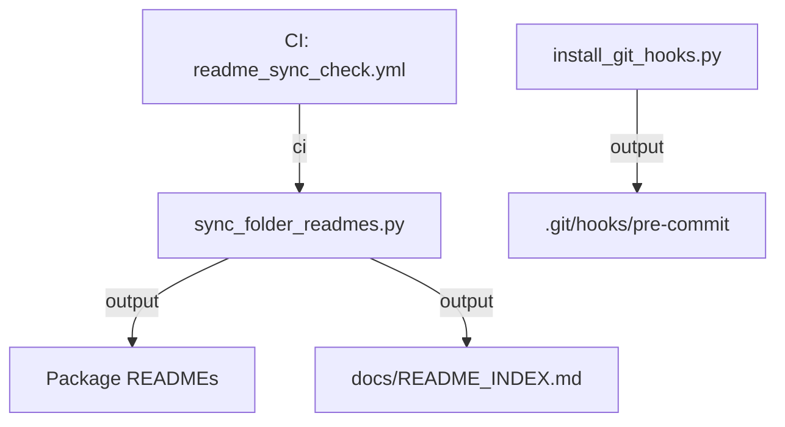
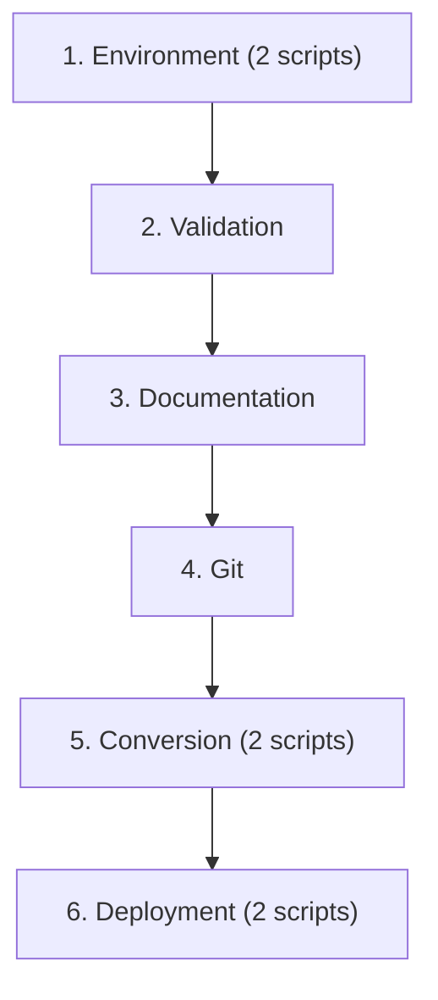
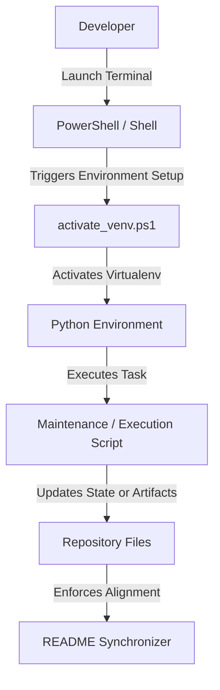

# Scripts

The `scripts/` folder serves as the central automation, maintenance, and utility hub for the ARGUS AI project.

## Folder Purpose

This folder contains project maintenance, automation, development, validation, evaluation, dataset processing, and repository utility scripts. These scripts automate key developer workflows, ensure environment consistency, run offline scientific evaluations, and maintain documentation alignment across the codebase.

## Script Inventory

<!-- BEGIN SYNC: KEY_MODULES -->
| Script | Purpose | Primary Usage |
| --- | --- | --- |
| [activate_venv.ps1](activate_venv.ps1) | ARGUS AI - Backward-compatibility shim for scripts/activate_venv.ps1. | `powershell -ExecutionPolicy Bypass -File scripts/activate_venv.ps1` |
| [doctor.py](doctor.py) | ARGUS AI - Backward-compatibility shim for doctor.py. | `python scripts/doctor.py` |
| [export_bygait_onnx.py](export_bygait_onnx.py) | ARGUS AI - Backward-compatibility shim for export_bygait_onnx.py. | `python scripts/export_bygait_onnx.py` |
| [export_silhouette_unet_onnx.py](export_silhouette_unet_onnx.py) | ARGUS AI - Backward-compatibility shim for export_silhouette_unet_onnx.py. | `python scripts/export_silhouette_unet_onnx.py` |
| [install_git_hooks.py](install_git_hooks.py) | ARGUS AI - Backward-compatibility shim for scripts/install_git_hooks.py. | `python scripts/install_git_hooks.py` |
| [manage_venv.ps1](manage_venv.ps1) | ARGUS AI - Backward-compatibility shim for scripts/manage_venv.ps1. | `powershell -ExecutionPolicy Bypass -File scripts/manage_venv.ps1` |
| [start_system.bat](start_system.bat) | ARGUS AI - Backward-compatibility shim for scripts/start_system.bat | `scripts/start_system.bat` |
| [start_system.sh](start_system.sh) | ARGUS AI - Backward-compatibility shim for scripts/start_system.sh | `scripts/start_system.sh` |
| [sync_folder_readmes.py](sync_folder_readmes.py) | ARGUS AI - Backward-compatibility shim for scripts/sync_folder_readmes.py. | `python scripts/sync_folder_readmes.py` |
<!-- END SYNC: KEY_MODULES -->

## Script Metadata

<!-- BEGIN SYNC: SCRIPT_METADATA_TABLE -->
| Script | Category | CLI | Auto | Used by CI | Used by Hook | Description |
| --- | --- | --- | --- | --- | --- | --- |
| [activate_venv.ps1](activate_venv.ps1) | Environment | No | Yes | No | No | ARGUS AI - Backward-compatibility shim for scripts/activa... |
| [doctor.py](doctor.py) | Validation | No | No | No | No | ARGUS AI - Backward-compatibility shim for doctor.py. |
| [export_bygait_onnx.py](export_bygait_onnx.py) | Conversion | No | No | No | No | ARGUS AI - Backward-compatibility shim for export_bygait_... |
| [export_silhouette_unet_onnx.py](export_silhouette_unet_onnx.py) | Conversion | No | No | No | No | ARGUS AI - Backward-compatibility shim for export_silhoue... |
| [install_git_hooks.py](install_git_hooks.py) | Git | No | No | No | Yes | ARGUS AI - Backward-compatibility shim for scripts/instal... |
| [manage_venv.ps1](manage_venv.ps1) | Environment | No | No | No | No | ARGUS AI - Backward-compatibility shim for scripts/manage... |
| [start_system.bat](start_system.bat) | Deployment | No | No | No | No | ARGUS AI - Backward-compatibility shim for scripts/start_... |
| [start_system.sh](start_system.sh) | Deployment | No | No | No | No | ARGUS AI - Backward-compatibility shim for scripts/start_... |
| [sync_folder_readmes.py](sync_folder_readmes.py) | Documentation | No | Yes | Yes | No | ARGUS AI - Backward-compatibility shim for scripts/sync_f... |
<!-- END SYNC: SCRIPT_METADATA_TABLE -->

## CLI Reference

<!-- BEGIN SYNC: CLI_REFERENCE -->
No CLI-enabled scripts detected.
<!-- END SYNC: CLI_REFERENCE -->

## Common Commands

### Documentation

`python scripts/sync_folder_readmes.py`

- **What it does**: Validates and synchronizes package folder `README.md` files and `docs/README_INDEX.md` with active source files across the codebase.
- **When it should be used**: Automatically invoked by the pre-commit Git hook, CI pipeline check, or manually after adding/modifying package modules or utility scripts.
- **Expected output**: Clean verification status (`[OK]`) or updated README files (`[UPDATED]`) without errors.

### Git Hooks

`python scripts/install_git_hooks.py`

- **Purpose**: Installs local `.git/hooks/pre-commit` script to enforce automated README synchronization before every commit.
- **Installation**: Run `python scripts/install_git_hooks.py` once during initial developer workspace setup.
- **Workflow**: Intercepts `git commit`, executes `sync_folder_readmes.py`, stages modified `README.md` files, and prevents commits if synchronization fails.

### Environment

`activate_venv.ps1`

- **Automatic activation**: Triggered automatically when opening a PowerShell terminal session inside the ARGUS AI repository.
- **Manual activation**: `powershell -ExecutionPolicy Bypass -File scripts/activate_venv.ps1`
- **Startup process**: Resolves workspace paths, validates python venv interpreter, deactivates foreign environments, and sets prompt context cleanly without side effects.

### Validation

Validation scripts perform environment health verification and component sanity tests:

<!-- BEGIN SYNC: VALIDATION_SCRIPTS -->
- **[doctor.py](doctor.py)**: ARGUS AI - Backward-compatibility shim for doctor.py. (`python scripts/doctor.py`)
<!-- END SYNC: VALIDATION_SCRIPTS -->

### Dataset

Dataset utility scripts handle CASIA-B raw preprocessing, GEI generation, gallery construction, and live gallery cleanup:

<!-- BEGIN SYNC: DATASET_SCRIPTS -->

<!-- END SYNC: DATASET_SCRIPTS -->

### Conversion

Export and conversion scripts handle model format conversion, acceleration engine compilation, and schema migrations:

<!-- BEGIN SYNC: CONVERSION_SCRIPTS -->
- **[export_bygait_onnx.py](export_bygait_onnx.py)**: ARGUS AI - Backward-compatibility shim for export_bygait_onnx.py. (`python scripts/export_bygait_onnx.py`)
- **[export_silhouette_unet_onnx.py](export_silhouette_unet_onnx.py)**: ARGUS AI - Backward-compatibility shim for export_silhouette_unet_onnx.py. (`python scripts/export_silhouette_unet_onnx.py`)
<!-- END SYNC: CONVERSION_SCRIPTS -->

### Development

Development helper scripts run benchmarks, evaluations, training pipelines, and interactive recognition tasks:

<!-- BEGIN SYNC: DEVELOPMENT_SCRIPTS -->

<!-- END SYNC: DEVELOPMENT_SCRIPTS -->

## Command Index

<!-- BEGIN SYNC: COMMAND_INDEX -->
| Command | Description |
| --- | --- |
| `powershell -ExecutionPolicy Bypass -File scripts/activate_venv.ps1` | ARGUS AI - Backward-compatibility shim for scripts/activate_venv.ps1. |
| `python scripts/doctor.py` | ARGUS AI - Backward-compatibility shim for doctor.py. |
| `python scripts/export_bygait_onnx.py` | ARGUS AI - Backward-compatibility shim for export_bygait_onnx.py. |
| `python scripts/export_silhouette_unet_onnx.py` | ARGUS AI - Backward-compatibility shim for export_silhouette_unet_o... |
| `python scripts/install_git_hooks.py` | ARGUS AI - Backward-compatibility shim for scripts/install_git_hook... |
| `powershell -ExecutionPolicy Bypass -File scripts/manage_venv.ps1` | ARGUS AI - Backward-compatibility shim for scripts/manage_venv.ps1. |
| `scripts/start_system.bat` | ARGUS AI - Backward-compatibility shim for scripts/start_system.bat |
| `scripts/start_system.sh` | ARGUS AI - Backward-compatibility shim for scripts/start_system.sh |
| `python scripts/sync_folder_readmes.py` | ARGUS AI - Backward-compatibility shim for scripts/sync_folder_read... |
<!-- END SYNC: COMMAND_INDEX -->

## Script Dependency Graph

<!-- BEGIN SYNC: SCRIPT_DEPENDENCY_GRAPH -->

<!-- END SYNC: SCRIPT_DEPENDENCY_GRAPH -->

## Script Execution Order

<!-- BEGIN SYNC: SCRIPT_EXECUTION_ORDER -->

<!-- END SYNC: SCRIPT_EXECUTION_ORDER -->

## Generated Outputs

<!-- BEGIN SYNC: CHANGE_IMPACT -->
| Script | Generated / Modified Outputs |
| --- | --- |
| [activate_venv.ps1](activate_venv.ps1) | `No file modifications` |
| [doctor.py](doctor.py) | `No file modifications` |
| [export_bygait_onnx.py](export_bygait_onnx.py) | `No file modifications` |
| [export_silhouette_unet_onnx.py](export_silhouette_unet_onnx.py) | `No file modifications` |
| [install_git_hooks.py](install_git_hooks.py) | `.git/hooks/pre-commit` |
| [manage_venv.ps1](manage_venv.ps1) | `No file modifications` |
| [start_system.bat](start_system.bat) | `No file modifications` |
| [start_system.sh](start_system.sh) | `No file modifications` |
| [sync_folder_readmes.py](sync_folder_readmes.py) | `*/README.md`, `docs/README_INDEX.md` |
<!-- END SYNC: CHANGE_IMPACT -->

## Safety Classification

<!-- BEGIN SYNC: SAFETY_CLASSIFICATION -->
| Classification | Scripts |
| --- | --- |
| **Deployment** | [start_system.bat](start_system.bat), [start_system.sh](start_system.sh) |
| **Documentation** | [sync_folder_readmes.py](sync_folder_readmes.py) |
| **Environment** | [activate_venv.ps1](activate_venv.ps1), [manage_venv.ps1](manage_venv.ps1) |
| **Git** | [install_git_hooks.py](install_git_hooks.py) |
| **Read-Only** | [doctor.py](doctor.py), [export_bygait_onnx.py](export_bygait_onnx.py), [export_silhouette_unet_onnx.py](export_silhouette_unet_onnx.py) |
<!-- END SYNC: SAFETY_CLASSIFICATION -->

## Script Execution Flow



## Dependencies

The scripts subsystem detects and relies on the following repository dependencies and CLI tooling:

- **Python**: Python 3.11+ runtime environment
- **PowerShell**: PowerShell 5.1+ or PowerShell Core (Windows / Cross-platform script host)
- **Git**: Version control CLI for hook installation and state verification
- **uv / pip**: Package management and environment resolution
- **pytest**: Test runner for executing validation script suite
- **ruff**: Linter and code formatter for Python scripts

## Cross References

<!-- BEGIN SYNC: CROSS_REFERENCES -->
- [Root README](../README.md)
- [Documentation Index](../docs/README_INDEX.md)
- [CI: CI.yaml](../.github/workflows/CI.yaml)
- [CI: readme_sync_check.yml](../.github/workflows/readme_sync_check.yml)
- [evaluation/README.md](../evaluation/README.md)
- [models/README.md](../models/README.md)
- [training/README.md](../training/README.md)
<!-- END SYNC: CROSS_REFERENCES -->

## Safety Notes

- **Production Model Safety**: Maintenance and utility scripts never modify active production model weights or live deployment configurations without explicit user invocation.
- **Documentation Safety**: Documentation synchronization scripts (`sync_folder_readmes.py`) only update markdown documentation files and are safe to run anytime.
- **Developer Scope**: Maintenance scripts are local developer tools and do not execute blocking network requests or unverified remote installations.
- **Idempotency**: All synchronization and validation scripts are idempotent; running them multiple times produces identical output.

## Command Examples

```bash
# Verify documentation synchronization status in CI check mode
python scripts/sync_folder_readmes.py --check

# Synchronize all folder READMEs and central documentation index
python scripts/sync_folder_readmes.py

# Install local pre-commit hook for automated README sync
python scripts/install_git_hooks.py

# Execute PowerShell environment auto-activation script
powershell -ExecutionPolicy Bypass -File scripts/activate_venv.ps1
```

## Automatic Maintenance

This `scripts/README.md` documentation file is automatically generated and permanently maintained by the repository documentation synchronization system (`scripts/sync_folder_readmes.py`).

Users should never manually edit auto-generated sections between `<!-- BEGIN SYNC -->` and `<!-- END SYNC -->` comment markers, as manual changes to these sections will be overwritten during synchronization.
